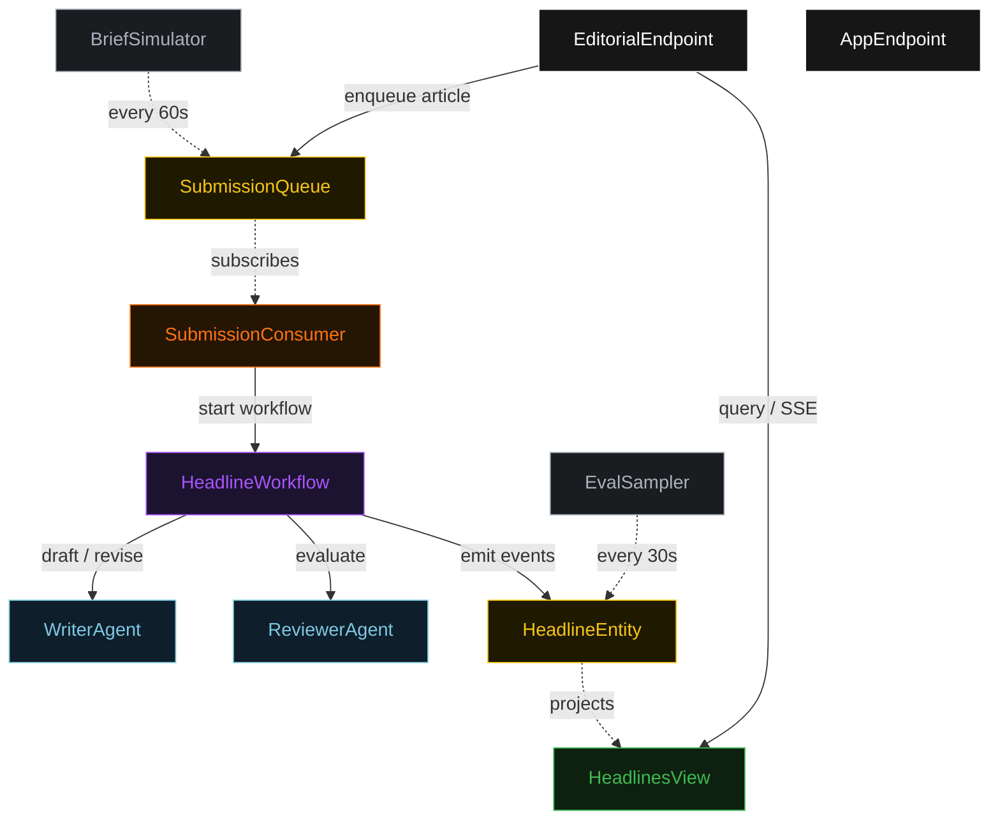
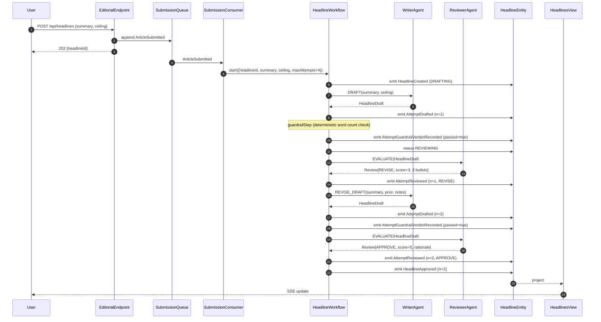
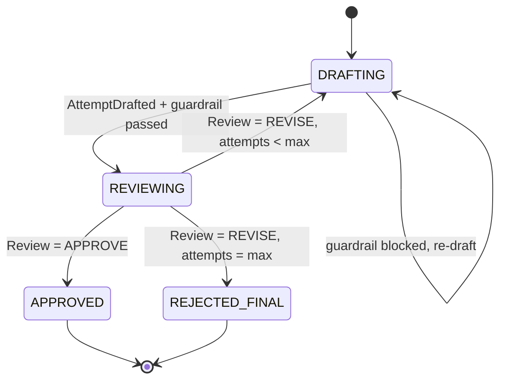
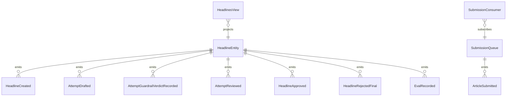

# PLAN — evaluator-optimizer-workflow

Architectural sketch consumed by `/akka:plan` (or skipped if `/akka:specify` covers it). Diagrams are rendered on the generated system's Architecture tab.

---

## Component graph

## Interaction sequence — J1 (convergence on attempt 2)

## State machine — `HeadlineEntity`

## Entity model

## Component table — Java file targets

| Component | Path (generated) |
|---|---|
| `WriterAgent` | `application/WriterAgent.java` |
| `ReviewerAgent` | `application/ReviewerAgent.java` |
| `EditorialTasks` | `application/EditorialTasks.java` |
| `HeadlineWorkflow` | `application/HeadlineWorkflow.java` |
| `HeadlineEntity` | `application/HeadlineEntity.java` (state in `domain/Headline.java`, events in `domain/HeadlineEvent.java`) |
| `SubmissionQueue` | `application/SubmissionQueue.java` |
| `HeadlinesView` | `application/HeadlinesView.java` |
| `SubmissionConsumer` | `application/SubmissionConsumer.java` |
| `BriefSimulator` | `application/BriefSimulator.java` |
| `EvalSampler` | `application/EvalSampler.java` |
| `EditorialEndpoint` | `api/EditorialEndpoint.java` |
| `AppEndpoint` | `api/AppEndpoint.java` |
| `MockModelProvider` (option (a) only) | `application/MockModelProvider.java` |
| Bootstrap | `Bootstrap.java` |

## Concurrency notes

- **Workflow step timeouts:** `draftStep` and `reviewStep` each carry `stepTimeout(Duration.ofSeconds(60))`. The default 5-second timeout never applies to agent-calling steps (Lesson 4).
- **Default step recovery:** `defaultStepRecovery(maxRetries(2).failoverTo(rejectStep))` — the workflow degrades to `REJECTED_FINAL` on irrecoverable agent failure rather than hanging.
- **Idempotency:** `EditorialEndpoint.submit` uses `(summary, requestedBy)` over a 10 s window as the dedup key.
- **EvalSampler idempotency:** the sampler keys its `recordEval` calls on `(headlineId, attemptNumber)` so a tick that fires twice for the same attempt is a no-op on the entity side.
- **maxAttempts ceiling:** read from `evaluator-optimizer-workflow.headline.max-attempts` (default 4). The workflow checks the count BEFORE calling `draftStep` for the next iteration; it never recurses past the ceiling.
- **Saga semantics:** there is no external side-effect to compensate. The halt-at-ceiling path is the only terminal safety valve; it preserves the best-scoring draft and every review on the entity.
- **Guardrail step:** `guardrailStep` is pure-function (no LLM call); it counts the words in the draft and either advances to `reviewStep` or returns to `draftStep` with a structured feedback note. The structured feedback never becomes an LLM-generated review; it stays a deterministic `ReviewNotes` payload with a single bullet.
