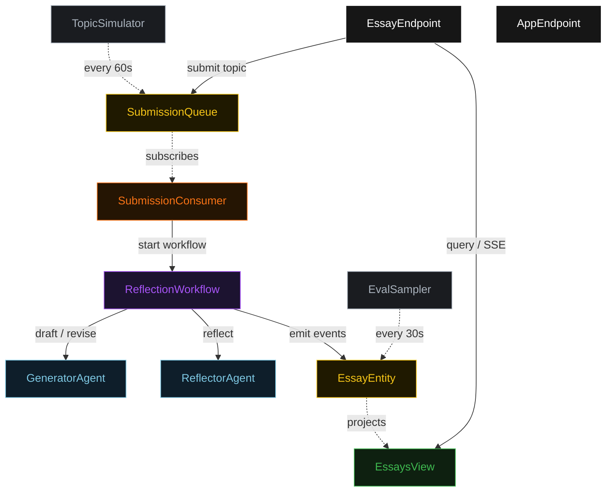
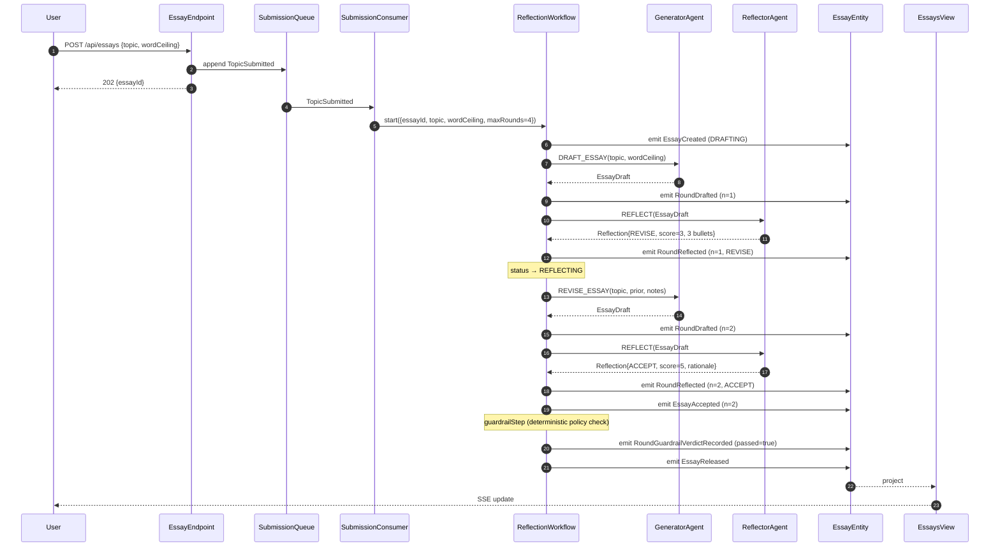
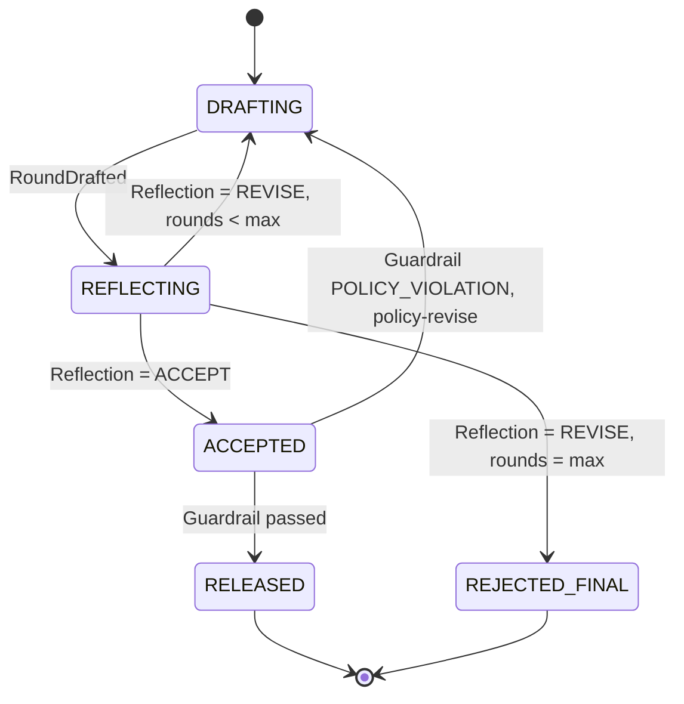
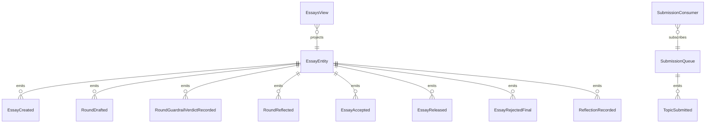

# PLAN — generator-critic

Architectural sketch consumed by `/akka:plan` (or skipped if `/akka:specify` covers it). Diagrams are rendered on the generated system's Architecture tab.

---

## Component graph

## Interaction sequence — J1 (convergence on round 2)

## State machine — `EssayEntity`

## Entity model

## Component table — Java file targets

| Component | Path (generated) |
|---|---|
| `GeneratorAgent` | `application/GeneratorAgent.java` |
| `ReflectorAgent` | `application/ReflectorAgent.java` |
| `EssayTasks` | `application/EssayTasks.java` |
| `ReflectionWorkflow` | `application/ReflectionWorkflow.java` |
| `EssayEntity` | `application/EssayEntity.java` (state in `domain/Essay.java`, events in `domain/EssayEvent.java`) |
| `SubmissionQueue` | `application/SubmissionQueue.java` |
| `EssaysView` | `application/EssaysView.java` |
| `SubmissionConsumer` | `application/SubmissionConsumer.java` |
| `TopicSimulator` | `application/TopicSimulator.java` |
| `EvalSampler` | `application/EvalSampler.java` |
| `EssayEndpoint` | `api/EssayEndpoint.java` |
| `AppEndpoint` | `api/AppEndpoint.java` |
| `MockModelProvider` (option (a) only) | `application/MockModelProvider.java` |
| Bootstrap | `Bootstrap.java` |

## Concurrency notes

- **Workflow step timeouts:** `draftStep` and `reflectStep` each carry `stepTimeout(Duration.ofSeconds(60))`. The default 5-second timeout never applies to agent-calling steps (Lesson 4).
- **Default step recovery:** `defaultStepRecovery(maxRetries(2).failoverTo(rejectStep))` — the workflow degrades to `REJECTED_FINAL` on irrecoverable agent failure rather than hanging.
- **Idempotency:** `EssayEndpoint.submit` uses `(topic, requestedBy)` over a 10 s window as the dedup key.
- **EvalSampler idempotency:** the sampler keys its `recordReflectionEval` calls on `(essayId, roundNumber)` so a tick that fires twice for the same round is a no-op on the entity side.
- **maxRounds ceiling:** read from `basic-reflection.reflection.max-rounds` (default 4). The workflow checks the count BEFORE calling `draftStep` for the next round; it never recurses past the ceiling.
- **Policy-revise loop:** the guardrail → policyReviseStep → guardrailStep mini-loop does not count toward `maxRounds`; it is bounded by the `stepTimeout` and `maxRetries` on the policyReviseStep. An irrecoverable policy failure also fails over to `rejectStep`.
- **Saga semantics:** there are no external side-effects to compensate. The halt mechanism is the only terminal boundary; it preserves the best draft and every reflection on the entity.
- **Guardrail step:** `guardrailStep` is pure-function (no LLM call); it scans the draft text against the phrase list from `basic-reflection.policy.forbidden-phrases`. The check runs once per acceptance; it does not run during the reflect-revise inner loop.
