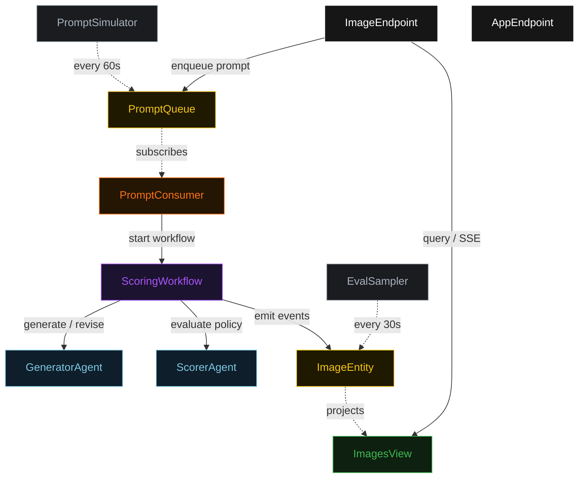
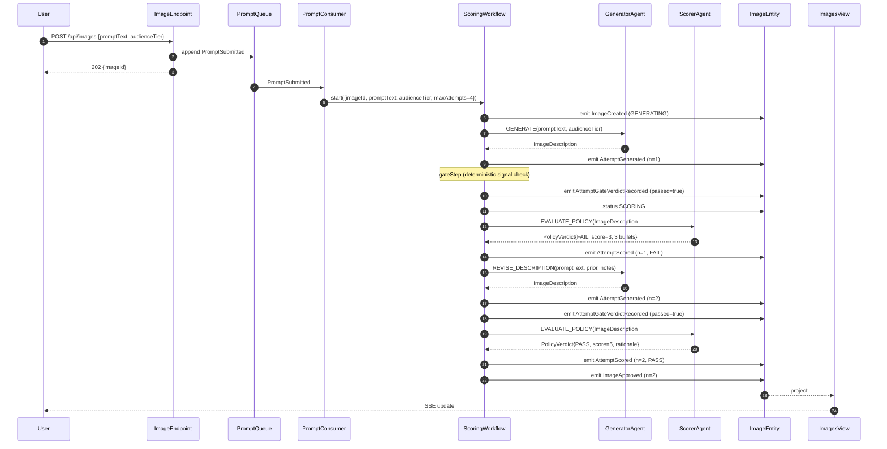
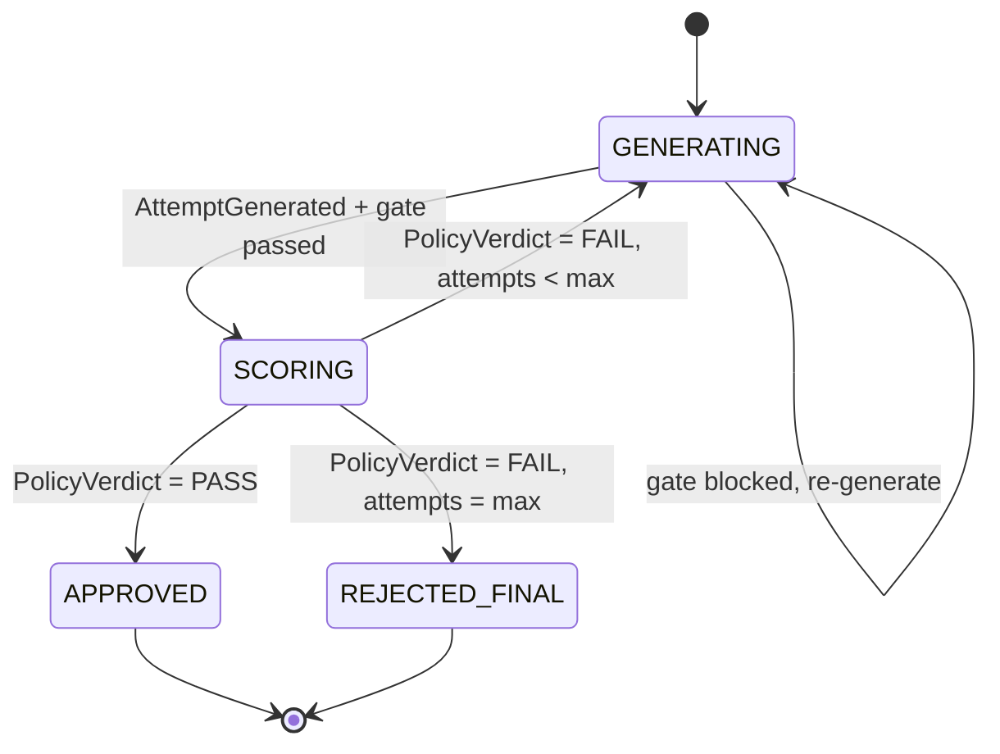
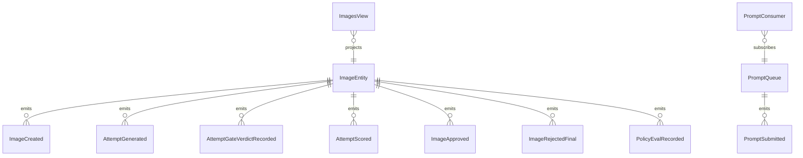

# PLAN — image-policy-scorer

Architectural sketch consumed by `/akka:plan` (or skipped if `/akka:specify` covers it). Diagrams are rendered on the generated system's Architecture tab.

---

## Component graph

## Interaction sequence — J1 (convergence on attempt 2)

## State machine — `ImageEntity`

## Entity model

## Component table — Java file targets

| Component | Path (generated) |
|---|---|
| `GeneratorAgent` | `application/GeneratorAgent.java` |
| `ScorerAgent` | `application/ScorerAgent.java` |
| `ImageTasks` | `application/ImageTasks.java` |
| `ScoringWorkflow` | `application/ScoringWorkflow.java` |
| `ImageEntity` | `application/ImageEntity.java` (state in `domain/Image.java`, events in `domain/ImageEvent.java`) |
| `PromptQueue` | `application/PromptQueue.java` |
| `ImagesView` | `application/ImagesView.java` |
| `PromptConsumer` | `application/PromptConsumer.java` |
| `PromptSimulator` | `application/PromptSimulator.java` |
| `EvalSampler` | `application/EvalSampler.java` |
| `ImageEndpoint` | `api/ImageEndpoint.java` |
| `AppEndpoint` | `api/AppEndpoint.java` |
| `MockModelProvider` (option (a) only) | `application/MockModelProvider.java` |
| Bootstrap | `Bootstrap.java` |

## Concurrency notes

- **Workflow step timeouts:** `generateStep` and `scoreStep` each carry `stepTimeout(Duration.ofSeconds(60))`. The default 5-second timeout never applies to agent-calling steps (Lesson 4).
- **Default step recovery:** `defaultStepRecovery(maxRetries(2).failoverTo(rejectStep))` — the workflow degrades to `REJECTED_FINAL` on irrecoverable agent failure rather than hanging.
- **Idempotency:** `ImageEndpoint.submit` uses `(promptText, requestedBy)` over a 10 s window as the dedup key.
- **EvalSampler idempotency:** the sampler keys its `recordEval` calls on `(imageId, attemptNumber)` so a tick that fires twice for the same attempt is a no-op on the entity side.
- **maxAttempts ceiling:** read from `image-policy-scorer.scoring.max-attempts` (default 4). The workflow checks the count BEFORE calling `generateStep` for the next iteration; it never recurses past the ceiling.
- **Saga semantics:** there is no external side-effect to compensate. Images are never written to an external store in the default configuration; the halt mechanism preserves the best description and every policy note on the entity.
- **Gate step:** `gateStep` is pure-function (no LLM call); it checks `description.brandSafetySignal()` against the prohibited-signal set from application.conf and either advances to `scoreStep` or returns to `generateStep` with a structured feedback note. The structured feedback stays a deterministic `PolicyNotes` payload — it is never an LLM-generated verdict.
