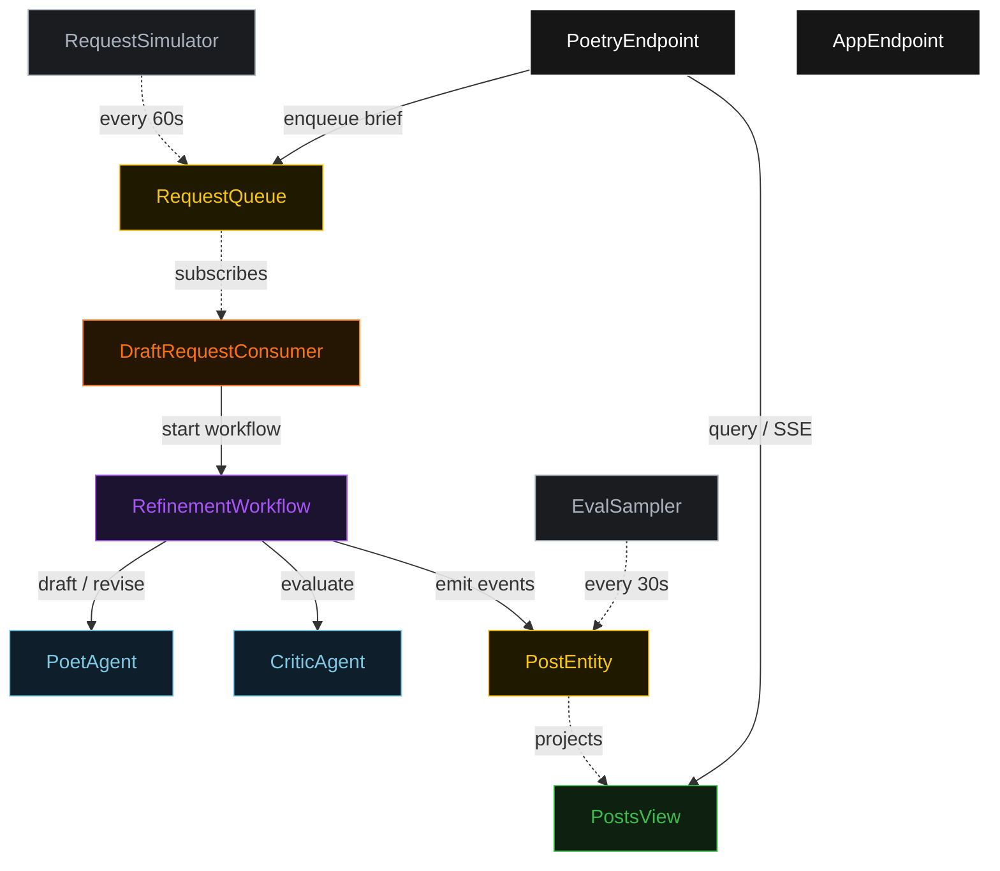
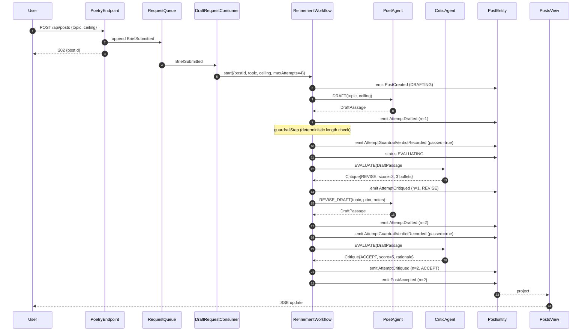
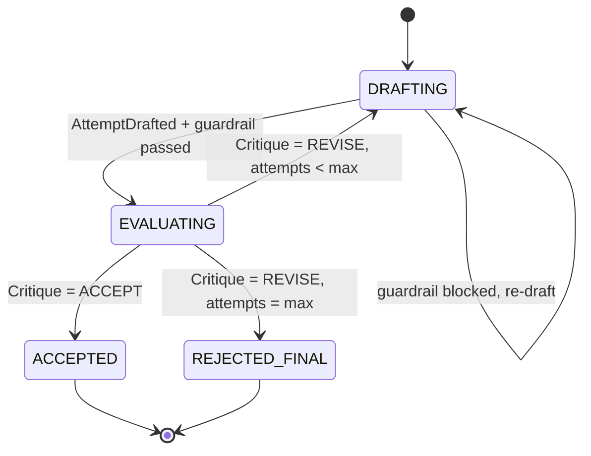
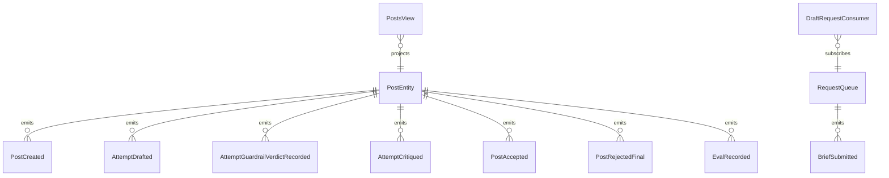

# PLAN — self-eval-loop

Architectural sketch consumed by `/akka:plan` (or skipped if `/akka:specify` covers it). Diagrams are rendered on the generated system's Architecture tab.

---

## Component graph

## Interaction sequence — J1 (convergence on attempt 2)

## State machine — `PostEntity`

## Entity model

## Component table — Java file targets

| Component | Path (generated) |
|---|---|
| `PoetAgent` | `application/PoetAgent.java` |
| `CriticAgent` | `application/CriticAgent.java` |
| `PoetryTasks` | `application/PoetryTasks.java` |
| `RefinementWorkflow` | `application/RefinementWorkflow.java` |
| `PostEntity` | `application/PostEntity.java` (state in `domain/Post.java`, events in `domain/PostEvent.java`) |
| `RequestQueue` | `application/RequestQueue.java` |
| `PostsView` | `application/PostsView.java` |
| `DraftRequestConsumer` | `application/DraftRequestConsumer.java` |
| `RequestSimulator` | `application/RequestSimulator.java` |
| `EvalSampler` | `application/EvalSampler.java` |
| `PoetryEndpoint` | `api/PoetryEndpoint.java` |
| `AppEndpoint` | `api/AppEndpoint.java` |
| `MockModelProvider` (option (a) only) | `application/MockModelProvider.java` |
| Bootstrap | `Bootstrap.java` |

## Concurrency notes

- **Workflow step timeouts:** `draftStep` and `critiqueStep` each carry `stepTimeout(Duration.ofSeconds(60))`. The default 5-second timeout never applies to agent-calling steps (Lesson 4).
- **Default step recovery:** `defaultStepRecovery(maxRetries(2).failoverTo(rejectStep))` — the workflow degrades to `REJECTED_FINAL` on irrecoverable agent failure rather than hanging.
- **Idempotency:** `PoetryEndpoint.submit` uses `(topic, requestedBy)` over a 10 s window as the dedup key.
- **EvalSampler idempotency:** the sampler keys its `recordEval` calls on `(postId, attemptNumber)` so a tick that fires twice for the same attempt is a no-op on the entity side.
- **maxAttempts ceiling:** read from `self-eval-loop.refinement.max-attempts` (default 4). The workflow checks the count BEFORE calling `draftStep` for the next iteration; it never recurses past the ceiling.
- **Saga semantics:** there is no external side-effect to compensate. The halt mechanism (`HT1`) is the only "compensation"; it preserves the best draft and every critique on the entity.
- **Guardrail step:** `guardrailStep` is pure-function (no LLM call); it computes the character count from the draft and either advances to `critiqueStep` or returns to `draftStep` with a structured feedback note. The structured feedback never becomes an LLM-generated critique; it stays a deterministic `CritiqueNotes` payload with a single bullet.
