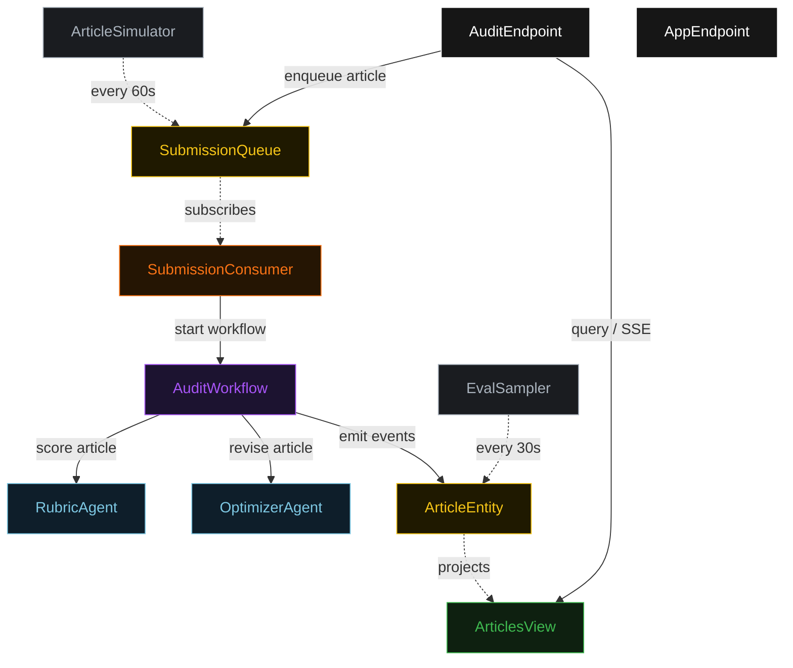
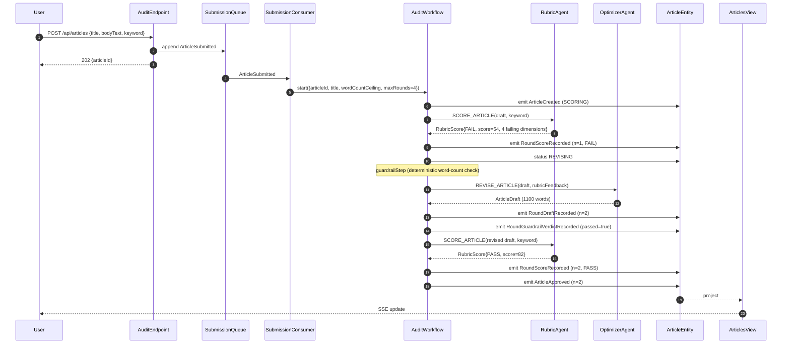
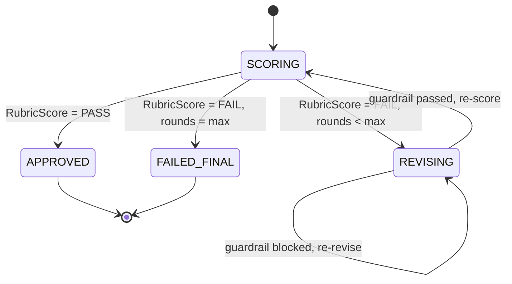
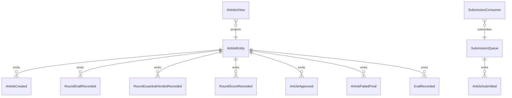

# PLAN — seo-rubric-critic

Architectural sketch consumed by `/akka:plan` (or skipped if `/akka:specify` covers it). Diagrams are rendered on the generated system's Architecture tab.

---

## Component graph

## Interaction sequence — J1 (convergence on round 2)

## State machine — `ArticleEntity`

## Entity model

## Component table — Java file targets

| Component | Path (generated) |
|---|---|
| `RubricAgent` | `application/RubricAgent.java` |
| `OptimizerAgent` | `application/OptimizerAgent.java` |
| `AuditTasks` | `application/AuditTasks.java` |
| `AuditWorkflow` | `application/AuditWorkflow.java` |
| `ArticleEntity` | `application/ArticleEntity.java` (state in `domain/Article.java`, events in `domain/ArticleEvent.java`) |
| `SubmissionQueue` | `application/SubmissionQueue.java` |
| `ArticlesView` | `application/ArticlesView.java` |
| `SubmissionConsumer` | `application/SubmissionConsumer.java` |
| `ArticleSimulator` | `application/ArticleSimulator.java` |
| `EvalSampler` | `application/EvalSampler.java` |
| `AuditEndpoint` | `api/AuditEndpoint.java` |
| `AppEndpoint` | `api/AppEndpoint.java` |
| `MockModelProvider` (option (a) only) | `application/MockModelProvider.java` |
| Bootstrap | `Bootstrap.java` |

## Concurrency notes

- **Workflow step timeouts:** `scoreStep` and `reviseStep` each carry `stepTimeout(Duration.ofSeconds(60))`. The default 5-second timeout never applies to agent-calling steps (Lesson 4).
- **Default step recovery:** `defaultStepRecovery(maxRetries(2).failoverTo(failStep))` — the workflow degrades to `FAILED_FINAL` on irrecoverable agent failure rather than hanging.
- **Idempotency:** `AuditEndpoint.submit` uses `(title, submittedBy)` over a 10 s window as the dedup key.
- **EvalSampler idempotency:** the sampler keys its `recordEval` calls on `(articleId, roundNumber)` so a tick that fires twice for the same round is a no-op on the entity side.
- **maxRounds ceiling:** read from `seo-rubric-critic.audit.max-rounds` (default 4). The workflow checks the count BEFORE calling `reviseStep` for the next iteration; it never recurses past the ceiling.
- **Saga semantics:** there is no external side-effect to compensate. The halt mechanism (`HT1`) is the only terminal path; it preserves the highest-scoring draft and every rubric score on the entity.
- **Guardrail step:** `guardrailStep` is pure-function (no LLM call); it counts the words in the draft and either advances to `scoreStep` or returns to `reviseStep` with a structured feedback note. The structured feedback never becomes an LLM-generated critique; it stays a deterministic `RubricFeedback` payload with a single bullet.
