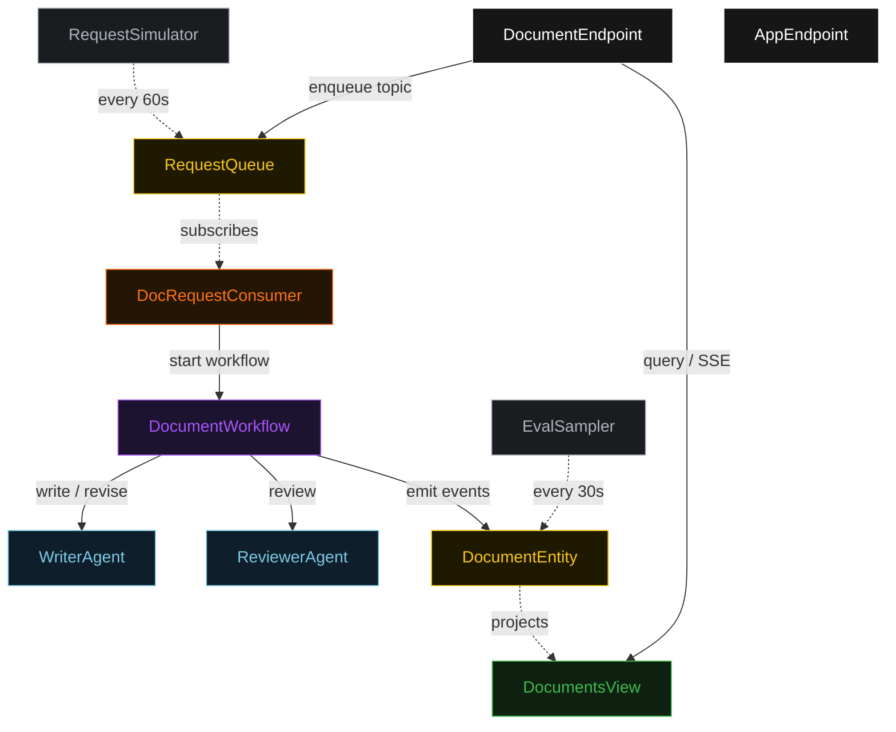
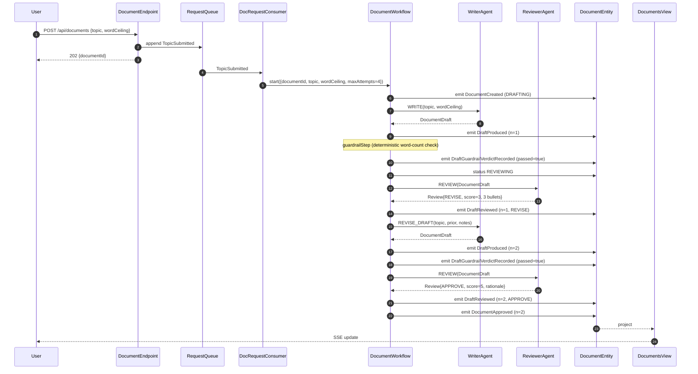
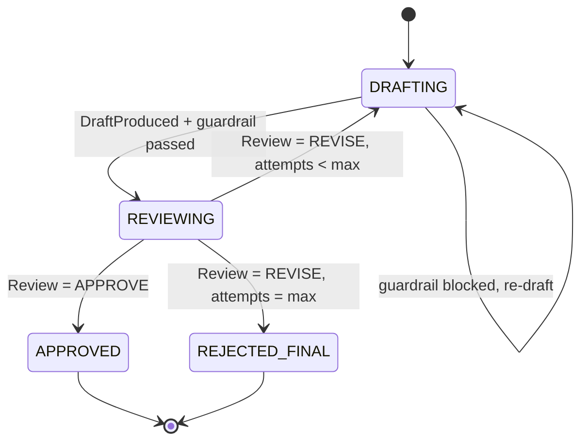
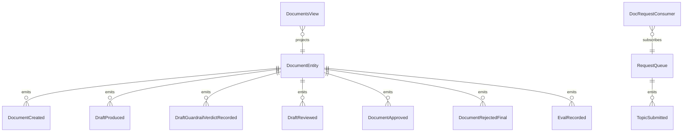

# PLAN — writer-reviewer-doc-gen

Architectural sketch consumed by `/akka:plan` (or skipped if `/akka:specify` covers it). Diagrams are rendered on the generated system's Architecture tab.

---

## Component graph

## Interaction sequence — J1 (convergence on attempt 2)

## State machine — `DocumentEntity`

## Entity model

## Component table — Java file targets

| Component | Path (generated) |
|---|---|
| `WriterAgent` | `application/WriterAgent.java` |
| `ReviewerAgent` | `application/ReviewerAgent.java` |
| `DocTasks` | `application/DocTasks.java` |
| `DocumentWorkflow` | `application/DocumentWorkflow.java` |
| `DocumentEntity` | `application/DocumentEntity.java` (state in `domain/Document.java`, events in `domain/DocumentEvent.java`) |
| `RequestQueue` | `application/RequestQueue.java` |
| `DocumentsView` | `application/DocumentsView.java` |
| `DocRequestConsumer` | `application/DocRequestConsumer.java` |
| `RequestSimulator` | `application/RequestSimulator.java` |
| `EvalSampler` | `application/EvalSampler.java` |
| `DocumentEndpoint` | `api/DocumentEndpoint.java` |
| `AppEndpoint` | `api/AppEndpoint.java` |
| `MockModelProvider` (option (a) only) | `application/MockModelProvider.java` |
| Bootstrap | `Bootstrap.java` |

## Concurrency notes

- **Workflow step timeouts:** `writeStep` and `reviewStep` each carry `stepTimeout(Duration.ofSeconds(60))`. The default 5-second timeout never applies to agent-calling steps (Lesson 4).
- **Default step recovery:** `defaultStepRecovery(maxRetries(2).failoverTo(rejectStep))` — the workflow degrades to `REJECTED_FINAL` on irrecoverable agent failure rather than hanging.
- **Idempotency:** `DocumentEndpoint.submit` uses `(topic, requestedBy)` over a 10 s window as the dedup key.
- **EvalSampler idempotency:** the sampler keys its `recordEval` calls on `(documentId, attemptNumber)` so a tick that fires twice for the same attempt is a no-op on the entity side.
- **maxAttempts ceiling:** read from `writer-reviewer-doc-gen.refinement.max-attempts` (default 4). The workflow checks the count BEFORE calling `writeStep` for the next iteration; it never recurses past the ceiling.
- **Saga semantics:** there is no external side-effect to compensate. The halt at `REJECTED_FINAL` is the only terminal fallback; it preserves the best draft and every review on the entity.
- **Guardrail step:** `guardrailStep` is pure-function (no LLM call); it counts words in the draft and either advances to `reviewStep` or returns to `writeStep` with a structured feedback note. The structured feedback never becomes an LLM-generated review; it stays a deterministic `ReviewNotes` payload with a single bullet.
