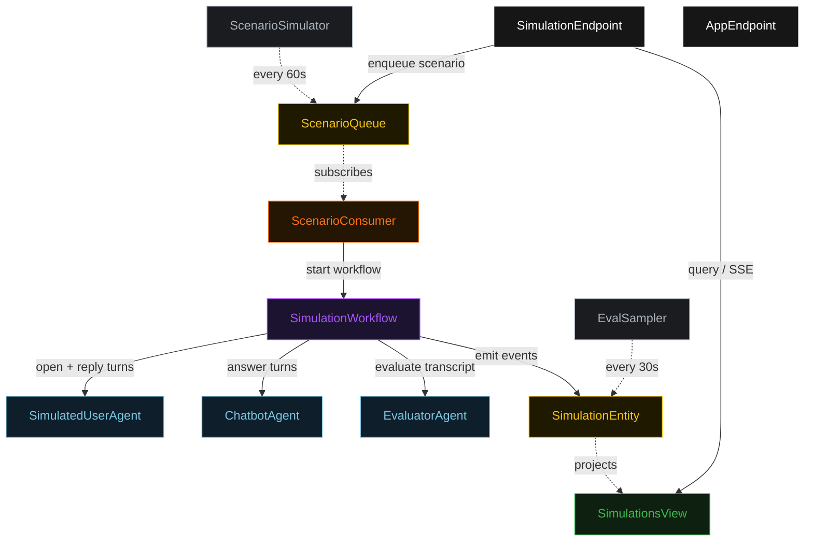
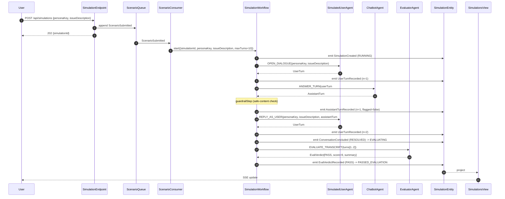
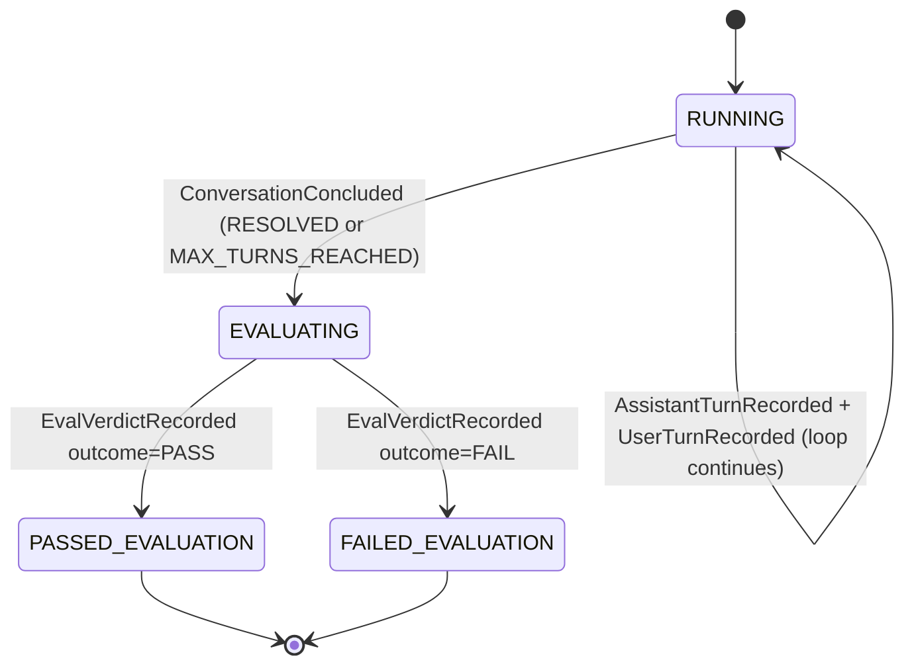
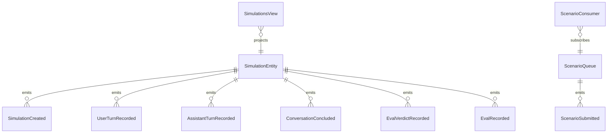

# PLAN — chatbot-sim-eval

Architectural sketch consumed by `/akka:plan` (or skipped if `/akka:specify` covers it). Diagrams are rendered on the generated system's Architecture tab.

---

## Component graph

## Interaction sequence — J1 (convergence: user signals resolution on turn 2)

## State machine — `SimulationEntity`

## Entity model

## Component table — Java file targets

| Component | Path (generated) |
|---|---|
| `SimulatedUserAgent` | `application/SimulatedUserAgent.java` |
| `ChatbotAgent` | `application/ChatbotAgent.java` |
| `EvaluatorAgent` | `application/EvaluatorAgent.java` |
| `SimulationTasks` | `application/SimulationTasks.java` |
| `SimulationWorkflow` | `application/SimulationWorkflow.java` |
| `SimulationEntity` | `application/SimulationEntity.java` (state in `domain/Simulation.java`, events in `domain/SimulationEvent.java`) |
| `ScenarioQueue` | `application/ScenarioQueue.java` |
| `SimulationsView` | `application/SimulationsView.java` |
| `ScenarioConsumer` | `application/ScenarioConsumer.java` |
| `ScenarioSimulator` | `application/ScenarioSimulator.java` |
| `EvalSampler` | `application/EvalSampler.java` |
| `SimulationEndpoint` | `api/SimulationEndpoint.java` |
| `AppEndpoint` | `api/AppEndpoint.java` |
| `MockModelProvider` (option (a) only) | `application/MockModelProvider.java` |
| Bootstrap | `Bootstrap.java` |

## Concurrency notes

- **Workflow step timeouts:** `openDialogueStep`, `chatbotStep`, and `userReplyStep` each carry `stepTimeout(Duration.ofSeconds(90))`; `evaluateStep` carries `stepTimeout(Duration.ofSeconds(120))`. The default 5-second timeout never applies to agent-calling steps (Lesson 4).
- **Default step recovery:** `defaultStepRecovery(maxRetries(2).failoverTo(failStep))` — unrecoverable agent failure ends in `FAILED_EVALUATION`, not in a hung workflow.
- **Turn loop ceiling:** `maxTurns` is read from `chatbot-sim-eval.simulation.max-turns` (default 10). The workflow checks `turnCount < maxTurns` BEFORE scheduling the next chatbot step; it never recurses past the ceiling.
- **Guardrail step:** `guardrailStep` is pure-function (no LLM call); it scans the assistant turn text against a keyword/pattern set and sets `safeContentFlagged=true` if any pattern matches. Non-blocking: the turn is still committed.
- **EvalSampler idempotency:** the sampler keys its `recordEval` calls on `simulationId` so a tick that fires twice for the same completed simulation is a no-op on the entity side.
- **CI gate:** `GET /api/simulations/ci-gate?set=<ids>` is a synchronous read against `SimulationsView`; no side effects. Returns `{ passed: false }` if any id is not in a terminal state or is `FAILED_EVALUATION`.
- **Saga semantics:** there are no external side-effects to compensate. The `failStep` is the sole terminal state for both evaluation failure and irrecoverable agent error.
