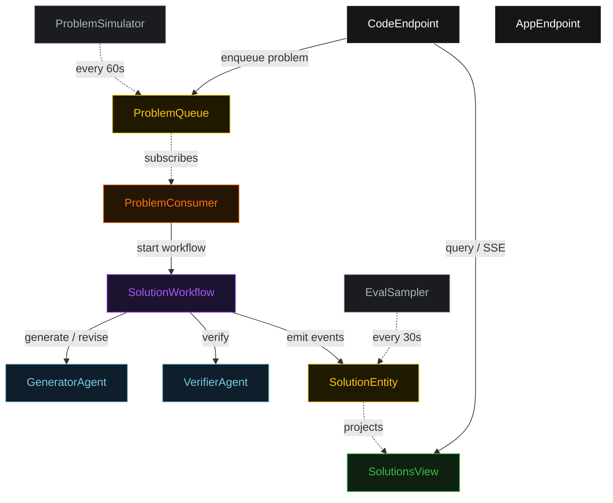
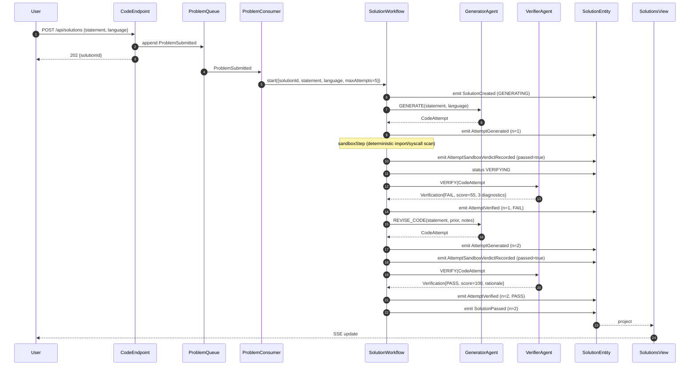
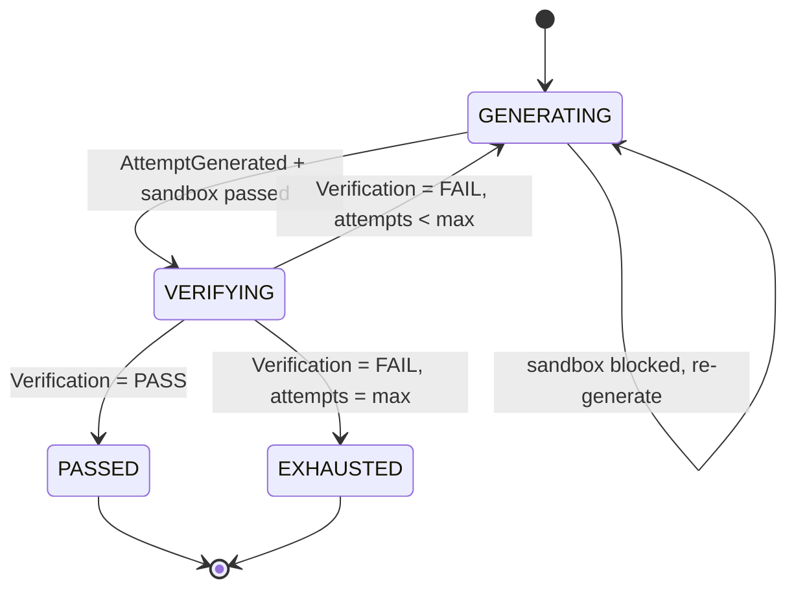
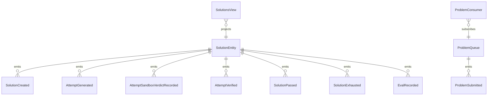

# PLAN — code-eval-loop

Architectural sketch consumed by `/akka:plan` (or skipped if `/akka:specify` covers it). Diagrams are rendered on the generated system's Architecture tab.

---

## Component graph

## Interaction sequence — J1 (convergence on attempt 2)

## State machine — `SolutionEntity`

## Entity model

## Component table — Java file targets

| Component | Path (generated) |
|---|---|
| `GeneratorAgent` | `application/GeneratorAgent.java` |
| `VerifierAgent` | `application/VerifierAgent.java` |
| `CodeTasks` | `application/CodeTasks.java` |
| `SolutionWorkflow` | `application/SolutionWorkflow.java` |
| `SolutionEntity` | `application/SolutionEntity.java` (state in `domain/Solution.java`, events in `domain/SolutionEvent.java`) |
| `ProblemQueue` | `application/ProblemQueue.java` |
| `SolutionsView` | `application/SolutionsView.java` |
| `ProblemConsumer` | `application/ProblemConsumer.java` |
| `ProblemSimulator` | `application/ProblemSimulator.java` |
| `EvalSampler` | `application/EvalSampler.java` |
| `CodeEndpoint` | `api/CodeEndpoint.java` |
| `AppEndpoint` | `api/AppEndpoint.java` |
| `MockModelProvider` (option (a) only) | `application/MockModelProvider.java` |
| Bootstrap | `Bootstrap.java` |

## Concurrency notes

- **Workflow step timeouts:** `generateStep` and `verifyStep` each carry `stepTimeout(Duration.ofSeconds(90))`. The default 5-second timeout never applies to agent-calling steps (Lesson 4).
- **Default step recovery:** `defaultStepRecovery(maxRetries(2).failoverTo(exhaustStep))` — the workflow degrades to `EXHAUSTED` on irrecoverable agent failure rather than hanging.
- **Idempotency:** `CodeEndpoint.submit` uses `(statement, submittedBy)` over a 10 s window as the dedup key.
- **EvalSampler idempotency:** the sampler keys its `recordEval` calls on `(solutionId, attemptNumber)` so a tick that fires twice for the same attempt is a no-op on the entity side.
- **maxAttempts ceiling:** read from `code-eval-loop.solution.max-attempts` (default 5). The workflow checks the count BEFORE calling `generateStep` for the next iteration; it never recurses past the ceiling.
- **Saga semantics:** there is no external side-effect to compensate. The halt mechanism (end-state `EXHAUSTED`) is the only terminal fallback; it preserves the best attempt and every diagnostic on the entity.
- **sandboxStep:** `sandboxStep` is pure-function (no LLM call); it scans the code string for forbidden import patterns (`java.lang.Runtime`, `java.lang.ProcessBuilder`, `sun.*`) and syscall markers, then either advances to `verifyStep` or returns to `generateStep` with a structured VerificationNotes payload. The structured feedback never becomes an LLM-generated diagnostic; it is a deterministic `VerificationNotes` list naming the offending pattern.
- **ci-gate:** after `PASS` is returned by the VerifierAgent, `passStep` runs a final deterministic re-check of the verification score field. Only a score of 100 advances to `SolutionPassed`; partial scores re-enter the loop as `FAIL` to guard against hallucinated pass verdicts.
