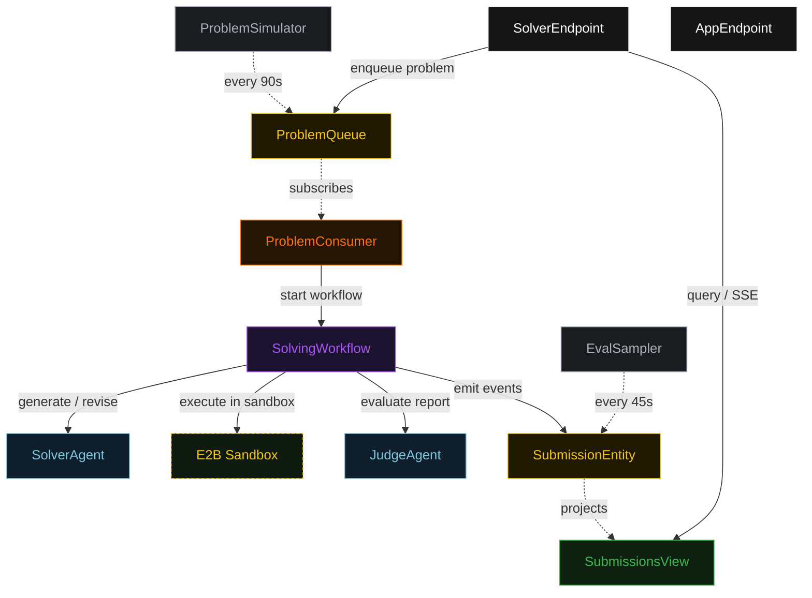
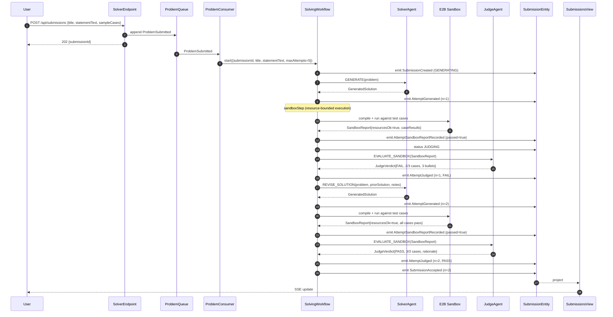
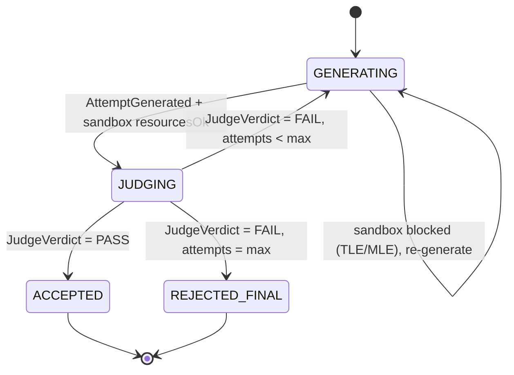
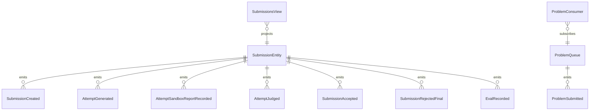

# PLAN — competitive-coding-agent

Architectural sketch consumed by `/akka:plan` (or skipped if `/akka:specify` covers it). Diagrams are rendered on the generated system's Architecture tab.

---

## Component graph

## Interaction sequence — J1 (convergence on attempt 2)

## State machine — `SubmissionEntity`

## Entity model

## Component table — Java file targets

| Component | Path (generated) |
|---|---|
| `SolverAgent` | `application/SolverAgent.java` |
| `JudgeAgent` | `application/JudgeAgent.java` |
| `SolverTasks` | `application/SolverTasks.java` |
| `SolvingWorkflow` | `application/SolvingWorkflow.java` |
| `SubmissionEntity` | `application/SubmissionEntity.java` (state in `domain/Submission.java`, events in `domain/SubmissionEvent.java`) |
| `ProblemQueue` | `application/ProblemQueue.java` |
| `SubmissionsView` | `application/SubmissionsView.java` |
| `ProblemConsumer` | `application/ProblemConsumer.java` |
| `ProblemSimulator` | `application/ProblemSimulator.java` |
| `EvalSampler` | `application/EvalSampler.java` |
| `SolverEndpoint` | `api/SolverEndpoint.java` |
| `AppEndpoint` | `api/AppEndpoint.java` |
| `MockModelProvider` (option (a) only) | `application/MockModelProvider.java` |
| Bootstrap | `Bootstrap.java` |

## Concurrency notes

- **Workflow step timeouts:** `generateStep` and `sandboxStep` each carry `stepTimeout(Duration.ofSeconds(120))`; `judgeStep` carries `stepTimeout(Duration.ofSeconds(60))`. The default 5-second timeout never applies to agent-calling or sandbox-calling steps (Lesson 4).
- **Default step recovery:** `defaultStepRecovery(maxRetries(2).failoverTo(rejectStep))` — the workflow degrades to `REJECTED_FINAL` on irrecoverable agent or sandbox failure rather than hanging.
- **Idempotency:** `SolverEndpoint.submit` uses `(title, submittedBy)` over a 10 s window as the dedup key.
- **EvalSampler idempotency:** the sampler keys its `recordEval` calls on `(submissionId, attemptNumber)` so a tick that fires twice for the same attempt is a no-op on the entity side.
- **maxAttempts ceiling:** read from `competitive-coding-agent.solving.max-attempts` (default 5). The workflow checks the count BEFORE calling `generateStep` for the next iteration; it never recurses past the ceiling.
- **Sandbox step:** `sandboxStep` is a pure-infrastructure step (no LLM call). It POSTs the generated source to the E2B HTTP API, awaits the execution result, and deserialises it into a `SandboxReport`. The E2B API key is read from `${?E2B_API_KEY}` at runtime; the workflow fails fast with a clear message if the key is absent.
- **Saga semantics:** the sandbox execution has no durable side-effects to compensate. If the sandbox call fails transiently, `maxRetries(2)` retries it in-process before failing over to `rejectStep`.
- **Best-of selection on rejection:** `rejectStep` selects the attempt whose `passedCases / totalCases` ratio is highest. Ties are broken by `attemptNumber` (later attempt preferred). The source code of that attempt is stored as `acceptedSourceCode` with `rejectionReason = "max attempts reached (N)"`.
