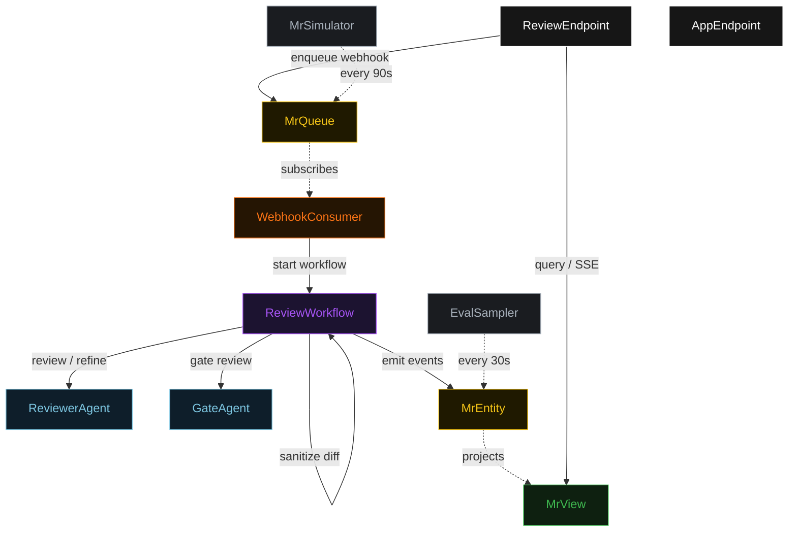
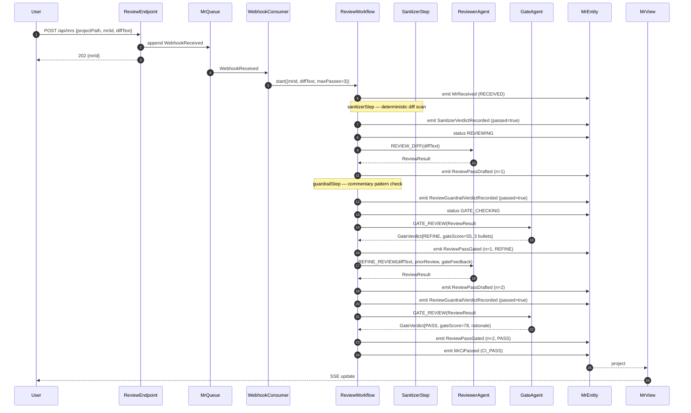
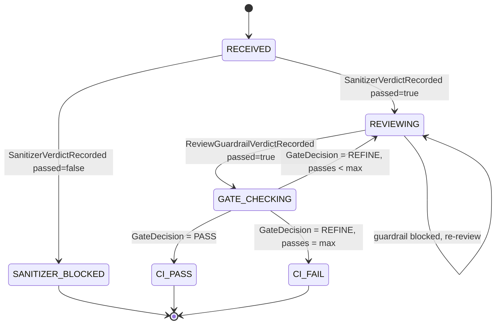
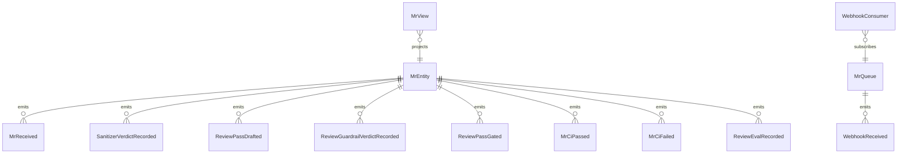

# PLAN — mr-reviewer

Architectural sketch consumed by `/akka:plan` (or skipped if `/akka:specify` covers it). Diagrams are rendered on the generated system's Architecture tab.

---

## Component graph

## Interaction sequence — J1 (convergence on pass 2)

## State machine — `MrEntity`

## Entity model

## Component table — Java file targets

| Component | Path (generated) |
|---|---|
| `ReviewerAgent` | `application/ReviewerAgent.java` |
| `GateAgent` | `application/GateAgent.java` |
| `ReviewTasks` | `application/ReviewTasks.java` |
| `ReviewWorkflow` | `application/ReviewWorkflow.java` |
| `MrEntity` | `application/MrEntity.java` (state in `domain/MergeRequest.java`, events in `domain/MrEvent.java`) |
| `MrQueue` | `application/MrQueue.java` |
| `MrView` | `application/MrView.java` |
| `WebhookConsumer` | `application/WebhookConsumer.java` |
| `MrSimulator` | `application/MrSimulator.java` |
| `EvalSampler` | `application/EvalSampler.java` |
| `ReviewEndpoint` | `api/ReviewEndpoint.java` |
| `AppEndpoint` | `api/AppEndpoint.java` |
| `MockModelProvider` (option (a) only) | `application/MockModelProvider.java` |
| Bootstrap | `Bootstrap.java` |

## Concurrency notes

- **Workflow step timeouts:** `reviewStep` and `gateStep` each carry `stepTimeout(Duration.ofSeconds(60))`. The default 5-second timeout never applies to agent-calling steps (Lesson 4).
- **Default step recovery:** `defaultStepRecovery(maxRetries(2).failoverTo(ciFailStep))` — the workflow degrades to `CI_FAIL` on irrecoverable agent failure rather than hanging.
- **Idempotency:** `ReviewEndpoint.submit` uses `(projectPath, mrIid)` over a 10 s window as the dedup key; a second webhook for the same MR returns the first `mrId` (200) rather than starting a new workflow.
- **EvalSampler idempotency:** the sampler keys its `recordEval` calls on `(mrId, passNumber)` so a tick that fires twice for the same pass is a no-op on the entity side.
- **maxPasses ceiling:** read from `mr-reviewer.review.max-passes` (default 3). The workflow checks the count BEFORE calling `reviewStep` for the next iteration; it never recurses past the ceiling.
- **Sanitizer step:** `sanitizerStep` is pure-function (no LLM call); it scans the raw diffText against a fixed pattern set and either advances to `reviewStep` or transitions to `blockStep`. The diff is never sent to the LLM on a sanitizer failure.
- **Guardrail step:** `guardrailStep` is pure-function; it checks `ReviewResult.commentary` against the same pattern set and either advances to `gateStep` or returns to `reviewStep` with a structured `GateFeedback` payload.
- **CI gate signal:** `MrEntity.ciSignal` records `"CI_PASS"` or `"CI_FAIL"` as a plain string. `ReviewEndpoint GET /api/mrs/{id}/ci-signal` returns this field directly; external pipelines need no additional authentication to read it.
