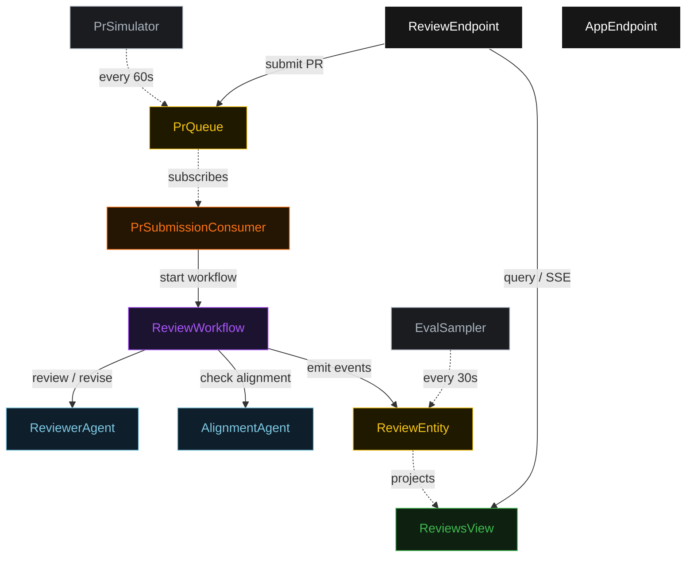
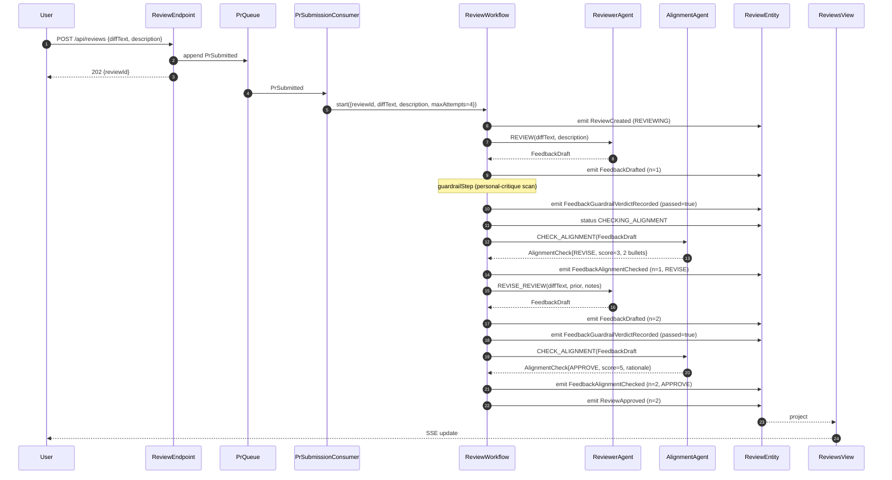
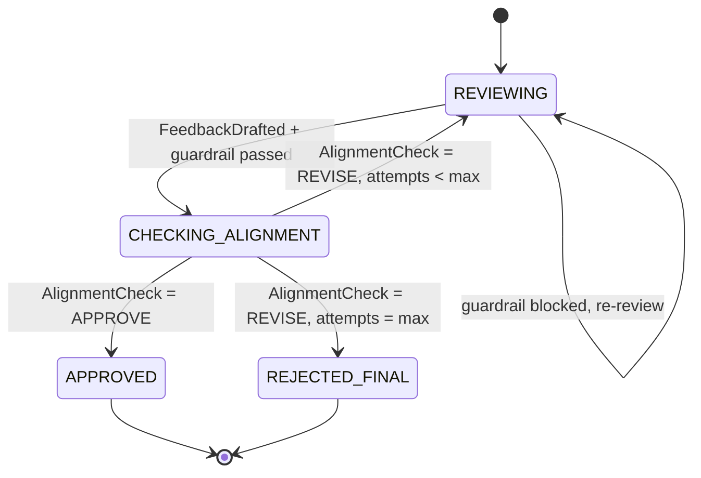
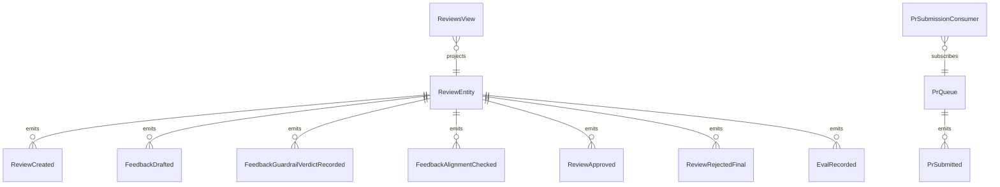

# PLAN — pr-reviewer

Architectural sketch consumed by `/akka:plan` (or skipped if `/akka:specify` covers it). Diagrams are rendered on the generated system's Architecture tab.

---

## Component graph

## Interaction sequence — J1 (convergence on attempt 2)

## State machine — `ReviewEntity`

## Entity model

## Component table — Java file targets

| Component | Path (generated) |
|---|---|
| `ReviewerAgent` | `application/ReviewerAgent.java` |
| `AlignmentAgent` | `application/AlignmentAgent.java` |
| `ReviewTasks` | `application/ReviewTasks.java` |
| `ReviewWorkflow` | `application/ReviewWorkflow.java` |
| `ReviewEntity` | `application/ReviewEntity.java` (state in `domain/Review.java`, events in `domain/ReviewEvent.java`) |
| `PrQueue` | `application/PrQueue.java` |
| `ReviewsView` | `application/ReviewsView.java` |
| `PrSubmissionConsumer` | `application/PrSubmissionConsumer.java` |
| `PrSimulator` | `application/PrSimulator.java` |
| `EvalSampler` | `application/EvalSampler.java` |
| `ReviewEndpoint` | `api/ReviewEndpoint.java` |
| `AppEndpoint` | `api/AppEndpoint.java` |
| `MockModelProvider` (option (a) only) | `application/MockModelProvider.java` |
| Bootstrap | `Bootstrap.java` |

## Concurrency notes

- **Workflow step timeouts:** `reviewStep` and `alignmentStep` each carry `stepTimeout(Duration.ofSeconds(60))`. The default 5-second timeout never applies to agent-calling steps (Lesson 4).
- **Default step recovery:** `defaultStepRecovery(maxRetries(2).failoverTo(rejectStep))` — the workflow degrades to `REJECTED_FINAL` on irrecoverable agent failure rather than hanging.
- **Idempotency:** `ReviewEndpoint.submit` deduplicates on `(diffText hash, submittedBy)` over a 10 s window.
- **EvalSampler idempotency:** the sampler keys its `recordEval` calls on `(reviewId, attemptNumber)` so a tick that fires twice for the same attempt is a no-op on the entity side.
- **maxAttempts ceiling:** read from `pr-reviewer.review.max-attempts` (default 4). The workflow checks the count BEFORE calling `reviewStep` for the next iteration; it never recurses past the ceiling.
- **Saga semantics:** there is no external side-effect to compensate. The halt mechanism ends the loop and preserves the best feedback and every alignment check on the entity.
- **Guardrail step:** `guardrailStep` is pure-function (no LLM call); it scans `FeedbackDraft.comments()` for personal language patterns (first/second-person singular references to the author) and either advances to `alignmentStep` or returns to `reviewStep` with a structured feedback note. The structured feedback never becomes an LLM-generated alignment note; it stays a deterministic `AlignmentNotes` payload with a single bullet.
