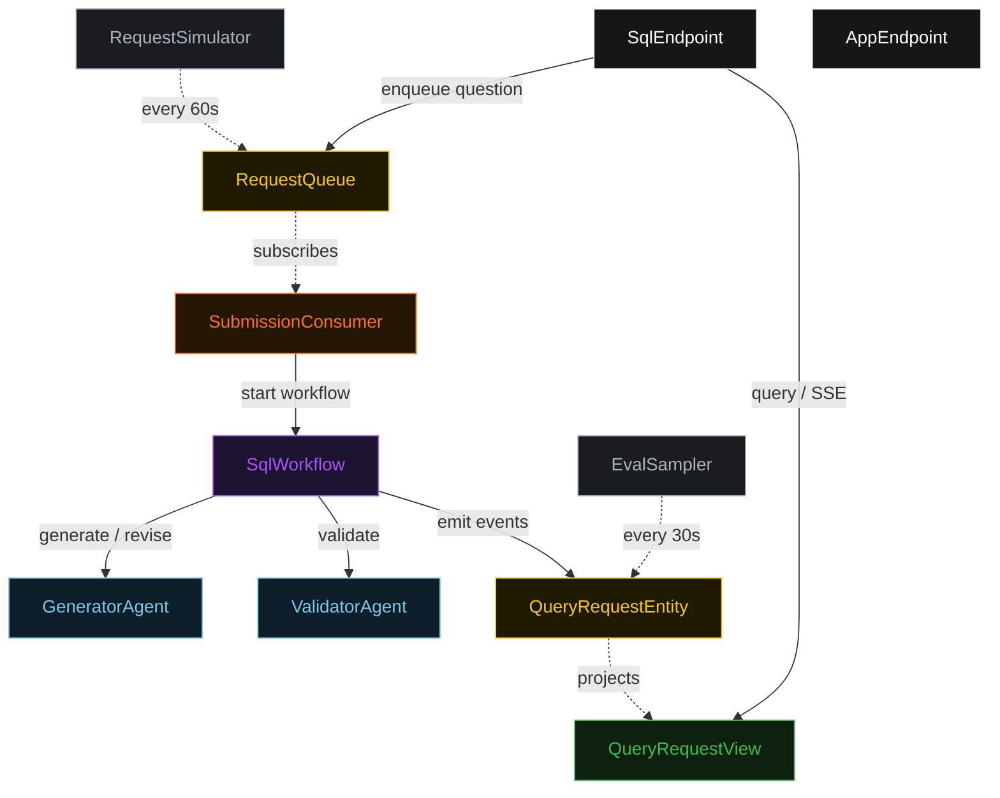
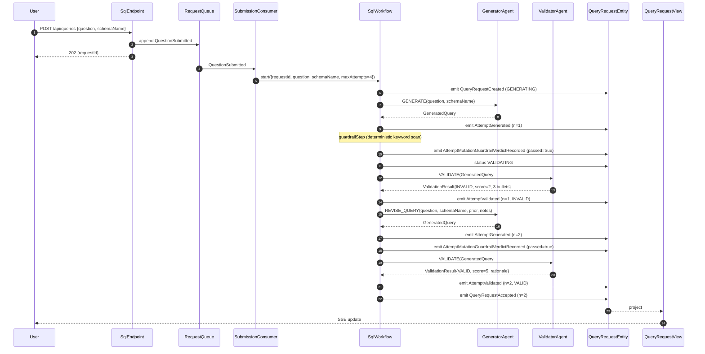
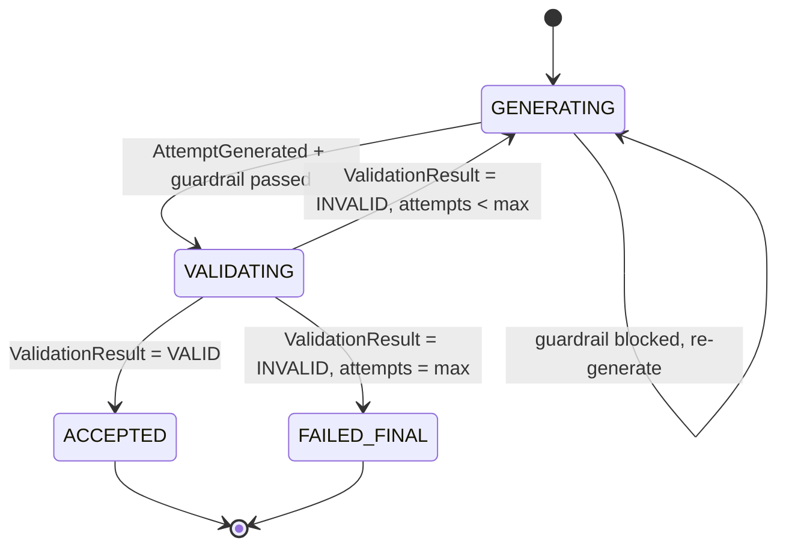
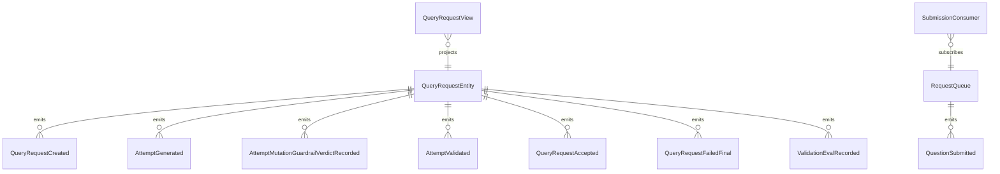

# PLAN — sql-gen-validator-loop

Architectural sketch consumed by `/akka:plan` (or skipped if `/akka:specify` covers it). Diagrams are rendered on the generated system's Architecture tab.

---

## Component graph

## Interaction sequence — J1 (convergence on attempt 2)

## State machine — `QueryRequestEntity`

## Entity model

## Component table — Java file targets

| Component | Path (generated) |
|---|---|
| `GeneratorAgent` | `application/GeneratorAgent.java` |
| `ValidatorAgent` | `application/ValidatorAgent.java` |
| `SqlTasks` | `application/SqlTasks.java` |
| `SqlWorkflow` | `application/SqlWorkflow.java` |
| `QueryRequestEntity` | `application/QueryRequestEntity.java` (state in `domain/QueryRequest.java`, events in `domain/QueryRequestEvent.java`) |
| `RequestQueue` | `application/RequestQueue.java` |
| `QueryRequestView` | `application/QueryRequestView.java` |
| `SubmissionConsumer` | `application/SubmissionConsumer.java` |
| `RequestSimulator` | `application/RequestSimulator.java` |
| `EvalSampler` | `application/EvalSampler.java` |
| `SqlEndpoint` | `api/SqlEndpoint.java` |
| `AppEndpoint` | `api/AppEndpoint.java` |
| `MockModelProvider` (option (a) only) | `application/MockModelProvider.java` |
| Bootstrap | `Bootstrap.java` |

## Concurrency notes

- **Workflow step timeouts:** `generateStep` and `validateStep` each carry `stepTimeout(Duration.ofSeconds(60))`. The default 5-second timeout never applies to agent-calling steps (Lesson 4).
- **Default step recovery:** `defaultStepRecovery(maxRetries(2).failoverTo(failStep))` — the workflow degrades to `FAILED_FINAL` on irrecoverable agent failure rather than hanging.
- **Idempotency:** `SqlEndpoint.submit` uses `(question, schemaName, requestedBy)` over a 10 s window as the dedup key.
- **EvalSampler idempotency:** the sampler keys its `recordEval` calls on `(requestId, attemptNumber)` so a tick that fires twice for the same attempt is a no-op on the entity side.
- **maxAttempts ceiling:** read from `sql-gen.workflow.max-attempts` (default 4). The workflow checks the count BEFORE calling `generateStep` for the next iteration; it never recurses past the ceiling.
- **Saga semantics:** there is no external side-effect to compensate. The halt mechanism is achieved via `failStep`; it preserves the best query and every validation note on the entity.
- **Guardrail step:** `guardrailStep` is pure-function (no LLM call); it scans `query.sql()` for mutating keywords using a case-insensitive whole-word regex and either advances to `validateStep` or returns to `generateStep` with a structured feedback note. The structured feedback never becomes an LLM-generated note; it stays a deterministic `ValidationNotes` payload with a single bullet.
