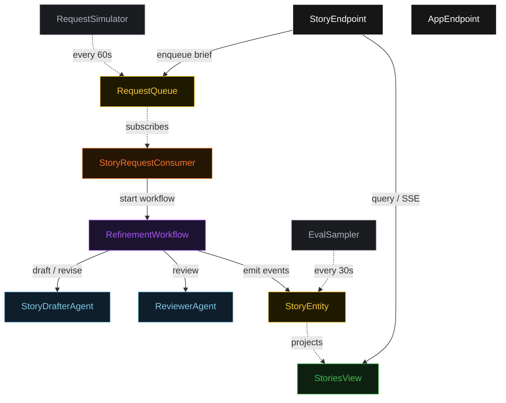
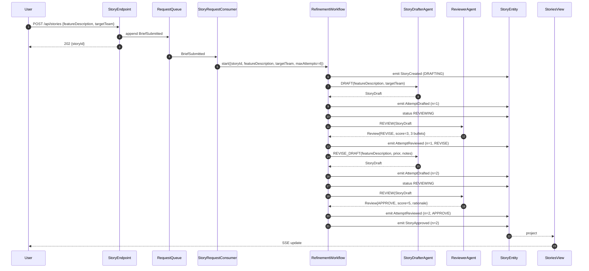
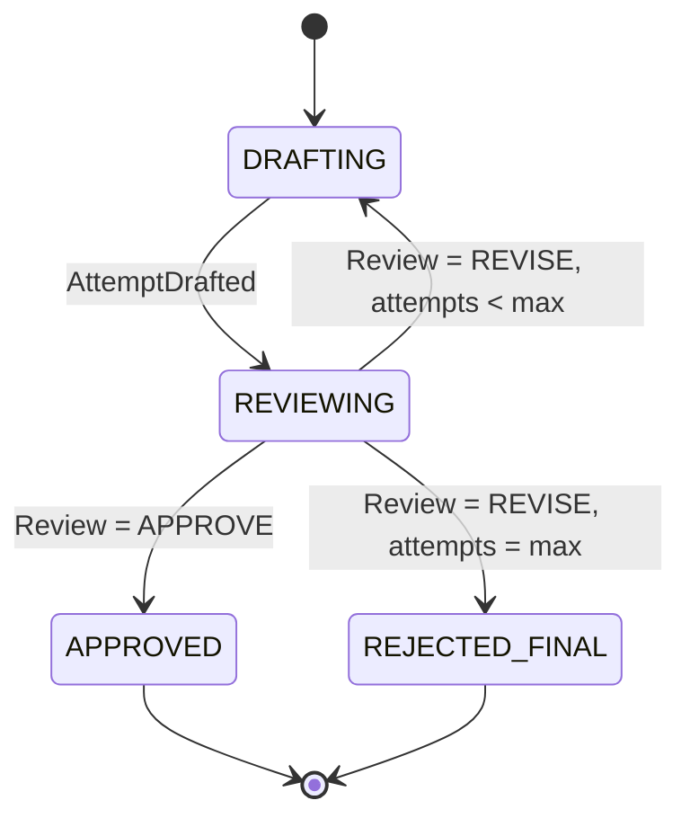
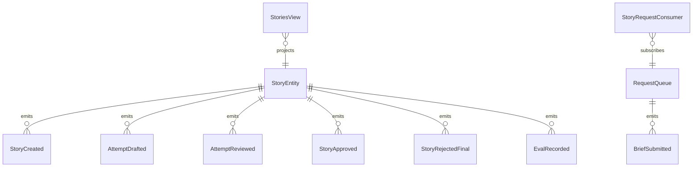

# PLAN — story-refiner

Architectural sketch consumed by `/akka:plan` (or skipped if `/akka:specify` covers it). Diagrams are rendered on the generated system's Architecture tab.

---

## Component graph

## Interaction sequence — J1 (convergence on attempt 2)

## State machine — `StoryEntity`

## Entity model

## Component table — Java file targets

| Component | Path (generated) |
|---|---|
| `StoryDrafterAgent` | `application/StoryDrafterAgent.java` |
| `ReviewerAgent` | `application/ReviewerAgent.java` |
| `StoryTasks` | `application/StoryTasks.java` |
| `RefinementWorkflow` | `application/RefinementWorkflow.java` |
| `StoryEntity` | `application/StoryEntity.java` (state in `domain/Story.java`, events in `domain/StoryEvent.java`) |
| `RequestQueue` | `application/RequestQueue.java` |
| `StoriesView` | `application/StoriesView.java` |
| `StoryRequestConsumer` | `application/StoryRequestConsumer.java` |
| `RequestSimulator` | `application/RequestSimulator.java` |
| `EvalSampler` | `application/EvalSampler.java` |
| `StoryEndpoint` | `api/StoryEndpoint.java` |
| `AppEndpoint` | `api/AppEndpoint.java` |
| `MockModelProvider` (option (a) only) | `application/MockModelProvider.java` |
| Bootstrap | `Bootstrap.java` |

## Concurrency notes

- **Workflow step timeouts:** `draftStep` and `reviewStep` each carry `stepTimeout(Duration.ofSeconds(60))`. The default 5-second timeout never applies to agent-calling steps (Lesson 4).
- **Default step recovery:** `defaultStepRecovery(maxRetries(2).failoverTo(rejectStep))` — the workflow degrades to `REJECTED_FINAL` on irrecoverable agent failure rather than hanging.
- **Idempotency:** `StoryEndpoint.submit` uses `(featureDescription, requestedBy)` over a 10 s window as the dedup key.
- **EvalSampler idempotency:** the sampler keys its `recordEval` calls on `(storyId, attemptNumber)` so a tick that fires twice for the same attempt is a no-op on the entity side.
- **maxAttempts ceiling:** read from `story-refiner.refinement.max-attempts` (default 4). The workflow checks the count BEFORE calling `draftStep` for the next iteration; it never recurses past the ceiling.
- **Saga semantics:** there is no external side-effect to compensate. The halt on ceiling exhaustion preserves the best draft and every review on the entity.
- **No guardrail step:** unlike content-generation loops, story refinement has no deterministic format ceiling to enforce before the reviewer runs. The reviewer's rubric covers all quality dimensions; adding a separate pre-review guardrail is an extension point, not a baseline requirement.
