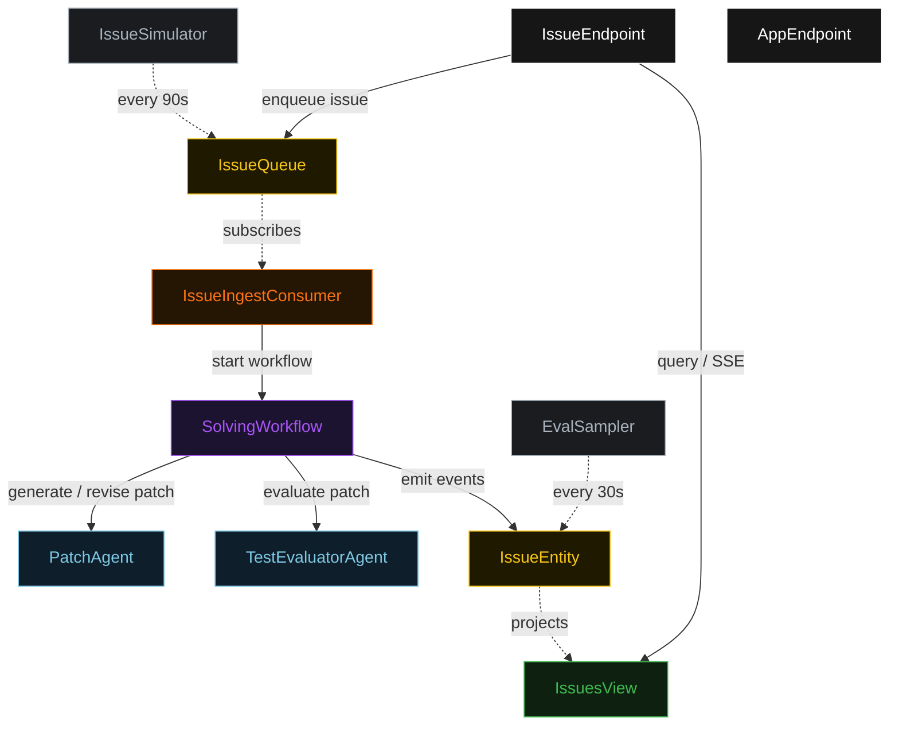
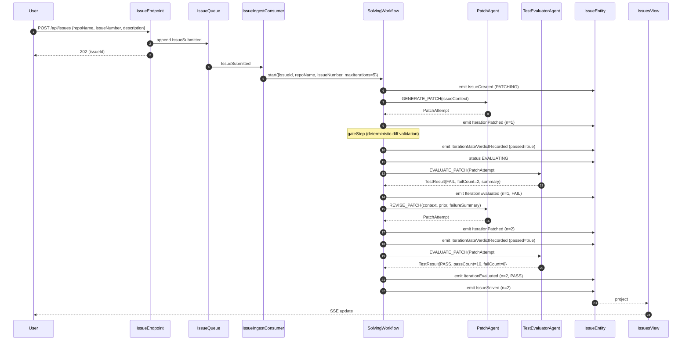
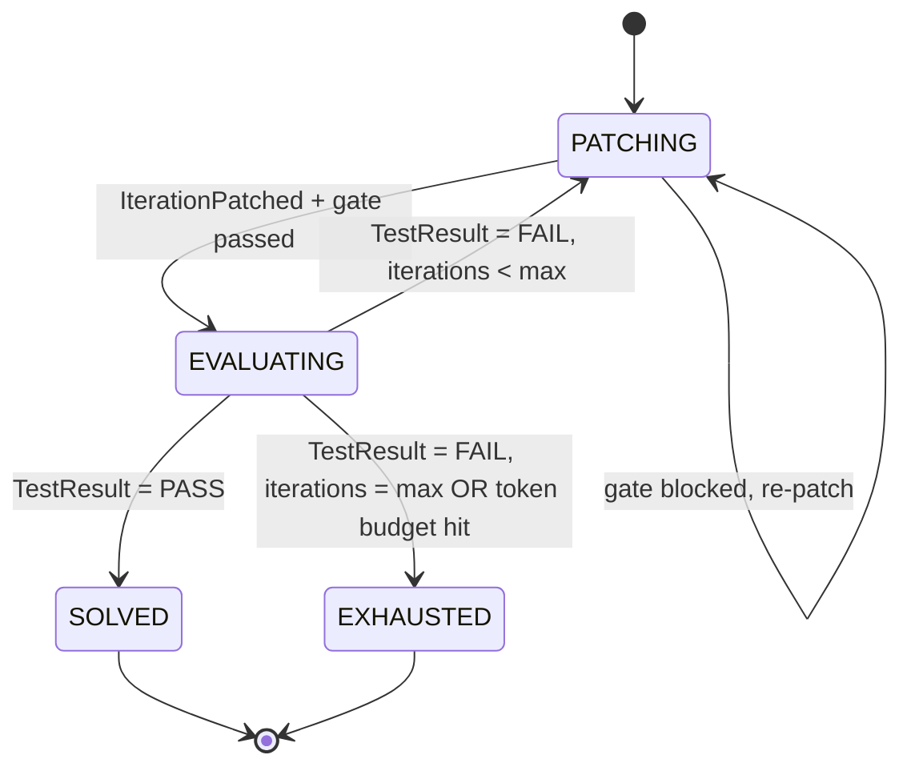
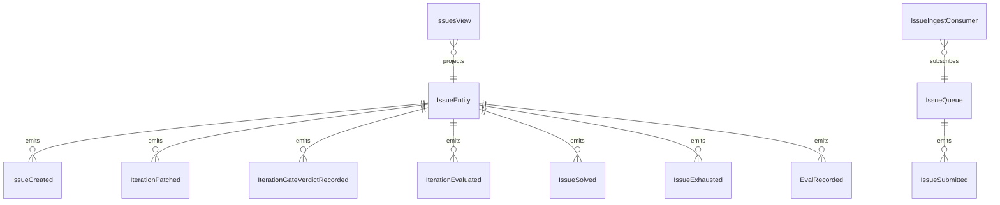

# PLAN — swebench-evaluator-loop

Architectural sketch consumed by `/akka:plan` (or skipped if `/akka:specify` covers it). Diagrams are rendered on the generated system's Architecture tab.

---

## Component graph

## Interaction sequence — J1 (convergence on iteration 2)

## State machine — `IssueEntity`

## Entity model

## Component table — Java file targets

| Component | Path (generated) |
|---|---|
| `PatchAgent` | `application/PatchAgent.java` |
| `TestEvaluatorAgent` | `application/TestEvaluatorAgent.java` |
| `CodingTasks` | `application/CodingTasks.java` |
| `SolvingWorkflow` | `application/SolvingWorkflow.java` |
| `IssueEntity` | `application/IssueEntity.java` (state in `domain/Issue.java`, events in `domain/IssueEvent.java`) |
| `IssueQueue` | `application/IssueQueue.java` |
| `IssuesView` | `application/IssuesView.java` |
| `IssueIngestConsumer` | `application/IssueIngestConsumer.java` |
| `IssueSimulator` | `application/IssueSimulator.java` |
| `EvalSampler` | `application/EvalSampler.java` |
| `IssueEndpoint` | `api/IssueEndpoint.java` |
| `AppEndpoint` | `api/AppEndpoint.java` |
| `MockModelProvider` (option (a) only) | `application/MockModelProvider.java` |
| Bootstrap | `Bootstrap.java` |

## Concurrency notes

- **Workflow step timeouts:** `patchStep` and `evaluateStep` each carry `stepTimeout(Duration.ofSeconds(120))`. The default 5-second timeout never applies to agent-calling steps (Lesson 4). Patch generation and test evaluation both involve multi-step reasoning that regularly exceeds the default.
- **Default step recovery:** `defaultStepRecovery(maxRetries(2).failoverTo(exhaustStep))` — the workflow degrades to `EXHAUSTED` on irrecoverable agent failure rather than hanging.
- **Idempotency:** `IssueEndpoint.submit` deduplicates on `(repoName, issueNumber)` over a 30 s window.
- **EvalSampler idempotency:** the sampler keys its `recordEval` calls on `(issueId, iterationNumber)` so a tick that fires twice for the same iteration is a no-op on the entity side.
- **maxIterations ceiling:** read from `swebench.solving.max-iterations` (default 5). The workflow checks the count AND the token budget BEFORE calling `patchStep` for the next iteration; it never recurses past either ceiling.
- **Token budget:** `tokenBudget` (default 50000) tracks cumulative token usage across agent calls in the workflow's local state. The `exhaustStep` is triggered if either ceiling is reached.
- **Gate step:** `gateStep` is pure-function (no LLM call); it validates the unified diff structure and checks `lineCount <= swebench.solving.max-diff-lines`. A malformed patch produces a structured `TestFailureSummary` with a single `errorSnippets` entry; this is fed to `patchStep` as the prior failure summary. Gate-blocked iterations still count toward `maxIterations`.
- **Saga semantics:** there are no external side-effects to compensate. The halt mechanism (`HT1`) is the only "compensation"; it preserves the best patch and every test result on the entity.
