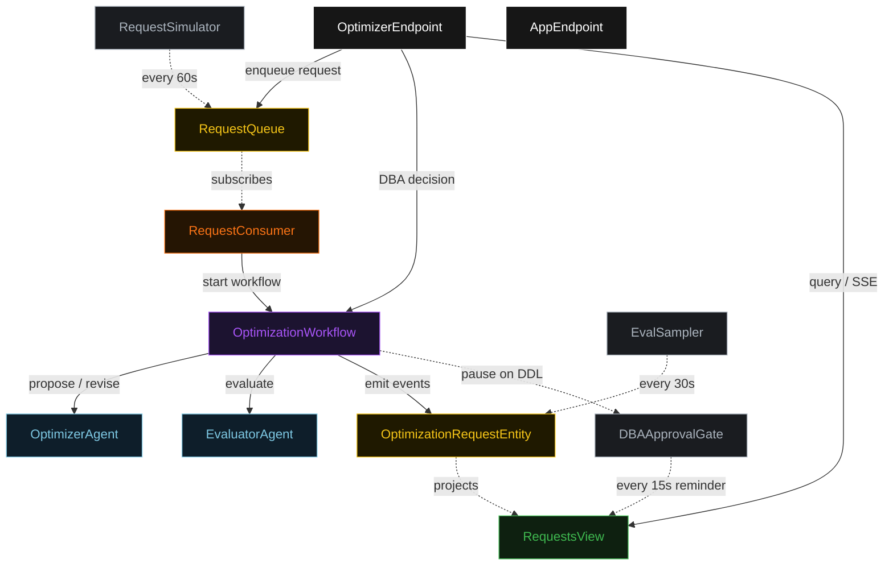
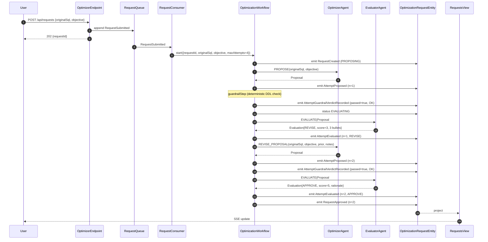
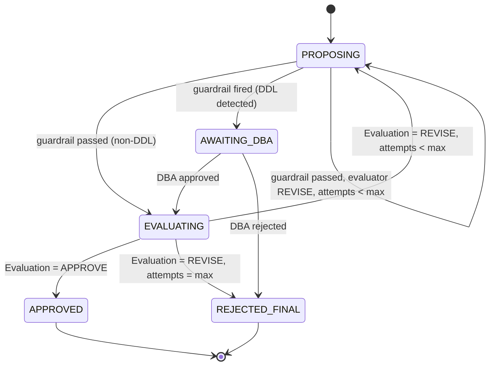
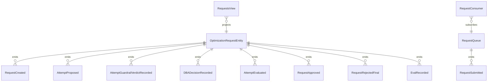

# PLAN — warehouse-optimizer

Architectural sketch consumed by `/akka:plan` (or skipped if `/akka:specify` covers it). Diagrams are rendered on the generated system's Architecture tab.

---

## Component graph

## Interaction sequence — J1 (convergence on attempt 2)

## State machine — `OptimizationRequestEntity`

## Entity model

## Component table — Java file targets

| Component | Path (generated) |
|---|---|
| `OptimizerAgent` | `application/OptimizerAgent.java` |
| `EvaluatorAgent` | `application/EvaluatorAgent.java` |
| `WarehouseTasks` | `application/WarehouseTasks.java` |
| `OptimizationWorkflow` | `application/OptimizationWorkflow.java` |
| `OptimizationRequestEntity` | `application/OptimizationRequestEntity.java` (state in `domain/OptimizationRequest.java`, events in `domain/RequestEvent.java`) |
| `RequestQueue` | `application/RequestQueue.java` |
| `RequestsView` | `application/RequestsView.java` |
| `RequestConsumer` | `application/RequestConsumer.java` |
| `RequestSimulator` | `application/RequestSimulator.java` |
| `EvalSampler` | `application/EvalSampler.java` |
| `DBAApprovalGate` | `application/DBAApprovalGate.java` |
| `OptimizerEndpoint` | `api/OptimizerEndpoint.java` |
| `AppEndpoint` | `api/AppEndpoint.java` |
| `MockModelProvider` (option (a) only) | `application/MockModelProvider.java` |
| Bootstrap | `Bootstrap.java` |

## Concurrency notes

- **Workflow step timeouts:** `proposeStep` and `evaluateStep` each carry `stepTimeout(Duration.ofSeconds(60))`. The default 5-second timeout never applies to agent-calling steps (Lesson 4).
- **Default step recovery:** `defaultStepRecovery(maxRetries(2).failoverTo(rejectStep))` — the workflow degrades to `REJECTED_FINAL` on irrecoverable agent failure rather than hanging.
- **DBA gate pause:** `dbaGateStep` has no LLM call and no step timeout — it awaits an external signal indefinitely. The `DBAApprovalGate` TimedAction logs a reminder every 15 s for requests that have been in `AWAITING_DBA` for more than 5 minutes; it does not auto-approve or auto-reject.
- **Idempotency:** `OptimizerEndpoint.submit` uses `(originalSql, submittedBy)` over a 10 s window as the dedup key. `EvalSampler` deduplicates on `(requestId, attemptNumber)` so a tick that fires twice for the same attempt is a no-op on the entity side.
- **maxAttempts ceiling:** read from `warehouse-optimizer.optimization.max-attempts` (default 4). The workflow checks the count BEFORE calling `proposeStep` for the next iteration; it never recurses past the ceiling.
- **Guardrail step:** `guardrailStep` is pure-function (no LLM call); it inspects the proposal text for DDL keywords using a case-insensitive regex and either advances to `evaluateStep` (non-DDL) or transitions to `dbaGateStep` (DDL detected).
- **Saga semantics:** there is no external warehouse execution; proposals are recommendations only. The halt mechanism (`HT1`) and DBA-rejection path are the only "compensations"; both preserve every proposal and evaluation on the entity.
