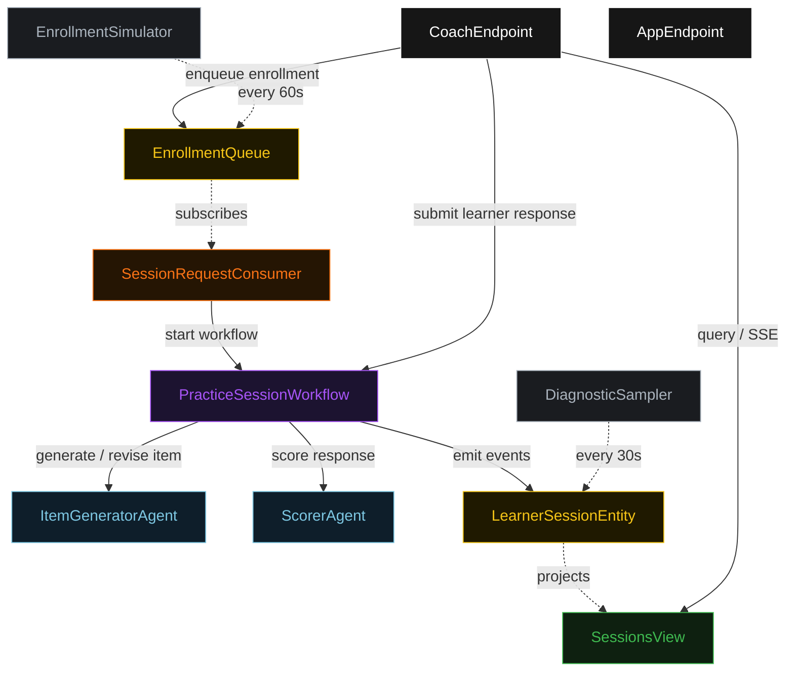
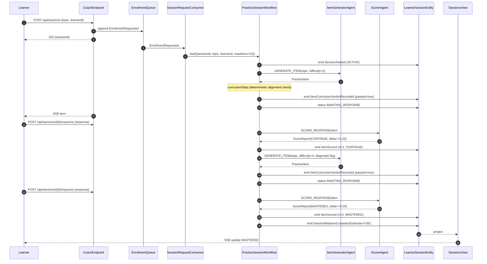
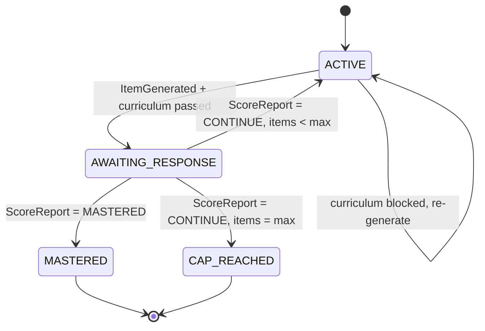
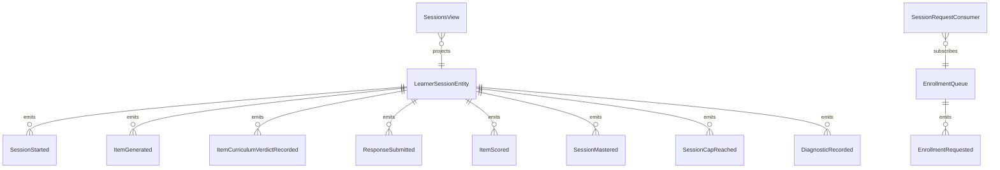

# PLAN — adaptive-practice-coach

Architectural sketch consumed by `/akka:plan` (or skipped if `/akka:specify` covers it). Diagrams are rendered on the generated system's Architecture tab.

---

## Component graph

## Interaction sequence — J1 (mastery on item 3)

## State machine — `LearnerSessionEntity`

## Entity model

## Component table — Java file targets

| Component | Path (generated) |
|---|---|
| `ItemGeneratorAgent` | `application/ItemGeneratorAgent.java` |
| `ScorerAgent` | `application/ScorerAgent.java` |
| `CoachTasks` | `application/CoachTasks.java` |
| `PracticeSessionWorkflow` | `application/PracticeSessionWorkflow.java` |
| `LearnerSessionEntity` | `application/LearnerSessionEntity.java` (state in `domain/LearnerSession.java`, events in `domain/SessionEvent.java`) |
| `EnrollmentQueue` | `application/EnrollmentQueue.java` |
| `SessionsView` | `application/SessionsView.java` |
| `SessionRequestConsumer` | `application/SessionRequestConsumer.java` |
| `EnrollmentSimulator` | `application/EnrollmentSimulator.java` |
| `DiagnosticSampler` | `application/DiagnosticSampler.java` |
| `CoachEndpoint` | `api/CoachEndpoint.java` |
| `AppEndpoint` | `api/AppEndpoint.java` |
| `MockModelProvider` (option (a) only) | `application/MockModelProvider.java` |
| Bootstrap | `Bootstrap.java` |

## Concurrency notes

- **Workflow step timeouts:** `generateStep` and `scoreStep` each carry `stepTimeout(Duration.ofSeconds(60))`. `awaitResponseStep` carries `stepTimeout(Duration.ofSeconds(300))` — the learner has 5 minutes to respond before the step re-parks itself. The default 5-second timeout never applies to agent-calling or wait steps (Lesson 4).
- **Default step recovery:** `defaultStepRecovery(maxRetries(2).failoverTo(capStep))` — the workflow ends with `CAP_REACHED` on irrecoverable agent failure rather than hanging.
- **Idempotency:** `CoachEndpoint.startSession` uses `(topic, learnerId)` over a 10 s window as the dedup key. `DiagnosticSampler` keys its `recordDiagnostic` calls on `(sessionId, itemNumber)` so a tick that fires twice for the same item is a no-op on the entity.
- **maxItems ceiling:** read from `adaptive-practice-coach.session.max-items` (default 10). The workflow checks the count BEFORE generating the next item; it never recurses past the ceiling.
- **Mastery threshold:** read from `adaptive-practice-coach.session.mastery-threshold` (default 0.8). The workflow compares `masteryEstimate` after each `ScoreReport`; on first crossing, it transitions to `masterStep` regardless of how many items remain.
- **Difficulty adaptation:** after each scored item, the workflow reads `ScoreReport.correct` and adjusts `currentDifficulty`: correct → increment by 1 (capped at 5); incorrect → decrement by 1 (floor at 1). The next `generateStep` receives the updated difficulty so the loop calibrates to the learner's demonstrated level.
- **Curriculum step:** `curriculumStep` is pure-function (no LLM call); it checks that `item.topic` textually matches the session topic and that `question` and `answerKey` are non-empty strings. On FAIL, emits `ItemCurriculumVerdictRecorded` with `passed = false` and transitions back to `generateStep` with a fixed feedback note. The replacement item still counts toward `maxItems`.
