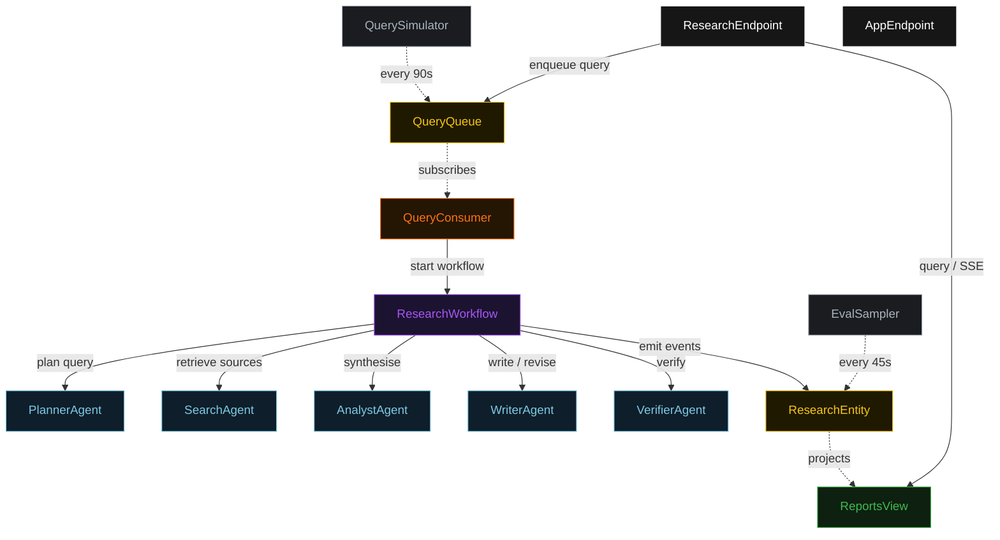
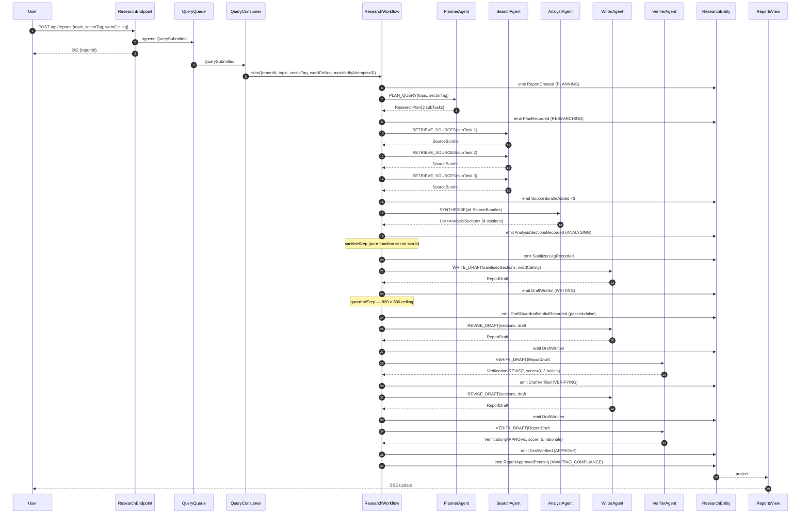
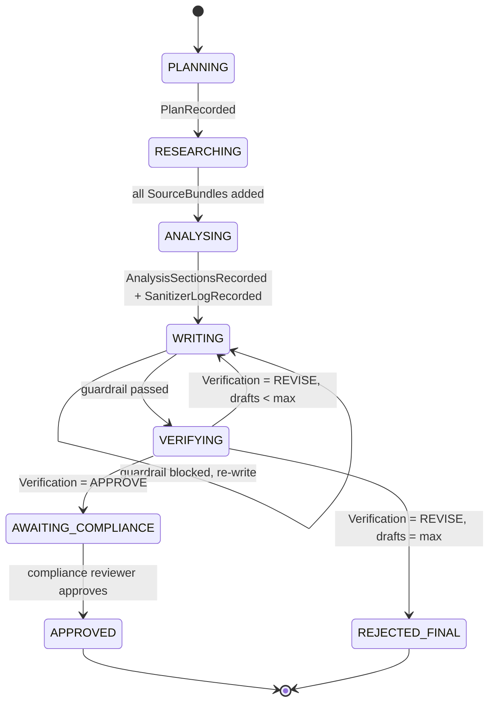
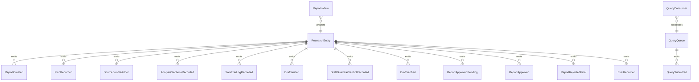

# PLAN — financial-research-pipeline

Architectural sketch consumed by `/akka:plan` (or skipped if `/akka:specify` covers it). Diagrams are rendered on the generated system's Architecture tab.

---

## Component graph

## Interaction sequence — J1 (convergence on draft 2)

## State machine — `ResearchEntity`

## Entity model

## Component table — Java file targets

| Component | Path (generated) |
|---|---|
| `PlannerAgent` | `application/PlannerAgent.java` |
| `SearchAgent` | `application/SearchAgent.java` |
| `AnalystAgent` | `application/AnalystAgent.java` |
| `WriterAgent` | `application/WriterAgent.java` |
| `VerifierAgent` | `application/VerifierAgent.java` |
| `ResearchTasks` | `application/ResearchTasks.java` |
| `ResearchWorkflow` | `application/ResearchWorkflow.java` |
| `ResearchEntity` | `application/ResearchEntity.java` (state in `domain/Report.java`, events in `domain/ReportEvent.java`) |
| `QueryQueue` | `application/QueryQueue.java` |
| `ReportsView` | `application/ReportsView.java` |
| `QueryConsumer` | `application/QueryConsumer.java` |
| `QuerySimulator` | `application/QuerySimulator.java` |
| `EvalSampler` | `application/EvalSampler.java` |
| `ResearchEndpoint` | `api/ResearchEndpoint.java` |
| `AppEndpoint` | `api/AppEndpoint.java` |
| `MockModelProvider` (option (a) only) | `application/MockModelProvider.java` |
| Bootstrap | `Bootstrap.java` |

## Concurrency notes

- **Workflow step timeouts:** all agent-calling steps carry `stepTimeout(Duration.ofSeconds(90))`. Sanitiser and guardrail steps use `stepTimeout(Duration.ofSeconds(5))`. The default 5-second timeout never applies to agent-calling steps (Lesson 4).
- **Search fan-out:** sub-task searches run sequentially in the default blueprint. A deployer can convert these to parallel workflow branches; the sequential version is safer for rate-limited model providers.
- **Default step recovery:** `defaultStepRecovery(maxRetries(2).failoverTo(rejectStep))` — any unrecoverable agent failure ends in `REJECTED_FINAL`.
- **Compliance parking:** `complianceStep` parks the workflow. The workflow does not consume a thread while parked; it resumes on the reviewer's HTTP call.
- **Idempotency:** `ResearchEndpoint.submit` deduplicates on `(topic, requestedBy)` over a 10 s window. `EvalSampler` deduplicates on `(reportId, draftNumber)`.
- **Guardrail step:** pure-function; checks word count; over-ceiling drafts produce `OVER_WORD_CEILING` and loop back to `writeStep` with a structured `VerificationNotes` payload.
- **Sanitiser step:** pure-function; applies regex list from config; the empty default list is a no-op. The log is always emitted even when `changed = false`.
