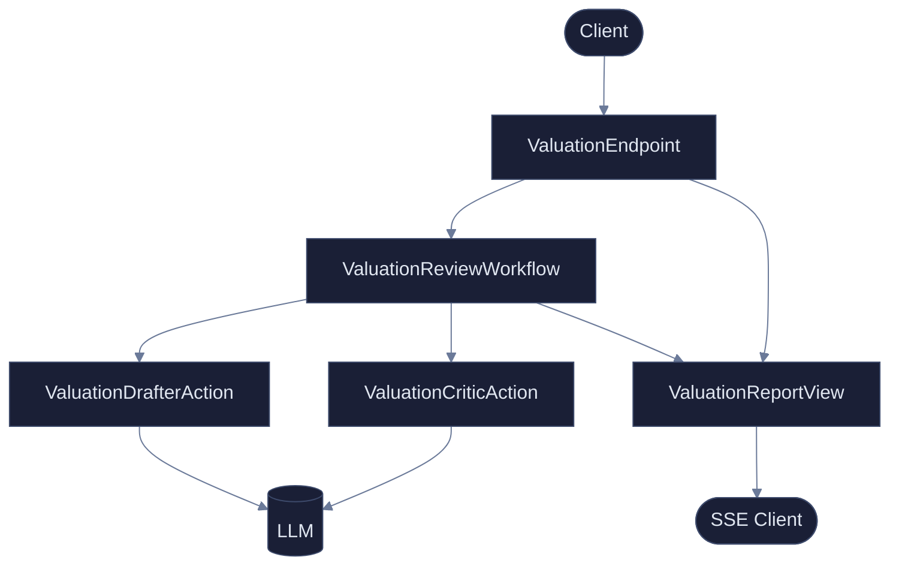
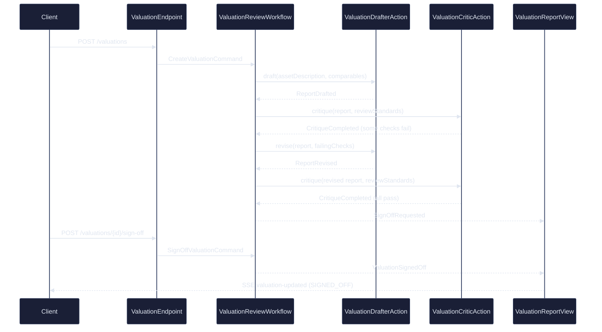
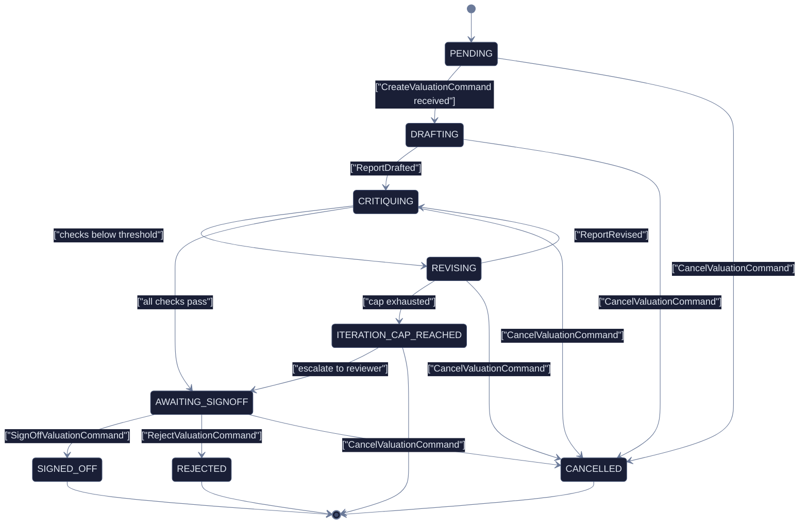
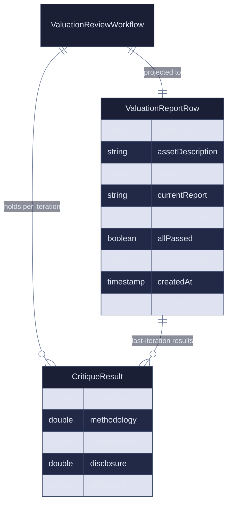

# Plan: Valuation Reviewer

> **Akka theme** — all Mermaid diagrams use `%%{init: {"theme": "base", "themeVariables": {"primaryColor": "#1A1F36", "primaryTextColor": "#E0E6F0", "primaryBorderColor": "#3D4A6B", "lineColor": "#6B7A99", "secondaryColor": "#252B45", "tertiaryColor": "#1A1F36", "edgeLabelBackground": "#1A1F36", "clusterBkg": "#252B45", "clusterBorder": "#3D4A6B", "titleColor": "#E0E6F0"}}}%%`
>
> State-machine labels that contain spaces or special characters are wrapped in `["label text"]` per Lesson 24.

---

## 1. Component graph

---

## 2. Sequence — happy-path iteration

---

## 3. State machine — `ValuationReviewWorkflow`

---

## 4. Entity–Relationship

