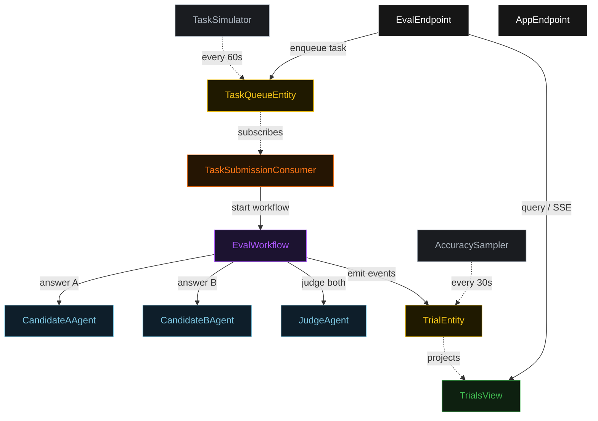
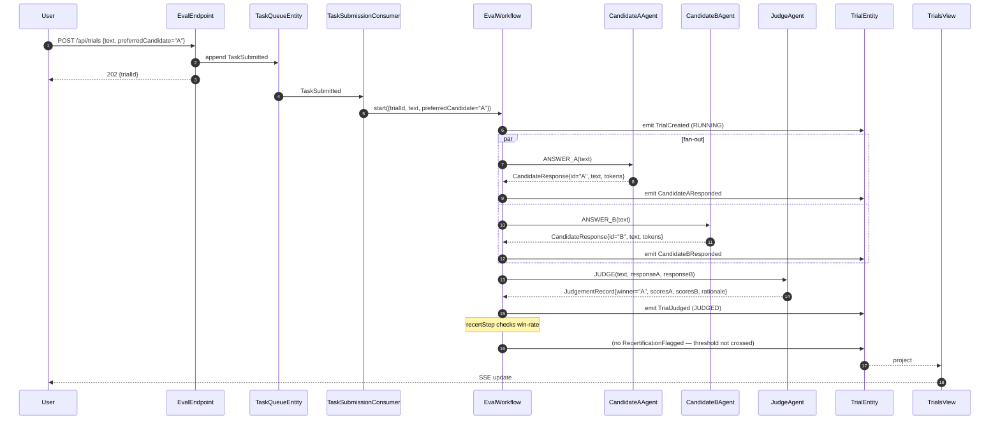
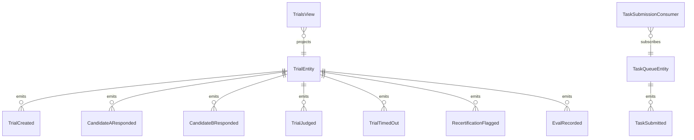

# PLAN — ab-model-eval

Architectural sketch consumed by `/akka:plan` (or skipped if `/akka:specify` covers it). Diagrams are rendered on the generated system's Architecture tab.

---

## Component graph

## Interaction sequence — J1 (normal trial, A wins)

## State machine — `TrialEntity`

```mermaid
stateDiagram-v2
  [*] --> RUNNING
  RUNNING --> JUDGED: both responses received + JudgeAgent returns verdict
  RUNNING --> TIMED_OUT: candidateAStep or candidateBStep times out
  JUDGED --> JUDGED: RecertificationFlagged (flag set; status unchanged)
  JUDGED --> [*]
  TIMED_OUT --> [*]
```

## Entity model

## Component table — Java file targets

| Component | Path (generated) |
|---|---|
| `CandidateAAgent` | `application/CandidateAAgent.java` |
| `CandidateBAgent` | `application/CandidateBAgent.java` |
| `JudgeAgent` | `application/JudgeAgent.java` |
| `EvalTasks` | `application/EvalTasks.java` |
| `EvalWorkflow` | `application/EvalWorkflow.java` |
| `TrialEntity` | `application/TrialEntity.java` (state in `domain/Trial.java`, events in `domain/TrialEvent.java`) |
| `TaskQueueEntity` | `application/TaskQueueEntity.java` |
| `TrialsView` | `application/TrialsView.java` |
| `TaskSubmissionConsumer` | `application/TaskSubmissionConsumer.java` |
| `TaskSimulator` | `application/TaskSimulator.java` |
| `AccuracySampler` | `application/AccuracySampler.java` |
| `EvalEndpoint` | `api/EvalEndpoint.java` |
| `AppEndpoint` | `api/AppEndpoint.java` |
| `MockModelProvider` (option (a) only) | `application/MockModelProvider.java` |
| Bootstrap | `Bootstrap.java` |

## Concurrency notes

- **Fan-out parallelism:** `candidateAStep` and `candidateBStep` run in parallel branches of `EvalWorkflow`. Each carries `stepTimeout(Duration.ofSeconds(60))`; the default 5-second timeout never applies (Lesson 4).
- **Default step recovery:** `defaultStepRecovery(maxRetries(1).failoverTo(timeoutStep))` — any unrecoverable agent failure ends in `TIMED_OUT`, not in a hung workflow.
- **Idempotency:** `EvalEndpoint.submit` deduplicates on `(text, submittedBy)` over a 10-second window.
- **AccuracySampler idempotency:** the sampler keys its `recordEval` calls on `trialId` so a tick that fires twice for the same trial is a no-op on the entity side.
- **Recertification evaluation:** `recertStep` is a pure-function step that reads the last `window-trials` TrialRow records from `TrialsView` in memory; it does not call any agent and is effectively instant.
- **Win-rate computation:** computed on the view side (TrialRow carries `winRateA` and `winRateB`) over all `JUDGED` trials. The workflow's `recertStep` reads these computed fields; it does not aggregate from scratch.
- **Promotion gate:** `POST /api/trials/promote` checks the `recertificationRequired` flag on any trial in the last `window-trials` window. The flag clears when `POST /api/trials/recertify` is called, which calls `TrialEntity.flagRecertification(false)` on all flagged trials and resets the view-side computed field.
