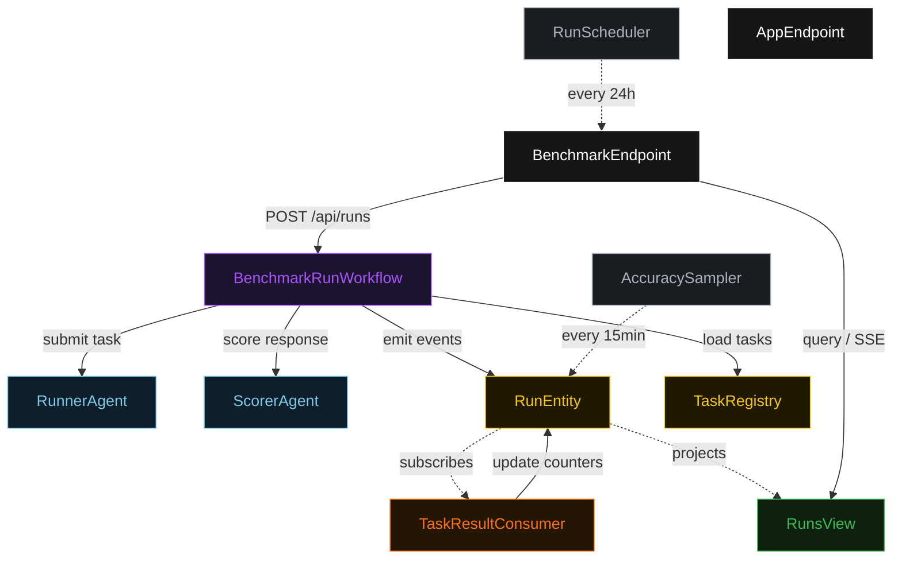
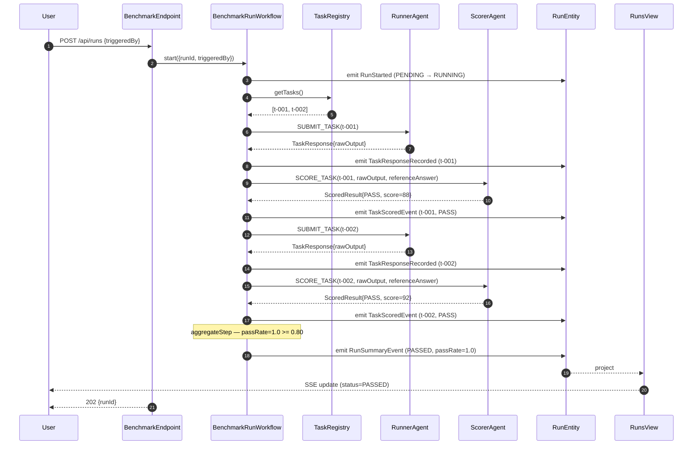
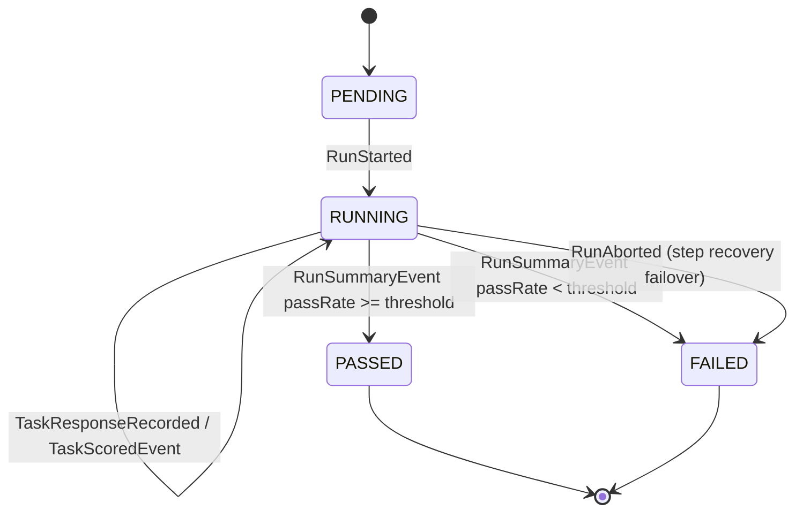
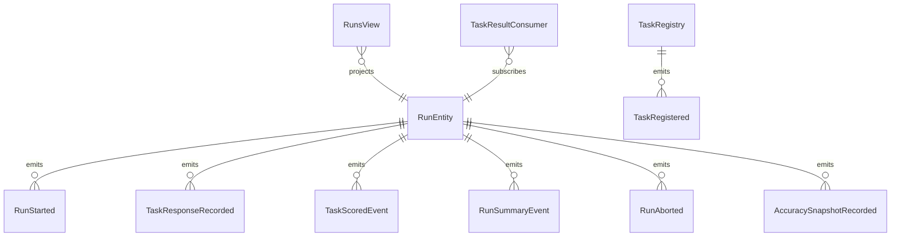

# PLAN — agent-benchmark-harness

Architectural sketch consumed by `/akka:plan` (or skipped if `/akka:specify` covers it). Diagrams are rendered on the generated system's Architecture tab.

---

## Component graph

## Interaction sequence — J1 (two-task passing run)

## State machine — `RunEntity`

## Entity model

## Component table — Java file targets

| Component | Path (generated) |
|---|---|
| `RunnerAgent` | `application/RunnerAgent.java` |
| `ScorerAgent` | `application/ScorerAgent.java` |
| `BenchmarkTasks` | `application/BenchmarkTasks.java` |
| `BenchmarkRunWorkflow` | `application/BenchmarkRunWorkflow.java` |
| `RunEntity` | `application/RunEntity.java` (state in `domain/BenchmarkRun.java`, events in `domain/RunEvent.java`) |
| `TaskRegistry` | `application/TaskRegistry.java` |
| `RunsView` | `application/RunsView.java` |
| `TaskResultConsumer` | `application/TaskResultConsumer.java` |
| `RunScheduler` | `application/RunScheduler.java` |
| `AccuracySampler` | `application/AccuracySampler.java` |
| `BenchmarkEndpoint` | `api/BenchmarkEndpoint.java` |
| `AppEndpoint` | `api/AppEndpoint.java` |
| `MockModelProvider` (option (a) only) | `application/MockModelProvider.java` |
| Bootstrap | `Bootstrap.java` |

## Concurrency notes

- **Workflow step timeouts:** `runStep` and `scoreStep` each carry `stepTimeout(Duration.ofSeconds(90))`. The default 5-second timeout never applies to agent-calling steps (Lesson 4).
- **Default step recovery:** `defaultStepRecovery(maxRetries(2).failoverTo(failStep))` — the workflow degrades to `FAILED` on irrecoverable agent failure rather than hanging, with a structured `failureReason` naming the failing task and the error type.
- **Fan-out ordering:** The workflow processes tasks sequentially (one `runStep`/`scoreStep` pair per task) to stay within a single workflow thread. Parallel fan-out is a known extension point but is out of scope for the default blueprint.
- **AccuracySampler idempotency:** the sampler keys its `recordAccuracySnapshot` calls on `runId` so a tick that fires twice for the same completed run is a no-op on the entity side.
- **TaskResultConsumer idempotency:** the consumer keys counter updates on `(runId, taskId)` so a redelivered `TaskScoredEvent` does not double-count a score.
- **CI gate semantics:** `GET /api/ci-gate` reads only completed runs (PASSED or FAILED). If no completed run exists it returns `gated=true` with a `reason: "no completed run"` field. This is a conservative default — absence of evidence is treated as a failure.
- **Threshold configuration:** `benchmark.passing-threshold` (default 0.80) is read once at workflow start and stored in `RunEntity` state, so a config change mid-run does not affect an in-flight run.
