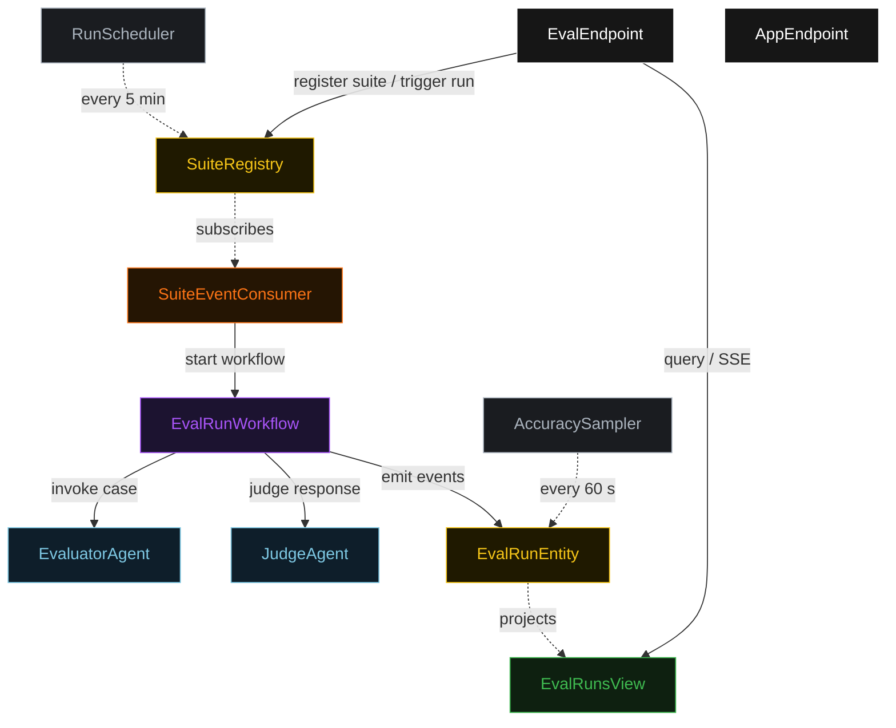
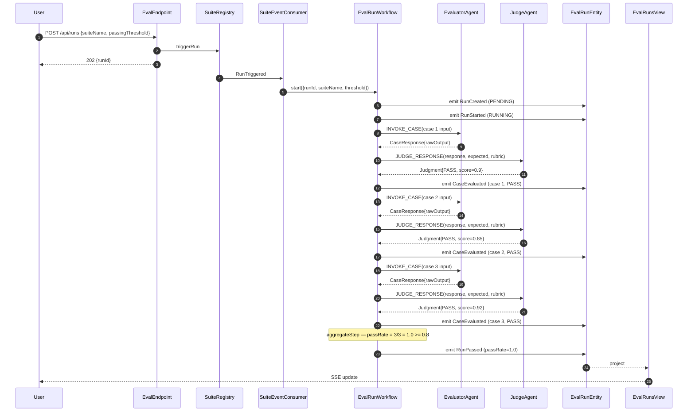
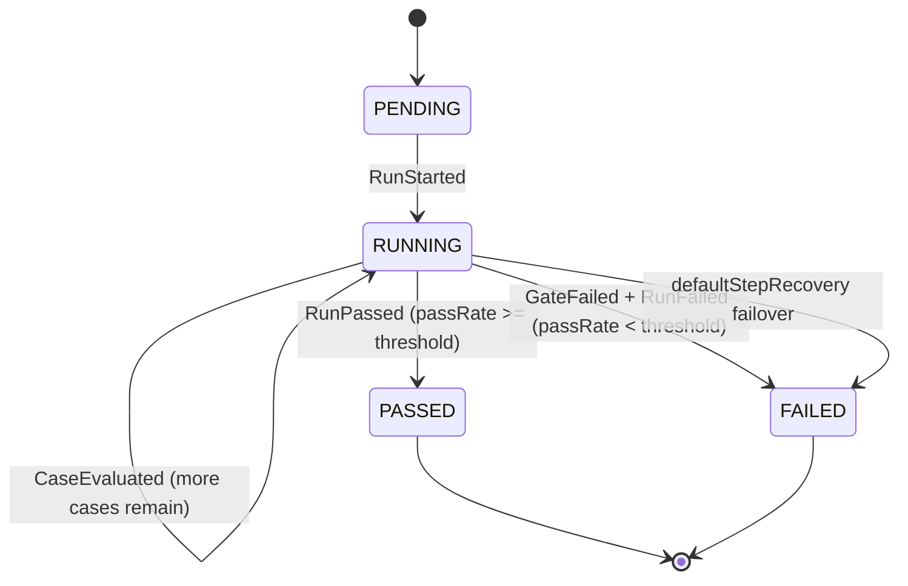
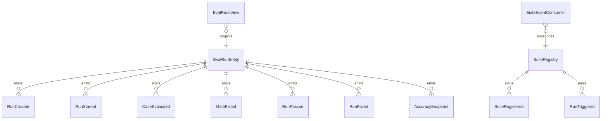

# PLAN — agent-eval-harness

Architectural sketch consumed by `/akka:plan` (or skipped if `/akka:specify` covers it). Diagrams are rendered on the generated system's Architecture tab.

---

## Component graph

## Interaction sequence — J1 (passing run, 3 cases)

## State machine — `EvalRunEntity`

## Entity model

## Component table — Java file targets

| Component | Path (generated) |
|---|---|
| `EvaluatorAgent` | `application/EvaluatorAgent.java` |
| `JudgeAgent` | `application/JudgeAgent.java` |
| `EvalTasks` | `application/EvalTasks.java` |
| `EvalRunWorkflow` | `application/EvalRunWorkflow.java` |
| `EvalRunEntity` | `application/EvalRunEntity.java` (state in `domain/EvalRun.java`, events in `domain/EvalRunEvent.java`) |
| `SuiteRegistry` | `application/SuiteRegistry.java` |
| `EvalRunsView` | `application/EvalRunsView.java` |
| `SuiteEventConsumer` | `application/SuiteEventConsumer.java` |
| `RunScheduler` | `application/RunScheduler.java` |
| `AccuracySampler` | `application/AccuracySampler.java` |
| `EvalEndpoint` | `api/EvalEndpoint.java` |
| `AppEndpoint` | `api/AppEndpoint.java` |
| `MockModelProvider` (option (a) only) | `application/MockModelProvider.java` |
| Bootstrap | `Bootstrap.java` |

## Concurrency notes

- **Workflow step timeouts:** `invokeStep` and `judgeStep` each carry `stepTimeout(Duration.ofSeconds(60))`. The default 5-second timeout never applies to agent-calling steps (Lesson 4).
- **Default step recovery:** `defaultStepRecovery(maxRetries(2).failoverTo(failStep))` — the workflow degrades to `FAILED` on irrecoverable agent failure rather than hanging.
- **Sequential case processing:** the workflow processes cases one at a time, writing a `CaseEvaluated` event before moving to the next case. This keeps the entity state consistent and lets the SSE stream reflect incremental progress.
- **AccuracySampler idempotency:** the sampler keys its `recordAccuracySnapshot` calls on `runId` so a tick that fires twice for the same completed run is a no-op on the entity side.
- **Aggregate step:** `aggregateStep` is pure-function (no LLM call); it counts `PASS` results from the accumulated `results` list and computes `passRate`. No external I/O.
- **Saga semantics:** there is no external side-effect to compensate. The CI gate (`G1`) is the only "compensation path"; it records a `GateFailed` event before transitioning to `FAILED` so the gate decision is always observable.
- **Suite isolation:** each run is keyed by `runId`; multiple concurrent runs on different suites do not share workflow or entity state.
