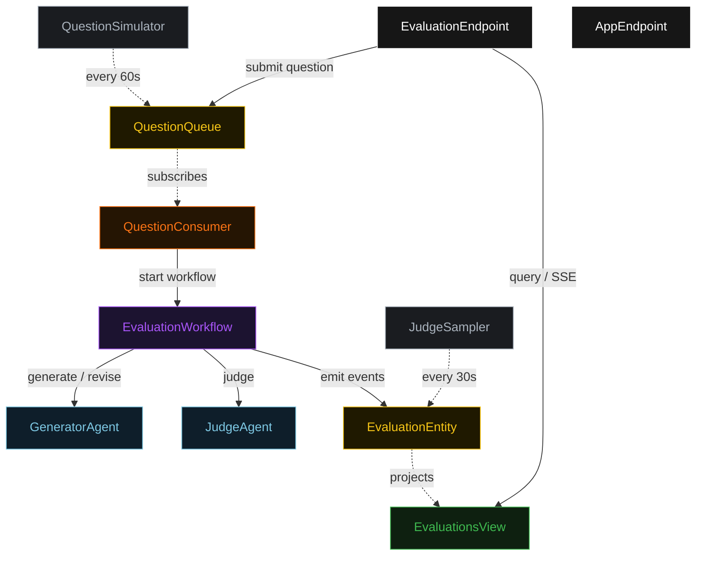
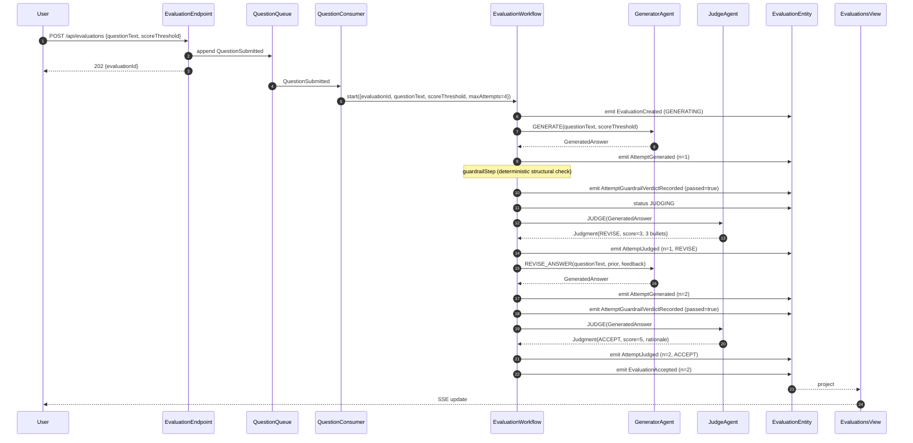
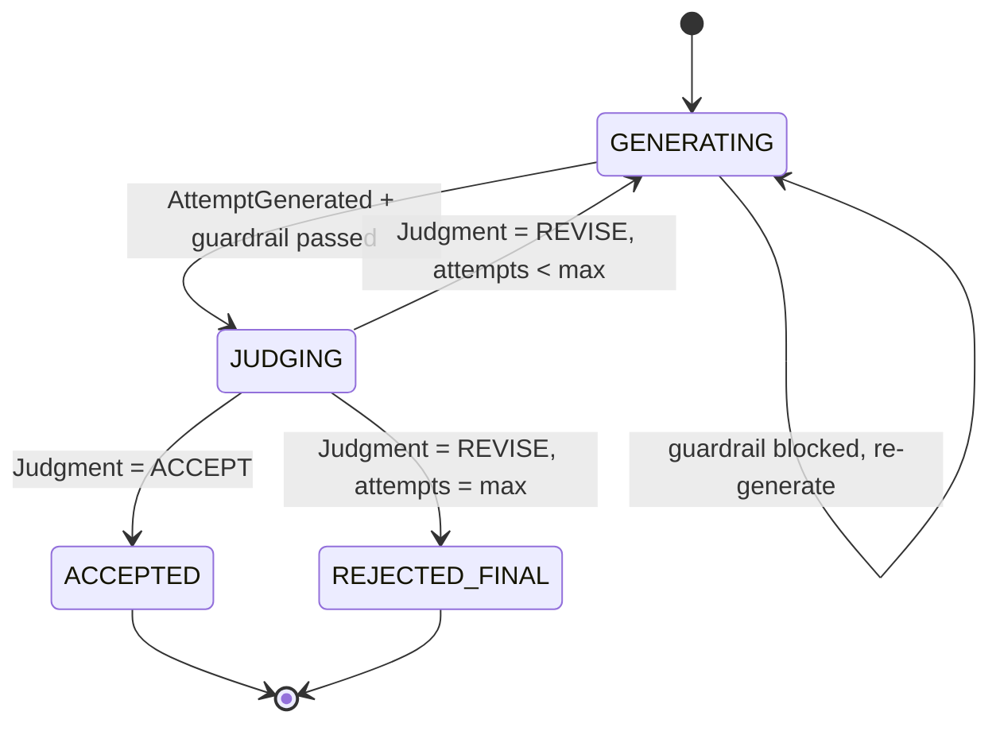
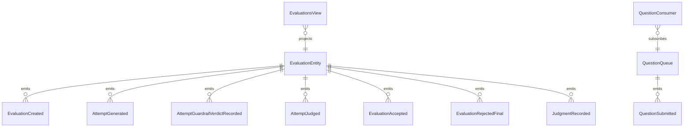

# PLAN — llm-judge-loop

Architectural sketch consumed by `/akka:plan` (or skipped if `/akka:specify` covers it). Diagrams are rendered on the generated system's Architecture tab.

---

## Component graph

## Interaction sequence — J1 (convergence on attempt 2)

## State machine — `EvaluationEntity`

## Entity model

## Component table — Java file targets

| Component | Path (generated) |
|---|---|
| `GeneratorAgent` | `application/GeneratorAgent.java` |
| `JudgeAgent` | `application/JudgeAgent.java` |
| `JudgeTasks` | `application/JudgeTasks.java` |
| `EvaluationWorkflow` | `application/EvaluationWorkflow.java` |
| `EvaluationEntity` | `application/EvaluationEntity.java` (state in `domain/Evaluation.java`, events in `domain/EvaluationEvent.java`) |
| `QuestionQueue` | `application/QuestionQueue.java` |
| `EvaluationsView` | `application/EvaluationsView.java` |
| `QuestionConsumer` | `application/QuestionConsumer.java` |
| `QuestionSimulator` | `application/QuestionSimulator.java` |
| `JudgeSampler` | `application/JudgeSampler.java` |
| `EvaluationEndpoint` | `api/EvaluationEndpoint.java` |
| `AppEndpoint` | `api/AppEndpoint.java` |
| `MockModelProvider` (option (a) only) | `application/MockModelProvider.java` |
| Bootstrap | `Bootstrap.java` |

## Concurrency notes

- **Workflow step timeouts:** `generateStep` and `judgeStep` each carry `stepTimeout(Duration.ofSeconds(60))`. The default 5-second timeout never applies to agent-calling steps (Lesson 4).
- **Default step recovery:** `defaultStepRecovery(maxRetries(2).failoverTo(rejectStep))` — the workflow degrades to `REJECTED_FINAL` on irrecoverable agent failure rather than hanging.
- **Idempotency:** `EvaluationEndpoint.submit` uses `(questionText, submittedBy)` over a 10 s window as the dedup key.
- **JudgeSampler idempotency:** the sampler keys its `recordJudgmentEvent` calls on `(evaluationId, attemptNumber)` so a tick that fires twice for the same attempt is a no-op on the entity side.
- **maxAttempts ceiling:** read from `llm-judge-loop.evaluation.max-attempts` (default 4). The workflow checks the count BEFORE calling `generateStep` for the next iteration; it never recurses past the ceiling.
- **Saga semantics:** there is no external side-effect to compensate. The halt on ceiling exhaustion ends in `REJECTED_FINAL`, preserving the best answer and every judgment on the entity.
- **Guardrail step:** `guardrailStep` is pure-function (no LLM call); it checks `answer.tokenCount() >= minTokens` and `!answer.text().contains(REFUSED_SENTINEL)`, and either advances to `judgeStep` or returns to `generateStep` with a structured feedback note.
