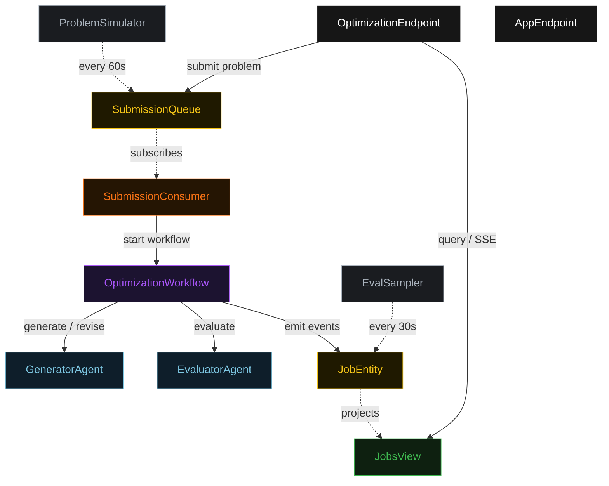
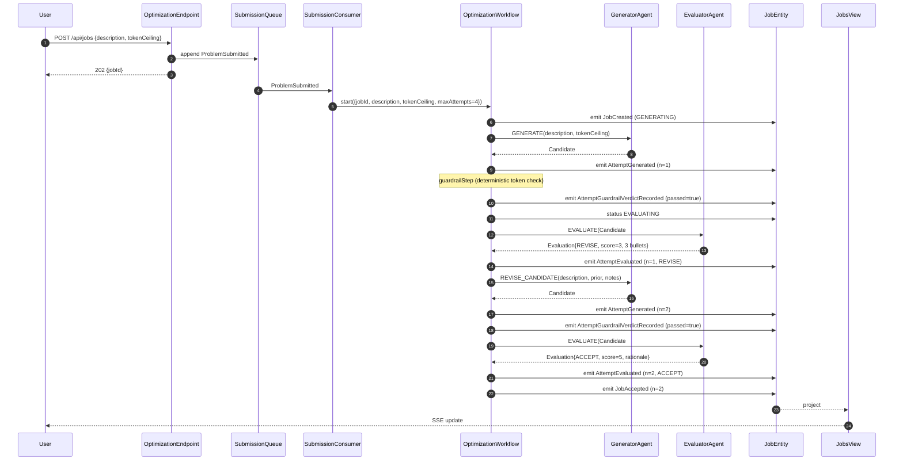
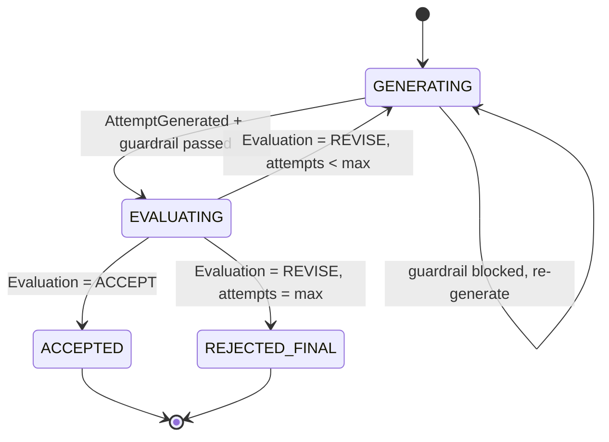
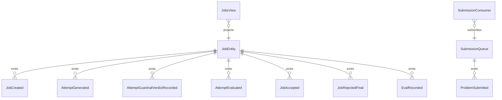

# PLAN — evaluator-optimizer-loop

Architectural sketch consumed by `/akka:plan` (or skipped if `/akka:specify` covers it). Diagrams are rendered on the generated system's Architecture tab.

---

## Component graph

## Interaction sequence — J1 (convergence on attempt 2)

## State machine — `JobEntity`

## Entity model

## Component table — Java file targets

| Component | Path (generated) |
|---|---|
| `GeneratorAgent` | `application/GeneratorAgent.java` |
| `EvaluatorAgent` | `application/EvaluatorAgent.java` |
| `OptimizationTasks` | `application/OptimizationTasks.java` |
| `OptimizationWorkflow` | `application/OptimizationWorkflow.java` |
| `JobEntity` | `application/JobEntity.java` (state in `domain/Job.java`, events in `domain/JobEvent.java`) |
| `SubmissionQueue` | `application/SubmissionQueue.java` |
| `JobsView` | `application/JobsView.java` |
| `SubmissionConsumer` | `application/SubmissionConsumer.java` |
| `ProblemSimulator` | `application/ProblemSimulator.java` |
| `EvalSampler` | `application/EvalSampler.java` |
| `OptimizationEndpoint` | `api/OptimizationEndpoint.java` |
| `AppEndpoint` | `api/AppEndpoint.java` |
| `MockModelProvider` (option (a) only) | `application/MockModelProvider.java` |
| Bootstrap | `Bootstrap.java` |

## Concurrency notes

- **Workflow step timeouts:** `generateStep` and `evaluateStep` each carry `stepTimeout(Duration.ofSeconds(60))`. The default 5-second timeout never applies to agent-calling steps (Lesson 4).
- **Default step recovery:** `defaultStepRecovery(maxRetries(2).failoverTo(rejectStep))` — the workflow degrades to `REJECTED_FINAL` on irrecoverable agent failure rather than hanging.
- **Idempotency:** `OptimizationEndpoint.submit` uses `(description, submittedBy)` over a 10 s window as the dedup key.
- **EvalSampler idempotency:** the sampler keys its `recordEval` calls on `(jobId, attemptNumber)` so a tick that fires twice for the same attempt is a no-op on the entity side.
- **maxAttempts ceiling:** read from `evaluator-optimizer.loop.max-attempts` (default 4). The workflow checks the count BEFORE calling `generateStep` for the next iteration; it never recurses past the ceiling.
- **Saga semantics:** there is no external side-effect to compensate. On irrecoverable failure the `defaultStepRecovery` failover lands in `REJECTED_FINAL`, preserving every candidate and every evaluation on the entity.
- **Guardrail step:** `guardrailStep` is pure-function (no LLM call); it computes the token count from the candidate and either advances to `evaluateStep` or returns to `generateStep` with a structured feedback note. The structured feedback is a deterministic `EvaluationNotes` payload with a single bullet.
