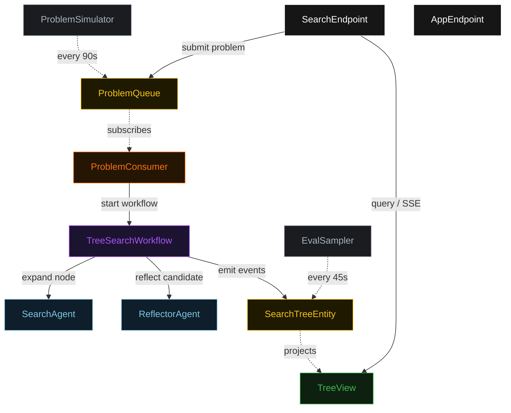
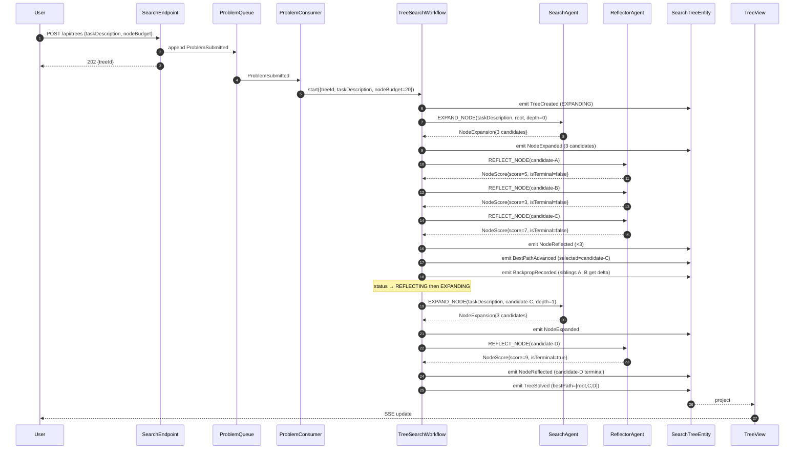
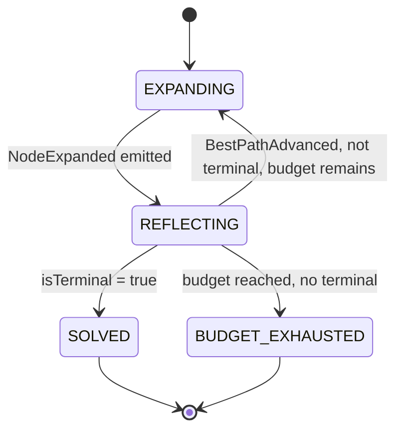
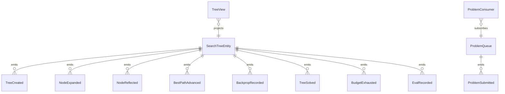

# PLAN — lats-tree-search

Architectural sketch consumed by `/akka:plan` (or skipped if `/akka:specify` covers it). Diagrams are rendered on the generated system's Architecture tab.

---

## Component graph

## Interaction sequence — J1 (solved on second expansion)

## State machine — `SearchTreeEntity`

## Entity model

## Component table — Java file targets

| Component | Path (generated) |
|---|---|
| `SearchAgent` | `application/SearchAgent.java` |
| `ReflectorAgent` | `application/ReflectorAgent.java` |
| `SearchTasks` | `application/SearchTasks.java` |
| `TreeSearchWorkflow` | `application/TreeSearchWorkflow.java` |
| `SearchTreeEntity` | `application/SearchTreeEntity.java` (state in `domain/SearchTree.java`, events in `domain/TreeEvent.java`) |
| `ProblemQueue` | `application/ProblemQueue.java` |
| `TreeView` | `application/TreeView.java` |
| `ProblemConsumer` | `application/ProblemConsumer.java` |
| `ProblemSimulator` | `application/ProblemSimulator.java` |
| `EvalSampler` | `application/EvalSampler.java` |
| `SearchEndpoint` | `api/SearchEndpoint.java` |
| `AppEndpoint` | `api/AppEndpoint.java` |
| `MockModelProvider` (option (a) only) | `application/MockModelProvider.java` |
| Bootstrap | `Bootstrap.java` |

## Concurrency notes

- **Workflow step timeouts:** `expandStep` and `reflectStep` each carry `stepTimeout(Duration.ofSeconds(90))`. The default 5-second timeout never applies to agent-calling steps (Lesson 4).
- **Default step recovery:** `defaultStepRecovery(maxRetries(2).failoverTo(exhaustStep))` — the workflow degrades to `BUDGET_EXHAUSTED` on irrecoverable agent failure rather than hanging.
- **Idempotency:** `SearchEndpoint.submit` uses `(taskDescription, submittedBy)` over a 10 s window as the dedup key.
- **EvalSampler idempotency:** the sampler keys its `recordEval` calls on `(treeId, nodeId)` so a tick that fires twice for the same node is a no-op on the entity side.
- **nodeBudget ceiling:** read from `lats-tree-search.search.node-budget` (default 20). The workflow checks the count BEFORE calling `expandStep` for the next iteration; it never recurses past the ceiling.
- **Reflect loop:** `reflectStep` calls `ReflectorAgent` once per candidate in the current expansion batch. Each call is an independent `runSingleTask(REFLECT_NODE)` with its own `stepTimeout(90s)`.
- **Backpropagation:** after `selectStep` picks the highest-scoring candidate, `BackpropRecorded` events are emitted for every non-selected sibling, each carrying the winning node's score × 0.1 as the delta. The entity applies these as a view-side annotation; they do not alter the tree's structural state.
- **Score threshold:** `lats-tree-search.search.score-threshold` (default 8). If the highest candidate score in a reflection batch is below this threshold, `selectStep` still advances the best path but logs a warning; it does not halt early. Early halt on sub-threshold would require a second halt control.
