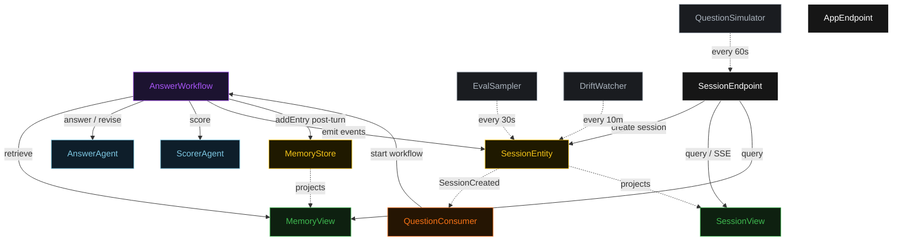
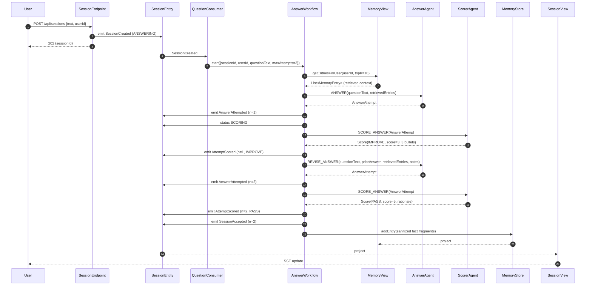
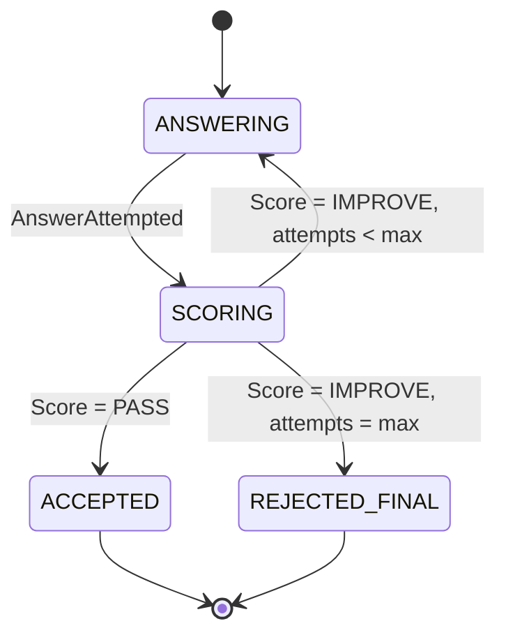
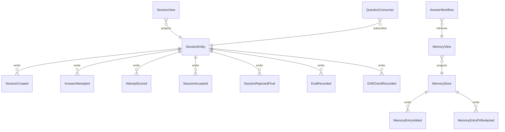

# PLAN — memory-eval-loop

Architectural sketch consumed by `/akka:plan` (or skipped if `/akka:specify` covers it). Diagrams are rendered on the generated system's Architecture tab.

---

## Component graph

## Interaction sequence — J1 (convergence on attempt 2)

## State machine — `SessionEntity`

## Entity model

## Component table — Java file targets

| Component | Path (generated) |
|---|---|
| `AnswerAgent` | `application/AnswerAgent.java` |
| `ScorerAgent` | `application/ScorerAgent.java` |
| `EvalTasks` | `application/EvalTasks.java` |
| `AnswerWorkflow` | `application/AnswerWorkflow.java` |
| `SessionEntity` | `application/SessionEntity.java` (state in `domain/Session.java`, events in `domain/SessionEvent.java`) |
| `MemoryStore` | `application/MemoryStore.java` (state in `domain/MemoryState.java`, events in `domain/MemoryEvent.java`) |
| `SessionView` | `application/SessionView.java` |
| `MemoryView` | `application/MemoryView.java` |
| `QuestionConsumer` | `application/QuestionConsumer.java` |
| `QuestionSimulator` | `application/QuestionSimulator.java` |
| `EvalSampler` | `application/EvalSampler.java` |
| `DriftWatcher` | `application/DriftWatcher.java` |
| `PiiSanitizer` | `application/PiiSanitizer.java` |
| `SessionEndpoint` | `api/SessionEndpoint.java` |
| `AppEndpoint` | `api/AppEndpoint.java` |
| `MockModelProvider` (option (a) only) | `application/MockModelProvider.java` |
| Bootstrap | `Bootstrap.java` |

## Concurrency notes

- **Workflow step timeouts:** `answerStep` and `scoreStep` each carry `stepTimeout(Duration.ofSeconds(60))`. The default 5-second timeout never applies to agent-calling steps (Lesson 4).
- **Default step recovery:** `defaultStepRecovery(maxRetries(2).failoverTo(rejectStep))` — the workflow degrades to `REJECTED_FINAL` on irrecoverable agent failure rather than hanging.
- **Memory write ordering:** `memoryWriteStep` runs only after the session is in a terminal state. The PII sanitizer runs inline in the step before the `MemoryStore.addEntry` call; no unsanitized content reaches the entity command handler.
- **EvalSampler idempotency:** the sampler keys its `recordEval` calls on `(sessionId, attemptNumber)` so a tick that fires twice for the same attempt is a no-op on the entity side.
- **DriftWatcher sentinel:** drift check state is written to a fixed entity id (`"drift-watch-singleton"`) rather than creating one entity per check. The TimedAction reads `SessionView` (no side-effect) and writes exactly one event.
- **maxAttempts ceiling:** read from `evals-with-memory.answer.max-attempts` (default 3). The workflow checks the count BEFORE calling `answerStep` for the next iteration.
- **Saga semantics:** there is no external side-effect to compensate other than the memory write. If `memoryWriteStep` fails, the session is already in `ACCEPTED`; the failure is logged and the step is retried up to 2 times before surfacing a warning. Memory writes are append-only and idempotent on `(sourceSessionId, content-hash)`.
- **MemoryView retrieval:** `getEntriesForUser` is called at the start of each answer attempt (not just the first), so if memory entries were written by a prior session, the revised answer can cite them.
