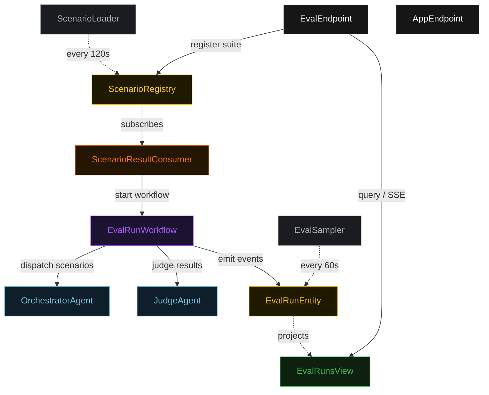
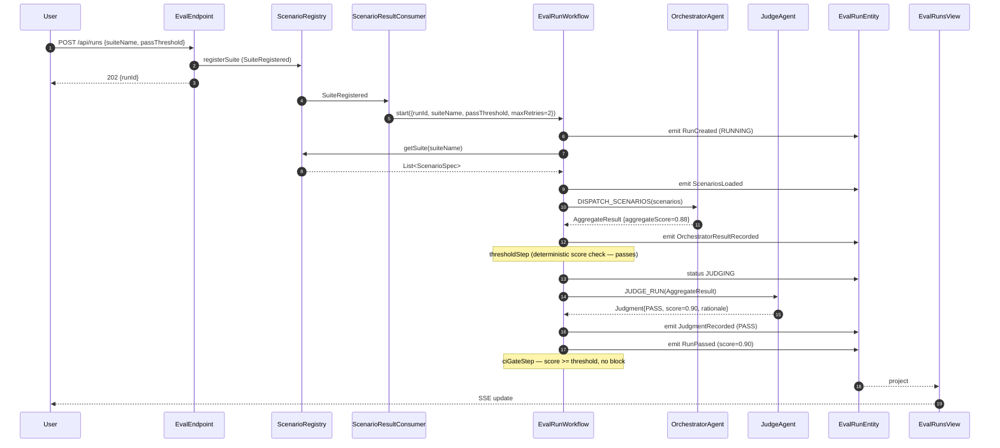
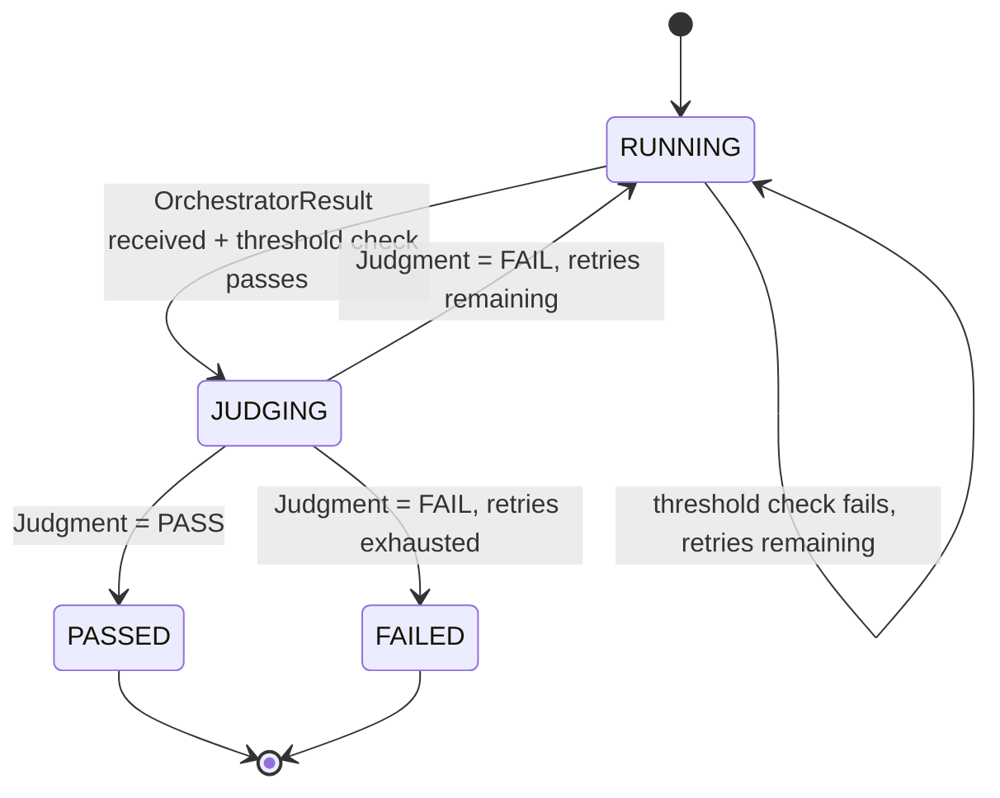
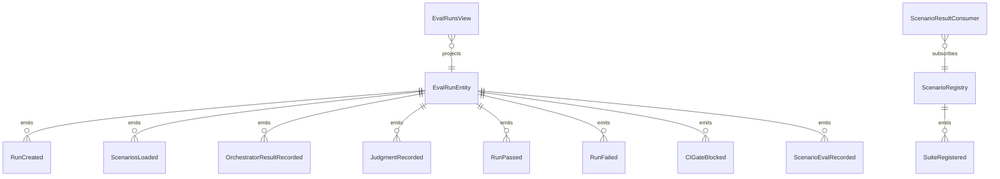

# PLAN — multi-agent-eval-harness

Architectural sketch consumed by `/akka:plan` (or skipped if `/akka:specify` covers it). Diagrams are rendered on the generated system's Architecture tab.

---

## Component graph

## Interaction sequence — J1 (passing run on attempt 1)

## State machine — `EvalRunEntity`

## Entity model

## Component table — Java file targets

| Component | Path (generated) |
|---|---|
| `OrchestratorAgent` | `application/OrchestratorAgent.java` |
| `JudgeAgent` | `application/JudgeAgent.java` |
| `EvalTasks` | `application/EvalTasks.java` |
| `EvalRunWorkflow` | `application/EvalRunWorkflow.java` |
| `EvalRunEntity` | `application/EvalRunEntity.java` (state in `domain/EvalRun.java`, events in `domain/EvalRunEvent.java`) |
| `ScenarioRegistry` | `application/ScenarioRegistry.java` |
| `EvalRunsView` | `application/EvalRunsView.java` |
| `ScenarioResultConsumer` | `application/ScenarioResultConsumer.java` |
| `ScenarioLoader` | `application/ScenarioLoader.java` |
| `EvalSampler` | `application/EvalSampler.java` |
| `EvalEndpoint` | `api/EvalEndpoint.java` |
| `AppEndpoint` | `api/AppEndpoint.java` |
| `MockModelProvider` (option (a) only) | `application/MockModelProvider.java` |
| Bootstrap | `Bootstrap.java` |

## Concurrency notes

- **Workflow step timeouts:** `dispatchStep` and `judgeStep` each carry `stepTimeout(Duration.ofSeconds(90))`. The orchestrator may fan out across multiple specialist paths; 90 s accommodates the aggregate latency. The default 5-second timeout never applies to agent-calling steps (Lesson 4).
- **Default step recovery:** `defaultStepRecovery(maxRetries(2).failoverTo(failStep))` — any unrecoverable agent failure ends in `FAILED` rather than a hung workflow.
- **Idempotency:** `EvalEndpoint.submit` deduplicates on `(suiteName, requestedBy)` over a 15 s window.
- **EvalSampler idempotency:** the sampler keys its `recordScenarioEval` calls on `(runId, scenarioId)` so a tick that fires twice for the same scenario is a no-op on the entity side.
- **maxRetries ceiling:** read from `multi-agent-eval.run.max-retries` (default 2). The workflow checks `retriesRemaining > 0` BEFORE scheduling `rerunStep`; it never recurses past the ceiling.
- **Rerun scope:** on a `FAIL` verdict, the workflow extracts the failing `scenarioId` list from `JudgmentNotes.bullets` and passes only those IDs to `RERUN_FAILING`, reducing orchestrator latency on subsequent attempts.
- **CI gate step:** `ciGateStep` is pure-function (no LLM call). It runs after every terminal transition (`passStep` or `failStep`) and emits `CIGateBlocked` when `finalScore < passThreshold` AND `ciGateBlocked` is not already set on the entity. The step is idempotent.
- **Saga semantics:** there are no external side-effects to compensate. The `failStep` preserves every scenario result and every judgment on the entity; an operator can inspect the full evidence without re-running.
