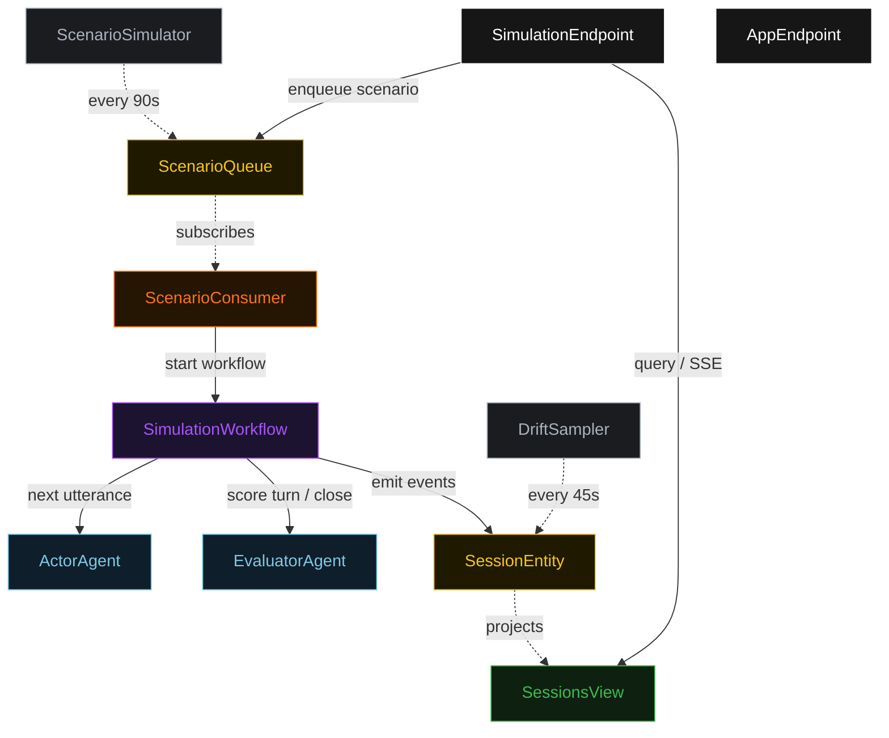
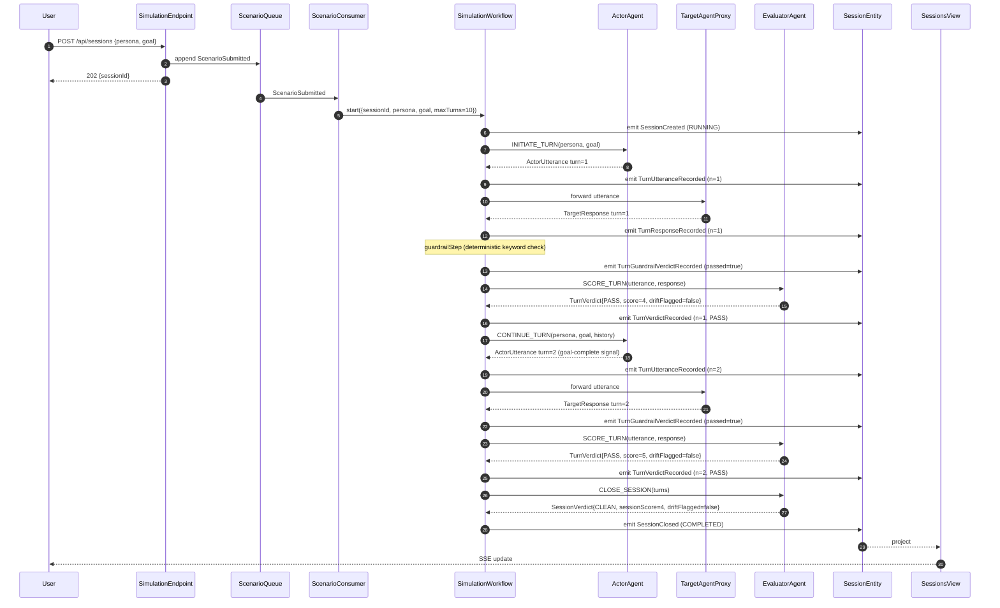
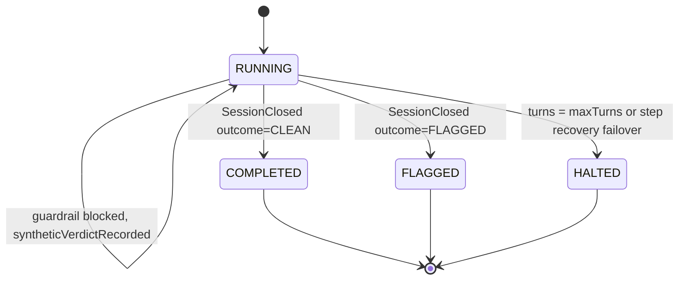
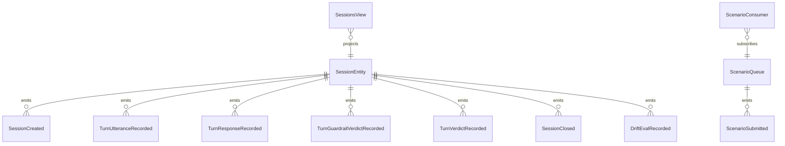

# PLAN — multi-turn-simulator

Architectural sketch consumed by `/akka:plan` (or skipped if `/akka:specify` covers it). Diagrams are rendered on the generated system's Architecture tab.

---

## Component graph

## Interaction sequence — J1 (clean session, 2 turns)

## State machine — `SessionEntity`

## Entity model

## Component table — Java file targets

| Component | Path (generated) |
|---|---|
| `ActorAgent` | `application/ActorAgent.java` |
| `EvaluatorAgent` | `application/EvaluatorAgent.java` |
| `SimulationTasks` | `application/SimulationTasks.java` |
| `SimulationWorkflow` | `application/SimulationWorkflow.java` |
| `SessionEntity` | `application/SessionEntity.java` (state in `domain/Session.java`, events in `domain/SessionEvent.java`) |
| `ScenarioQueue` | `application/ScenarioQueue.java` |
| `SessionsView` | `application/SessionsView.java` |
| `ScenarioConsumer` | `application/ScenarioConsumer.java` |
| `ScenarioSimulator` | `application/ScenarioSimulator.java` |
| `DriftSampler` | `application/DriftSampler.java` |
| `SimulationEndpoint` | `api/SimulationEndpoint.java` |
| `AppEndpoint` | `api/AppEndpoint.java` |
| `TargetAgentProxy` | `application/TargetAgentProxy.java` |
| `MockModelProvider` (option (a) only) | `application/MockModelProvider.java` |
| Bootstrap | `Bootstrap.java` |

## Concurrency notes

- **Workflow step timeouts:** `actorStep`, `targetStep`, and `scoreStep` each carry `stepTimeout(Duration.ofSeconds(60))`. The default 5-second timeout never applies to agent-calling or network-calling steps (Lesson 4).
- **Default step recovery:** `defaultStepRecovery(maxRetries(2).failoverTo(haltStep))` — the workflow degrades to `HALTED` on irrecoverable agent or network failure rather than hanging.
- **Idempotency:** `SimulationEndpoint.submit` uses `(persona, goal, submittedBy)` over a 10 s window as the dedup key.
- **DriftSampler idempotency:** the sampler keys its `recordDriftEval` calls on `(sessionId, turnNumber)` so a tick that fires twice for the same turn is a no-op on the entity side.
- **maxTurns ceiling:** read from `multi-turn-simulator.simulation.max-turns` (default 10). The workflow checks the count BEFORE calling `actorStep` for the next turn; it never recurses past the ceiling.
- **Saga semantics:** there is no external side-effect to compensate for. The halt mechanism (`HT1`) is the only "compensation"; it preserves every turn record and every verdict on the entity.
- **Guardrail step:** `guardrailStep` is pure-function (no LLM call); it scans the raw response text for sensitive-pattern keywords and either advances to `scoreStep` or synthesizes a `TurnVerdict` with `outcome = POLICY_VIOLATION`. The synthetic verdict is deterministic; it never calls the EvaluatorAgent.
- **TargetAgentProxy:** by default, proxies to a configurable URL (`multi-turn-simulator.simulation.target-url`). When the value is `"stub"`, the proxy returns a deterministic canned response keyed on `(persona, turnNumber)` from `src/main/resources/stub-responses/target.json`. This lets the service run out of the box with no external endpoint.
