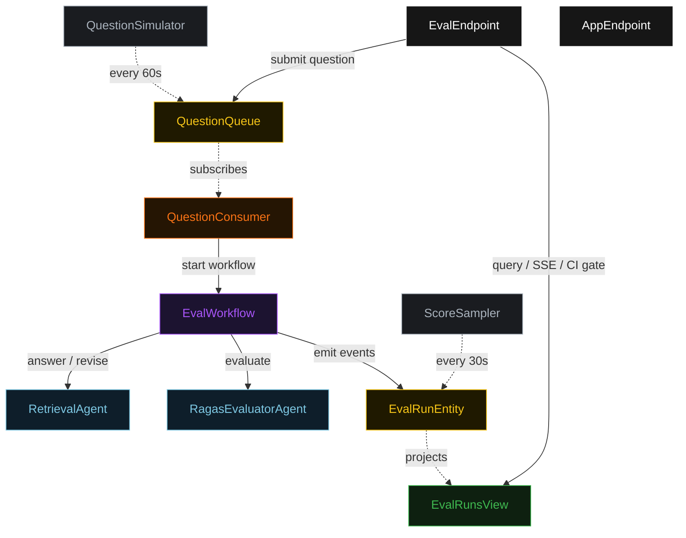
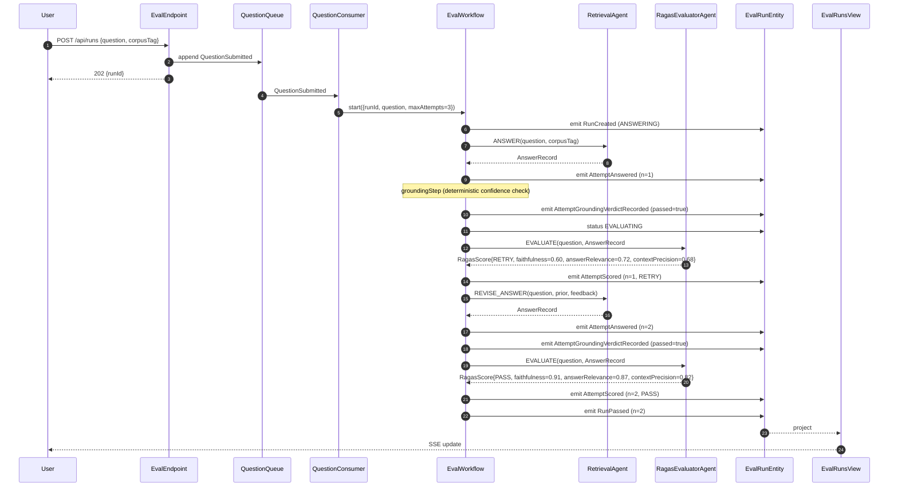
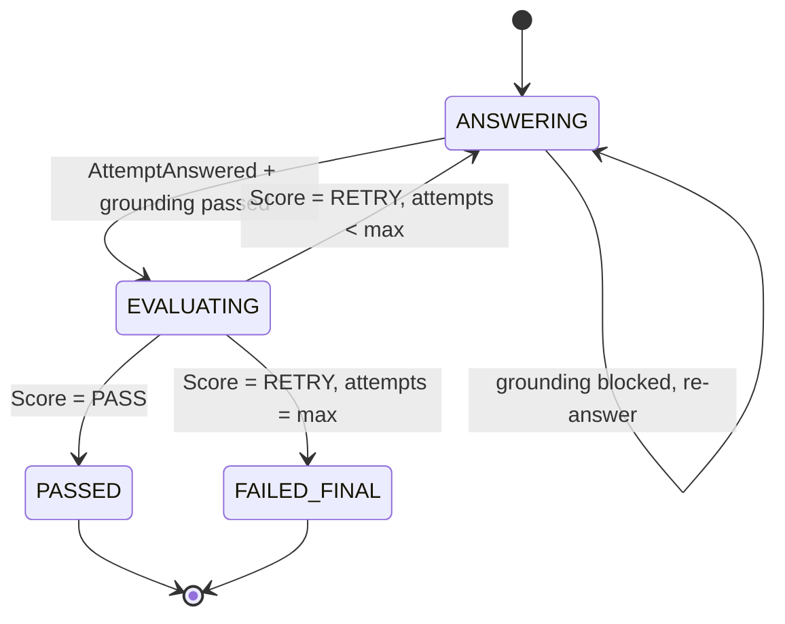
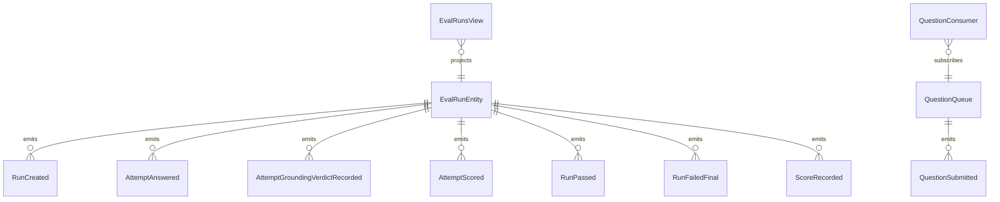

# PLAN — ragas-eval-harness

Architectural sketch consumed by `/akka:plan` (or skipped if `/akka:specify` covers it). Diagrams are rendered on the generated system's Architecture tab.

---

## Component graph

## Interaction sequence — J1 (convergence on attempt 2)

## State machine — `EvalRunEntity`

## Entity model

## Component table — Java file targets

| Component | Path (generated) |
|---|---|
| `RetrievalAgent` | `application/RetrievalAgent.java` |
| `RagasEvaluatorAgent` | `application/RagasEvaluatorAgent.java` |
| `EvalTasks` | `application/EvalTasks.java` |
| `EvalWorkflow` | `application/EvalWorkflow.java` |
| `EvalRunEntity` | `application/EvalRunEntity.java` (state in `domain/EvalRun.java`, events in `domain/EvalRunEvent.java`) |
| `QuestionQueue` | `application/QuestionQueue.java` |
| `EvalRunsView` | `application/EvalRunsView.java` |
| `QuestionConsumer` | `application/QuestionConsumer.java` |
| `QuestionSimulator` | `application/QuestionSimulator.java` |
| `ScoreSampler` | `application/ScoreSampler.java` |
| `EvalEndpoint` | `api/EvalEndpoint.java` |
| `AppEndpoint` | `api/AppEndpoint.java` |
| `MockModelProvider` (option (a) only) | `application/MockModelProvider.java` |
| Bootstrap | `Bootstrap.java` |

## Concurrency notes

- **Workflow step timeouts:** `answerStep` and `scoreStep` each carry `stepTimeout(Duration.ofSeconds(60))`. The default 5-second timeout never applies to agent-calling steps (Lesson 4).
- **Default step recovery:** `defaultStepRecovery(maxRetries(2).failoverTo(failStep))` — the workflow degrades to `FAILED_FINAL` on irrecoverable agent failure rather than hanging.
- **Idempotency:** `EvalEndpoint.submit` uses `(questionText, submittedBy)` over a 10 s window as the dedup key.
- **ScoreSampler idempotency:** the sampler keys its `recordEval` calls on `(runId, attemptNumber)` so a tick that fires twice for the same attempt is a no-op on the entity side.
- **maxAttempts ceiling:** read from `ragas-eval.workflow.max-attempts` (default 3). The workflow checks the count BEFORE calling `answerStep` for the next iteration; it never recurses past the ceiling.
- **Saga semantics:** there is no external side-effect to compensate. The halt mechanism is the only "compensation"; it preserves the best-scoring answer and every score set on the entity.
- **Grounding step:** `groundingStep` is pure-function (no LLM call); it compares `answer.groundingConfidence()` against the configured floor and either advances to `scoreStep` or returns to `answerStep` with a structured `RagasFeedback` payload. The feedback never becomes an LLM-generated score; it stays a deterministic payload with `failedMetrics=["grounding"]`.
- **CI gate:** `GET /api/ci/gate-status` queries `EvalRunsView.getAllRuns`, counts the last 100 completed runs, and returns `{ gatePassed, passRate, windowSize }`. The endpoint is synchronous and read-only; it does not mutate entity state.
