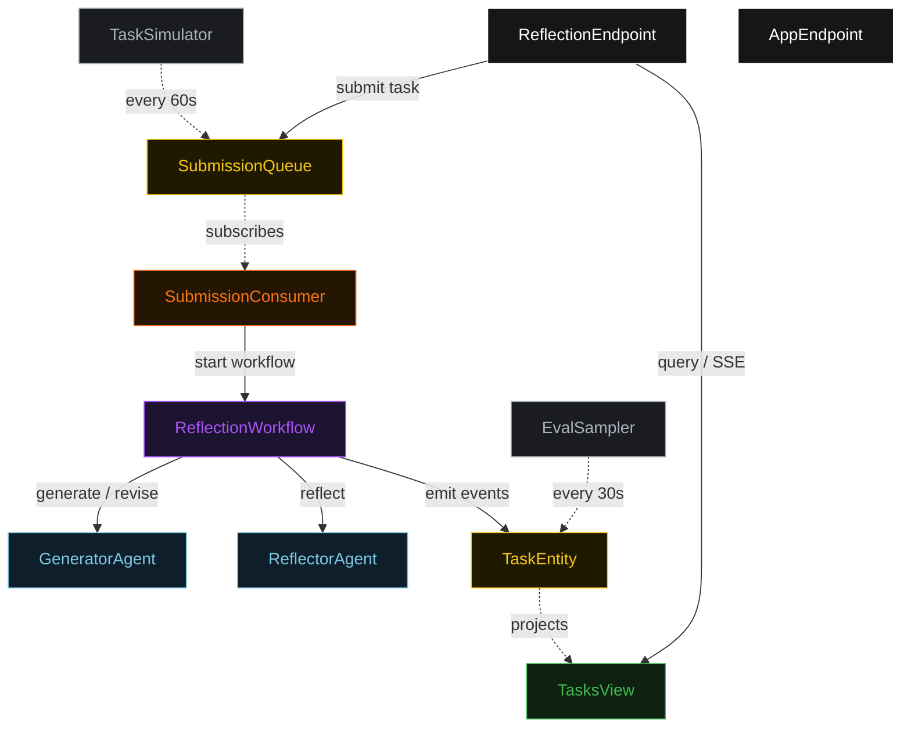
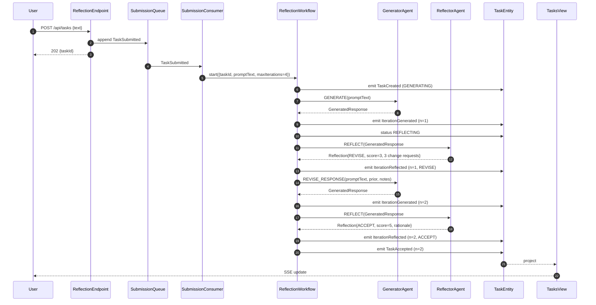
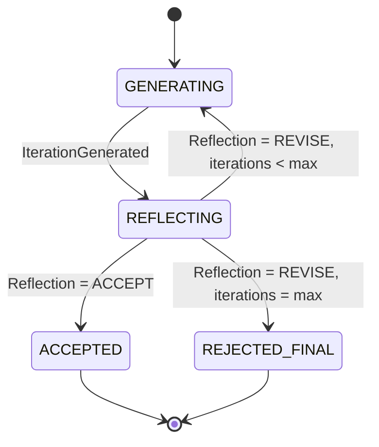
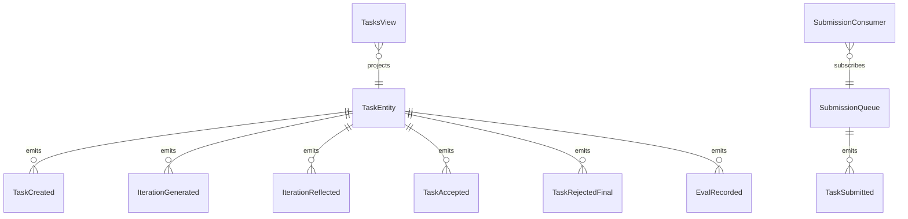

# PLAN — reflection-agent

Architectural sketch consumed by `/akka:plan` (or skipped if `/akka:specify` covers it). Diagrams are rendered on the generated system's Architecture tab.

---

## Component graph

## Interaction sequence — J1 (convergence on iteration 2)

## State machine — `TaskEntity`

## Entity model

## Component table — Java file targets

| Component | Path (generated) |
|---|---|
| `GeneratorAgent` | `application/GeneratorAgent.java` |
| `ReflectorAgent` | `application/ReflectorAgent.java` |
| `ReflectionTasks` | `application/ReflectionTasks.java` |
| `ReflectionWorkflow` | `application/ReflectionWorkflow.java` |
| `TaskEntity` | `application/TaskEntity.java` (state in `domain/Task.java`, events in `domain/TaskEvent.java`) |
| `SubmissionQueue` | `application/SubmissionQueue.java` |
| `TasksView` | `application/TasksView.java` |
| `SubmissionConsumer` | `application/SubmissionConsumer.java` |
| `TaskSimulator` | `application/TaskSimulator.java` |
| `EvalSampler` | `application/EvalSampler.java` |
| `ReflectionEndpoint` | `api/ReflectionEndpoint.java` |
| `AppEndpoint` | `api/AppEndpoint.java` |
| `MockModelProvider` (option (a) only) | `application/MockModelProvider.java` |
| Bootstrap | `Bootstrap.java` |

## Concurrency notes

- **Workflow step timeouts:** `generateStep` and `reflectStep` each carry `stepTimeout(Duration.ofSeconds(60))`. The default 5-second timeout never applies to agent-calling steps (Lesson 4).
- **Default step recovery:** `defaultStepRecovery(maxRetries(2).failoverTo(rejectStep))` — the workflow degrades to `REJECTED_FINAL` on irrecoverable agent failure rather than hanging.
- **Idempotency:** `ReflectionEndpoint.submit` uses `(text, submittedBy)` over a 10 s window as the dedup key.
- **EvalSampler idempotency:** the sampler keys its `recordEval` calls on `(taskId, iterationNumber)` so a tick that fires twice for the same iteration is a no-op on the entity side.
- **maxIterations ceiling:** read from `reflection-agent.loop.max-iterations` (default 4). The workflow checks the count BEFORE calling `generateStep` for the next iteration; it never recurses past the ceiling.
- **Saga semantics:** there is no external side-effect to compensate. The halt mechanism (`HT1`) is the only "compensation"; it preserves the best response and every critique on the entity.
- **No guardrail step:** unlike the content-editorial variant, this general-domain blueprint omits the deterministic length guardrail. The quality gate is fully delegated to `ReflectorAgent`.
