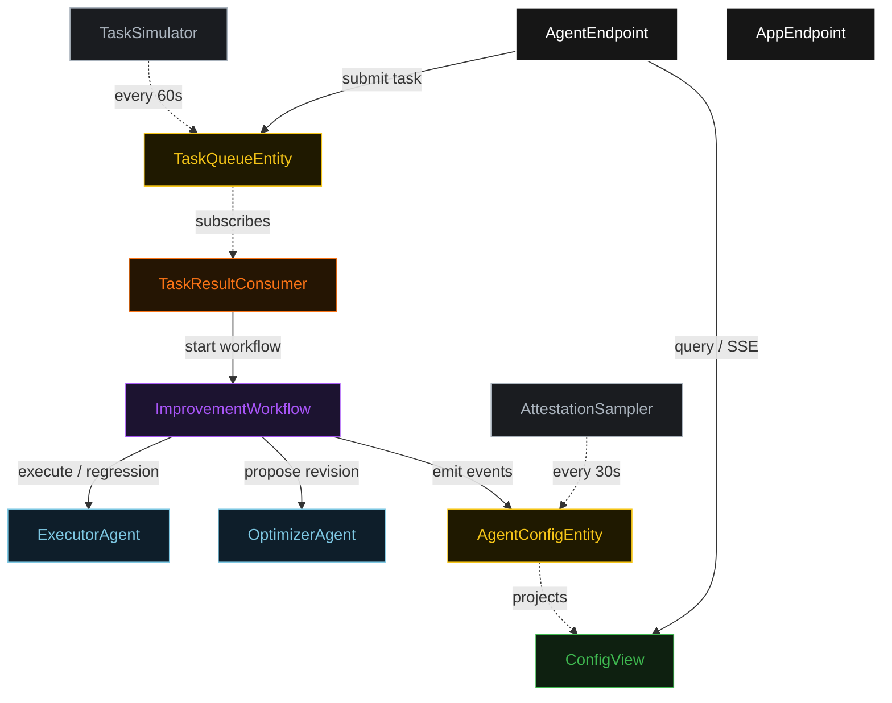
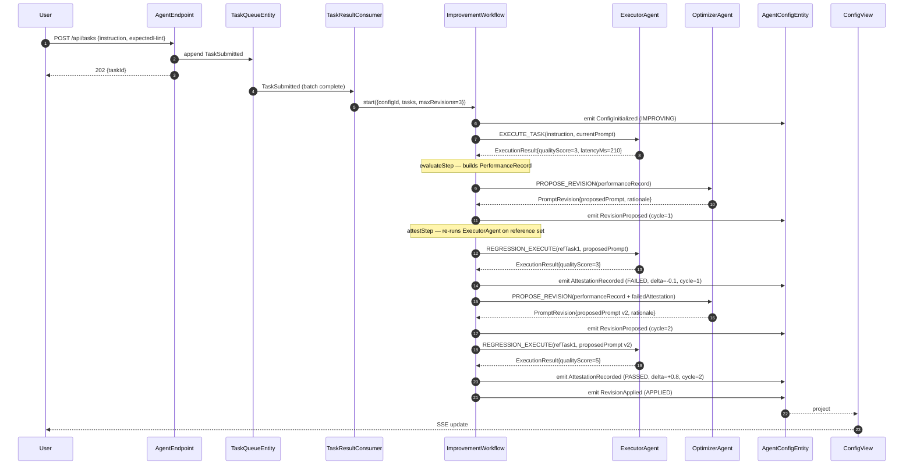
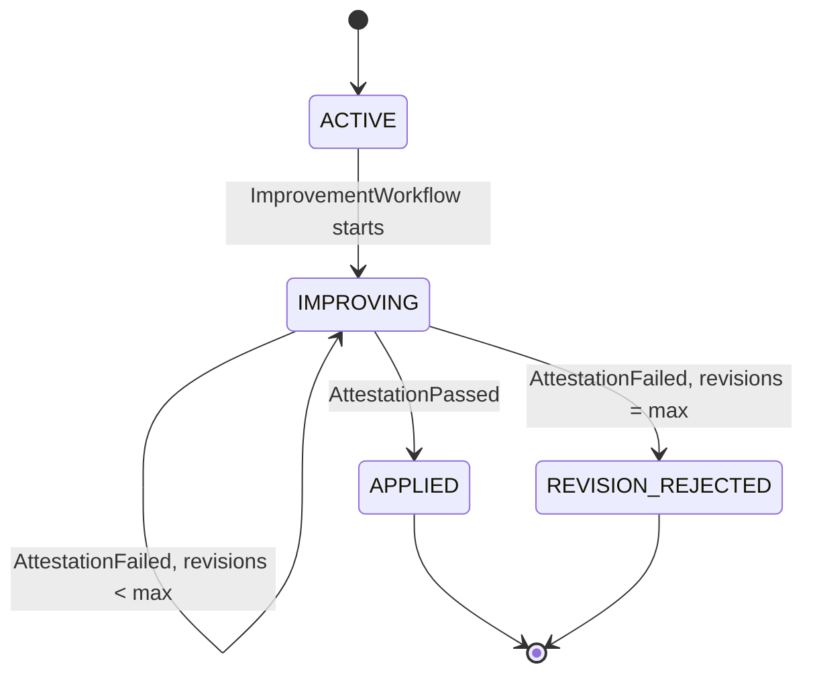
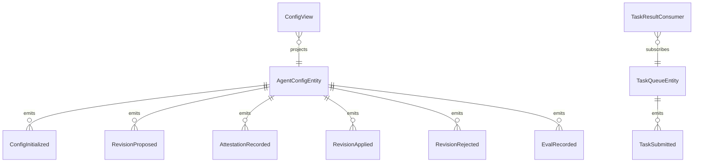

# PLAN — self-improving-agent

Architectural sketch consumed by `/akka:plan` (or skipped if `/akka:specify` covers it). Diagrams are rendered on the generated system's Architecture tab.

---

## Component graph

## Interaction sequence — J1 (revision applied on cycle 2)

## State machine — `AgentConfigEntity`

## Entity model

## Component table — Java file targets

| Component | Path (generated) |
|---|---|
| `ExecutorAgent` | `application/ExecutorAgent.java` |
| `OptimizerAgent` | `application/OptimizerAgent.java` |
| `AgentTasks` | `application/AgentTasks.java` |
| `ImprovementWorkflow` | `application/ImprovementWorkflow.java` |
| `AgentConfigEntity` | `application/AgentConfigEntity.java` (state in `domain/AgentConfig.java`, events in `domain/ConfigEvent.java`) |
| `TaskQueueEntity` | `application/TaskQueueEntity.java` |
| `ConfigView` | `application/ConfigView.java` |
| `TaskResultConsumer` | `application/TaskResultConsumer.java` |
| `TaskSimulator` | `application/TaskSimulator.java` |
| `AttestationSampler` | `application/AttestationSampler.java` |
| `AgentEndpoint` | `api/AgentEndpoint.java` |
| `AppEndpoint` | `api/AppEndpoint.java` |
| `MockModelProvider` (option (a) only) | `application/MockModelProvider.java` |
| Bootstrap | `Bootstrap.java` |

## Concurrency notes

- **Workflow step timeouts:** `executeStep`, `proposeStep`, and `attestStep` each carry `stepTimeout(Duration.ofSeconds(90))`. The default 5-second timeout never applies to agent-calling steps (Lesson 4).
- **Default step recovery:** `defaultStepRecovery(maxRetries(2).failoverTo(rejectStep))` — the workflow degrades to `REVISION_REJECTED` on irrecoverable agent failure rather than hanging.
- **Idempotency:** `AgentEndpoint.submitTask` uses `(instruction, submittedBy)` over a 10 s window as the dedup key.
- **AttestationSampler idempotency:** the sampler keys its `recordEval` calls on `(configId, cycleNumber)` so a tick that fires twice for the same cycle is a no-op on the entity side.
- **maxRevisions ceiling:** read from `self-improving-agent.improvement.max-revisions` (default 3). The workflow checks the count BEFORE calling `proposeStep` for the next iteration; it never recurses past the ceiling.
- **Attestation determinism:** the reference task set used in `attestStep` is fixed at workflow start (first 3 tasks from `sample-events/tasks.jsonl`). The baseline quality score is computed from the first `executeStep` run; the delta is `meanRegressionScore - baselineScore`.
- **Saga semantics:** there is no external side-effect to compensate. The halt mechanism (`REVISION_REJECTED`) preserves the best-scoring proposed revision and every attestation verdict on the entity.
- **Monitor SSE:** `/api/configs/monitor/sse` streams only `RevisionApplied` and `RevisionRejected` events, filtered from the full `AgentConfigEntity` event stream. Clients connect once and receive all future terminal transitions.
