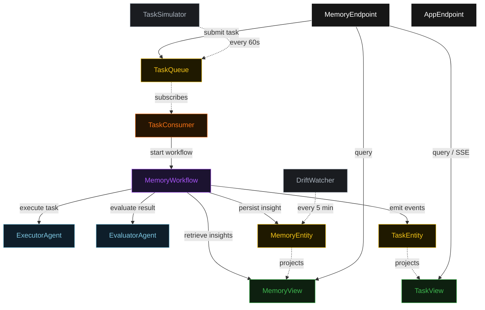
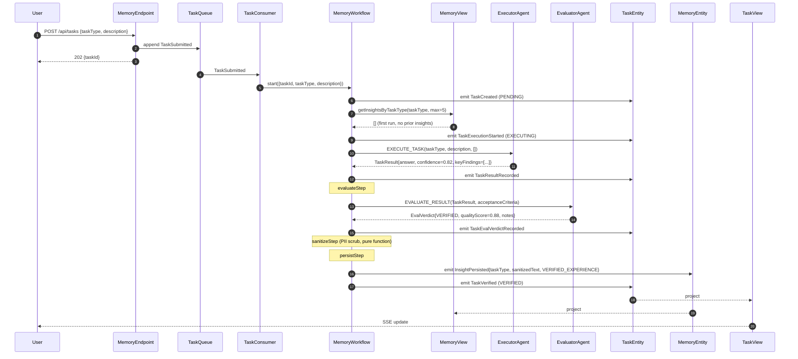
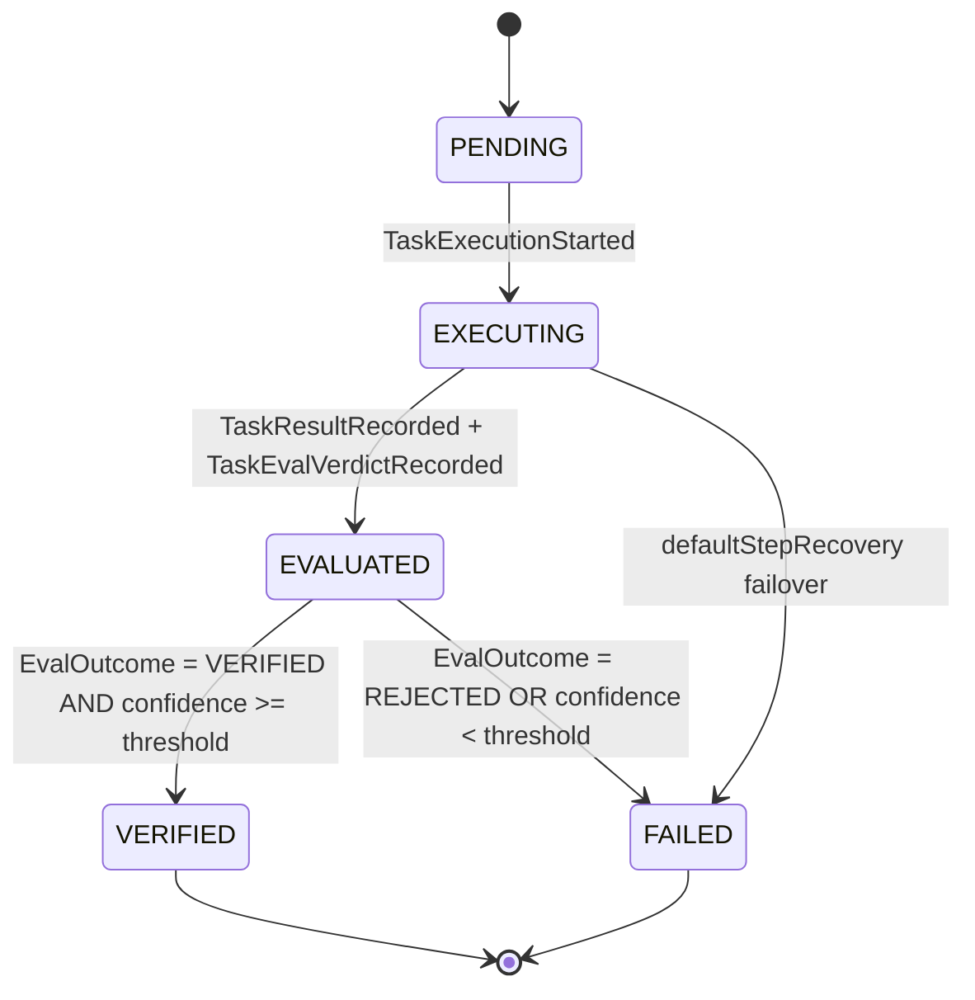
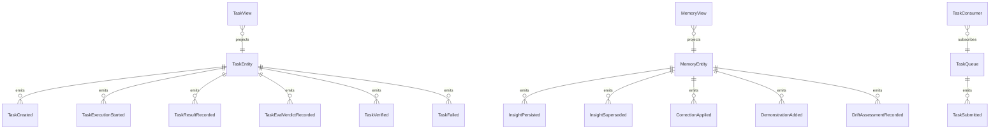

# PLAN — task-insight-memory

Architectural sketch consumed by `/akka:plan` (or skipped if `/akka:specify` covers it). Diagrams are rendered on the generated system's Architecture tab.

---

## Component graph

## Interaction sequence — J1 (verified persistence on first attempt)

## State machine — `TaskEntity`

## Entity model

## Component table — Java file targets

| Component | Path (generated) |
|---|---|
| `ExecutorAgent` | `application/ExecutorAgent.java` |
| `EvaluatorAgent` | `application/EvaluatorAgent.java` |
| `MemoryTasks` | `application/MemoryTasks.java` |
| `MemoryWorkflow` | `application/MemoryWorkflow.java` |
| `MemoryEntity` | `application/MemoryEntity.java` (state in `domain/MemoryStore.java`, events in `domain/MemoryEvent.java`) |
| `TaskEntity` | `application/TaskEntity.java` (state in `domain/TaskRecord.java`, events in `domain/TaskEvent.java`) |
| `TaskQueue` | `application/TaskQueue.java` |
| `MemoryView` | `application/MemoryView.java` |
| `TaskView` | `application/TaskView.java` |
| `TaskConsumer` | `application/TaskConsumer.java` |
| `TaskSimulator` | `application/TaskSimulator.java` |
| `DriftWatcher` | `application/DriftWatcher.java` |
| `MemoryEndpoint` | `api/MemoryEndpoint.java` |
| `AppEndpoint` | `api/AppEndpoint.java` |
| `MockModelProvider` (option (a) only) | `application/MockModelProvider.java` |
| Bootstrap | `Bootstrap.java` |

## Concurrency notes

- **Workflow step timeouts:** `executeStep` and `evaluateStep` each carry `stepTimeout(Duration.ofSeconds(60))`. The default 5-second timeout never applies to agent-calling steps (Lesson 4).
- **Default step recovery:** `defaultStepRecovery(maxRetries(2).failoverTo(failStep))` — any unrecoverable agent failure ends in `FAILED` rather than a hung workflow.
- **Sanitize step:** `sanitizeStep` is pure-function (no LLM call); it applies regex patterns to each key finding and replaces matches with `[REDACTED]`. The redaction count is included in the `SanitizerApplied` signal for observability.
- **MemoryEntity atomicity:** the memory store is written in a single `InsightPersisted` event per verified result. The workflow never writes partial state to `MemoryEntity`.
- **DriftWatcher idempotency:** the watcher keys its `recordDriftAssessment` call on the 5-minute window timestamp, so a tick that fires twice within the same window produces exactly one event.
- **Insight retrieval ordering:** `getInsightsByTaskType` orders by `persistedAt DESC`; the top 5 most-recent verified insights are passed to `ExecutorAgent`. Superseded insights are filtered out at the view query level.
- **Correction / demonstration writes:** `POST /api/memory/correction` and `POST /api/memory/demonstration` write directly to `MemoryEntity` via `MemoryEndpoint`; they do not go through the workflow. The `InsightProvenance` field distinguishes them from `VERIFIED_EXPERIENCE` insights.
