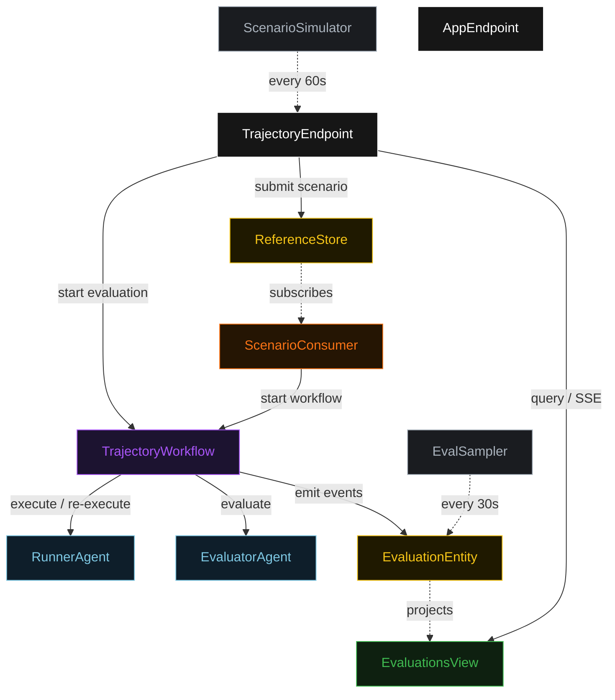
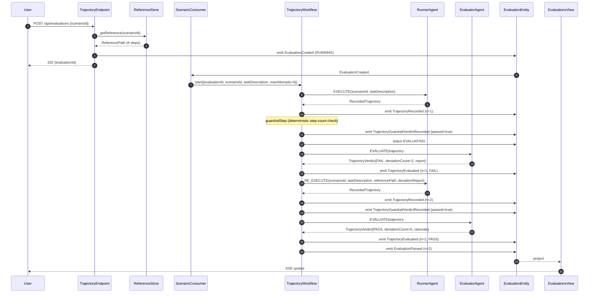
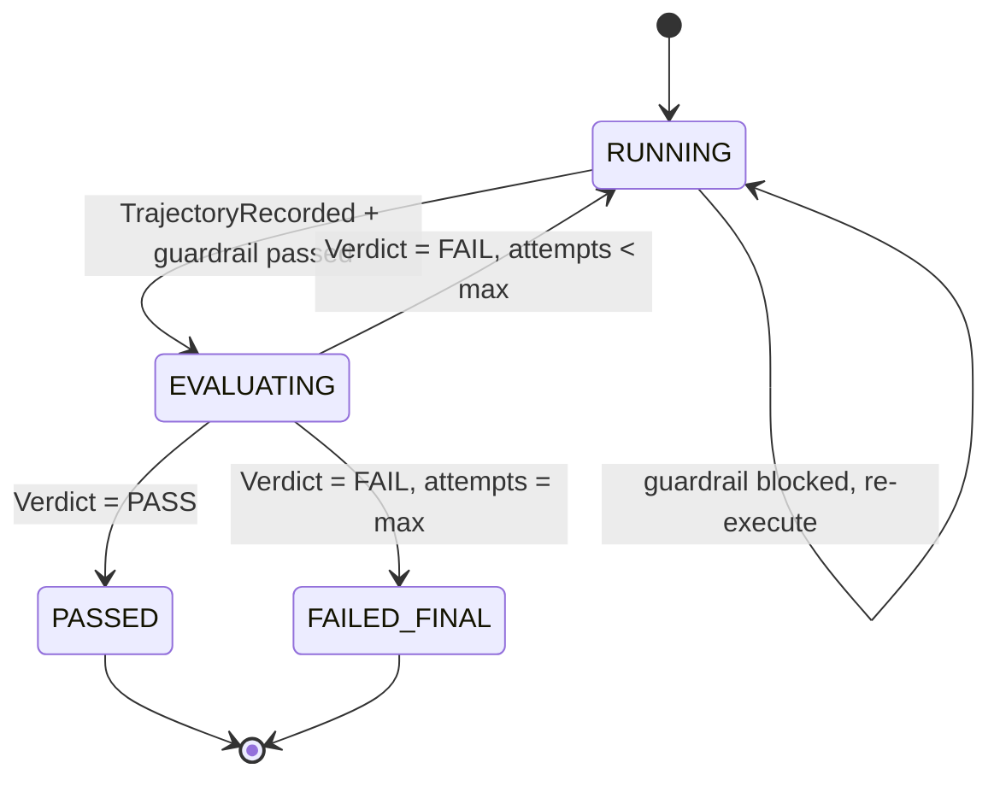
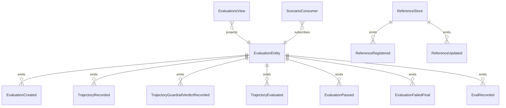

# PLAN — trajectory-eval

Architectural sketch consumed by `/akka:plan` (or skipped if `/akka:specify` covers it). Diagrams are rendered on the generated system's Architecture tab.

---

## Component graph

## Interaction sequence — J1 (convergence on attempt 2)

## State machine — `EvaluationEntity`

## Entity model

## Component table — Java file targets

| Component | Path (generated) |
|---|---|
| `RunnerAgent` | `application/RunnerAgent.java` |
| `EvaluatorAgent` | `application/EvaluatorAgent.java` |
| `TrajectoryTasks` | `application/TrajectoryTasks.java` |
| `TrajectoryWorkflow` | `application/TrajectoryWorkflow.java` |
| `EvaluationEntity` | `application/EvaluationEntity.java` (state in `domain/Evaluation.java`, events in `domain/EvaluationEvent.java`) |
| `ReferenceStore` | `application/ReferenceStore.java` |
| `EvaluationsView` | `application/EvaluationsView.java` |
| `ScenarioConsumer` | `application/ScenarioConsumer.java` |
| `ScenarioSimulator` | `application/ScenarioSimulator.java` |
| `EvalSampler` | `application/EvalSampler.java` |
| `TrajectoryEndpoint` | `api/TrajectoryEndpoint.java` |
| `AppEndpoint` | `api/AppEndpoint.java` |
| `MockModelProvider` (option (a) only) | `application/MockModelProvider.java` |
| Bootstrap | `Bootstrap.java` |

## Concurrency notes

- **Workflow step timeouts:** `executeStep` and `evaluateStep` each carry `stepTimeout(Duration.ofSeconds(60))`. The default 5-second timeout never applies to agent-calling steps (Lesson 4).
- **Default step recovery:** `defaultStepRecovery(maxRetries(2).failoverTo(failStep))` — the workflow degrades to `FAILED_FINAL` on irrecoverable agent failure rather than hanging.
- **Idempotency:** `TrajectoryEndpoint.submit` uses `(scenarioId, requestedBy)` over a 10 s window as the dedup key.
- **EvalSampler idempotency:** the sampler keys its `recordEval` calls on `(evaluationId, attemptNumber)` so a tick that fires twice for the same attempt is a no-op on the entity side.
- **maxAttempts ceiling:** read from `trajectory-eval.runner.max-attempts` (default 4). The workflow checks the count BEFORE calling `executeStep` for the next iteration; it never recurses past the ceiling.
- **Saga semantics:** there is no external side-effect to compensate. The halt mechanism (`HT1`) is the only "compensation"; it preserves the closest-match trajectory and every deviation report on the entity.
- **Guardrail step:** `guardrailStep` is pure-function (no LLM call); it computes the step count from the trajectory and either advances to `evaluateStep` or returns to `executeStep` with a structured feedback note. The feedback note is a deterministic `DeviationReport` payload; it is never LLM-generated.
- **Reference path lookup:** the workflow fetches the `ReferencePath` from `ReferenceStore` at `startStep` and passes it into every subsequent `evaluateStep`. It does not re-fetch mid-loop; reference updates take effect on the next evaluation submission.
