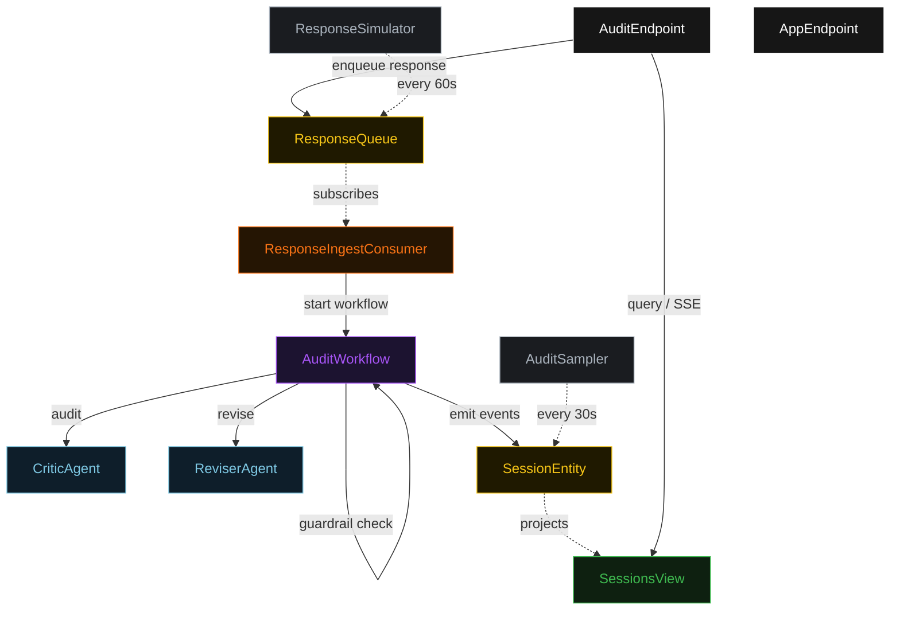
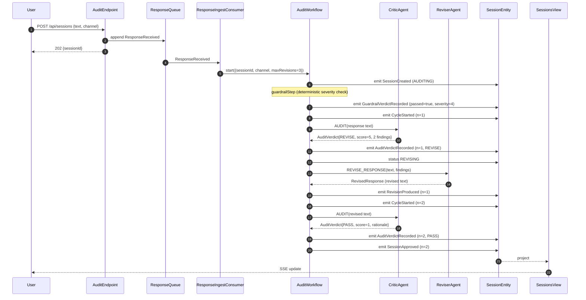
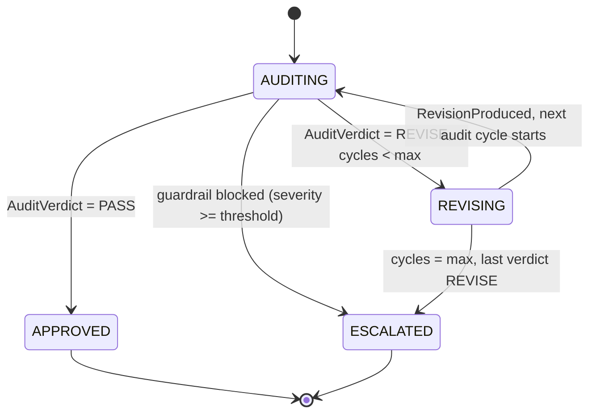
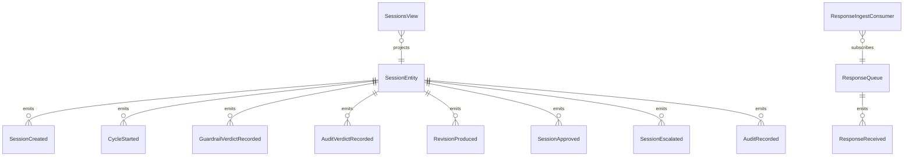

# PLAN — llm-auditor

Architectural sketch consumed by `/akka:plan` (or skipped if `/akka:specify` covers it). Diagrams are rendered on the generated system's Architecture tab.

---

## Component graph

## Interaction sequence — J1 (convergence on cycle 2)

## State machine — `SessionEntity`

## Entity model

## Component table — Java file targets

| Component | Path (generated) |
|---|---|
| `CriticAgent` | `application/CriticAgent.java` |
| `ReviserAgent` | `application/ReviserAgent.java` |
| `AuditTasks` | `application/AuditTasks.java` |
| `AuditWorkflow` | `application/AuditWorkflow.java` |
| `SessionEntity` | `application/SessionEntity.java` (state in `domain/Session.java`, events in `domain/SessionEvent.java`) |
| `ResponseQueue` | `application/ResponseQueue.java` |
| `SessionsView` | `application/SessionsView.java` |
| `ResponseIngestConsumer` | `application/ResponseIngestConsumer.java` |
| `ResponseSimulator` | `application/ResponseSimulator.java` |
| `AuditSampler` | `application/AuditSampler.java` |
| `AuditEndpoint` | `api/AuditEndpoint.java` |
| `AppEndpoint` | `api/AppEndpoint.java` |
| `MockModelProvider` (option (a) only) | `application/MockModelProvider.java` |
| Bootstrap | `Bootstrap.java` |

## Concurrency notes

- **Workflow step timeouts:** `auditStep` and `reviseStep` each carry `stepTimeout(Duration.ofSeconds(60))`. The default 5-second timeout never applies to agent-calling steps (Lesson 4).
- **Default step recovery:** `defaultStepRecovery(maxRetries(2).failoverTo(escalateStep))` — the workflow degrades to `ESCALATED` on irrecoverable agent failure rather than hanging.
- **Idempotency:** `AuditEndpoint.submit` uses `(text hash, channel)` over a 10 s window as the dedup key.
- **AuditSampler idempotency:** the sampler keys its `recordAuditEvent` calls on `(sessionId, cycleNumber)` so a tick that fires twice for the same cycle is a no-op on the entity side.
- **maxRevisions ceiling:** read from `llm-auditor.audit.max-revisions` (default 3). The workflow checks the count BEFORE calling `auditStep` for the next cycle; it never recurses past the ceiling.
- **Guardrail step:** `guardrailStep` is pure-function (no LLM call); it scans keyword indicators in the response text, computes an `initialSeverity` (0–10), and either advances to `auditStep` or escalates immediately. The severity computation is deterministic and never makes an LLM call.
- **Saga semantics:** there is no external side-effect to compensate. The escalation mechanism is the only termination path beyond approval; it preserves the lowest-severity revision and every finding set on the entity.
