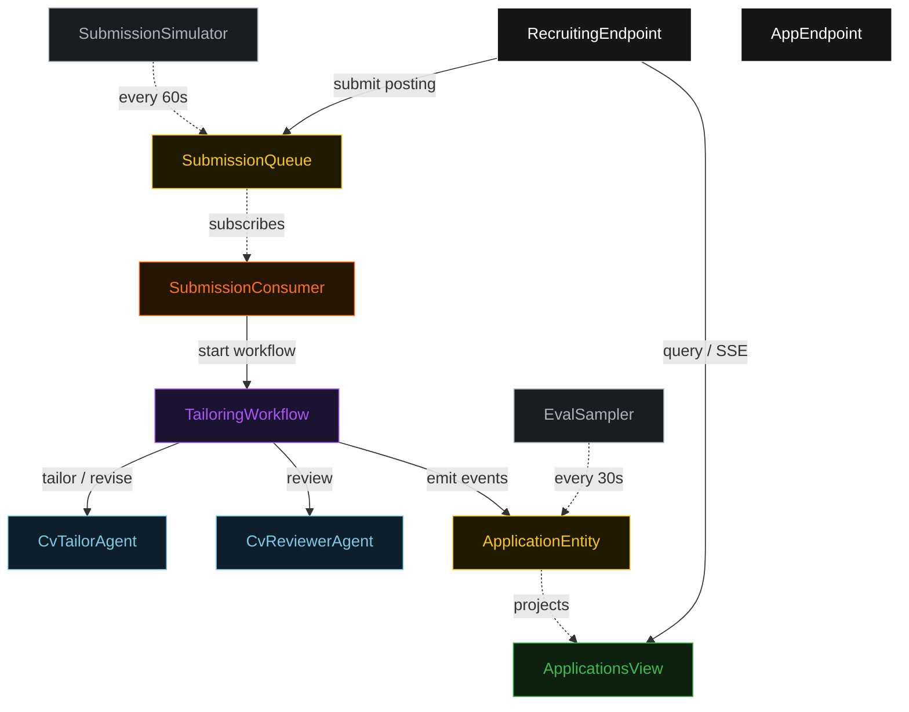
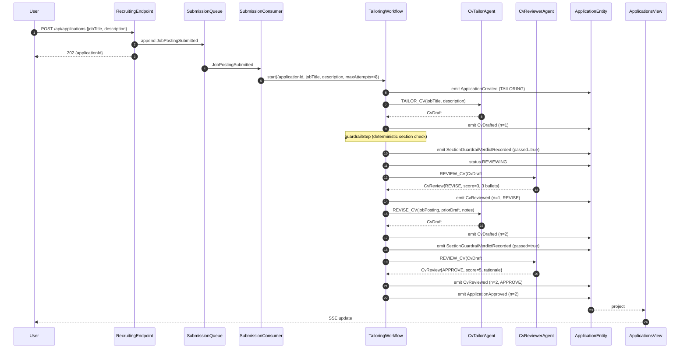
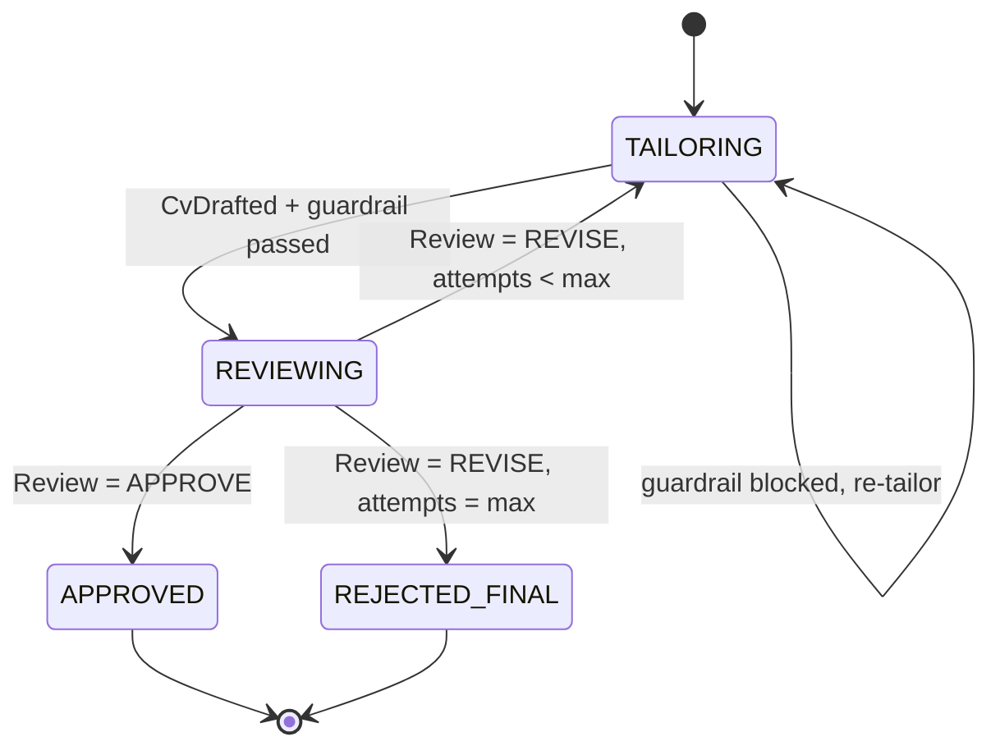
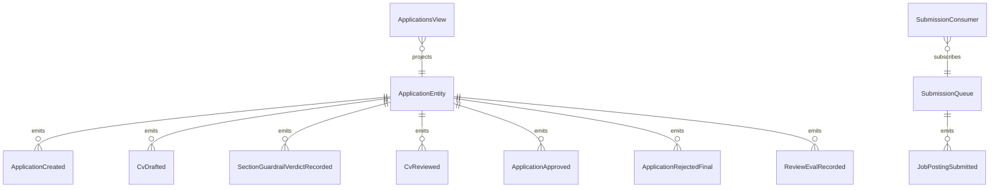

# PLAN — scored-loop-tailor

Architectural sketch consumed by `/akka:plan` (or skipped if `/akka:specify` covers it). Diagrams are rendered on the generated system's Architecture tab.

---

## Component graph

## Interaction sequence — J1 (convergence on attempt 2)

## State machine — `ApplicationEntity`

## Entity model

## Component table — Java file targets

| Component | Path (generated) |
|---|---|
| `CvTailorAgent` | `application/CvTailorAgent.java` |
| `CvReviewerAgent` | `application/CvReviewerAgent.java` |
| `RecruitingTasks` | `application/RecruitingTasks.java` |
| `TailoringWorkflow` | `application/TailoringWorkflow.java` |
| `ApplicationEntity` | `application/ApplicationEntity.java` (state in `domain/Application.java`, events in `domain/ApplicationEvent.java`) |
| `SubmissionQueue` | `application/SubmissionQueue.java` |
| `ApplicationsView` | `application/ApplicationsView.java` |
| `SubmissionConsumer` | `application/SubmissionConsumer.java` |
| `SubmissionSimulator` | `application/SubmissionSimulator.java` |
| `EvalSampler` | `application/EvalSampler.java` |
| `RecruitingEndpoint` | `api/RecruitingEndpoint.java` |
| `AppEndpoint` | `api/AppEndpoint.java` |
| `MockModelProvider` (option (a) only) | `application/MockModelProvider.java` |
| Bootstrap | `Bootstrap.java` |

## Concurrency notes

- **Workflow step timeouts:** `tailorStep` and `reviewStep` each carry `stepTimeout(Duration.ofSeconds(60))`. The default 5-second timeout never applies to agent-calling steps (Lesson 4).
- **Default step recovery:** `defaultStepRecovery(maxRetries(2).failoverTo(rejectStep))` — the workflow degrades to `REJECTED_FINAL` on irrecoverable agent failure rather than hanging.
- **Idempotency:** `RecruitingEndpoint.submit` uses `(jobTitle, candidateProfile)` over a 10 s window as the dedup key.
- **EvalSampler idempotency:** the sampler keys its `recordEval` calls on `(applicationId, attemptNumber)` so a tick that fires twice for the same attempt is a no-op on the entity side.
- **maxAttempts ceiling:** read from `scored-loop-tailor.tailoring.max-attempts` (default 4). The workflow checks the count BEFORE calling `tailorStep` for the next iteration; it never recurses past the ceiling.
- **Saga semantics:** there is no external side-effect to compensate. The halt mechanism (`HT1`) is the only "compensation"; it preserves the highest-scoring draft and every review on the entity.
- **Guardrail step:** `guardrailStep` is pure-function (no LLM call); it checks `draft.sectionsPresent()` for the strings "Summary", "Experience", and "Skills", and either advances to `reviewStep` or returns to `tailorStep` with a structured feedback note. The structured feedback never becomes an LLM-generated review; it stays a deterministic `ReviewNotes` payload with a single bullet.
