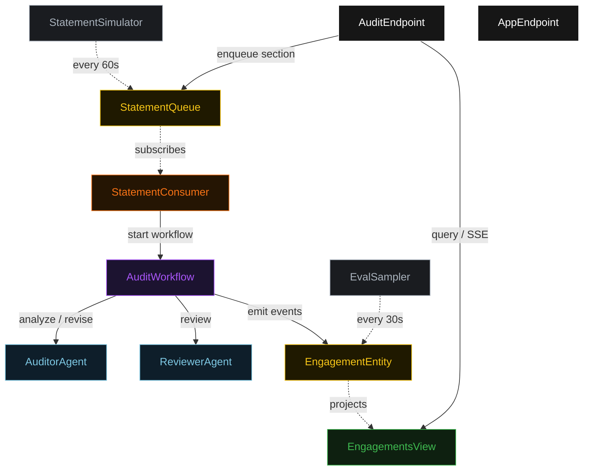
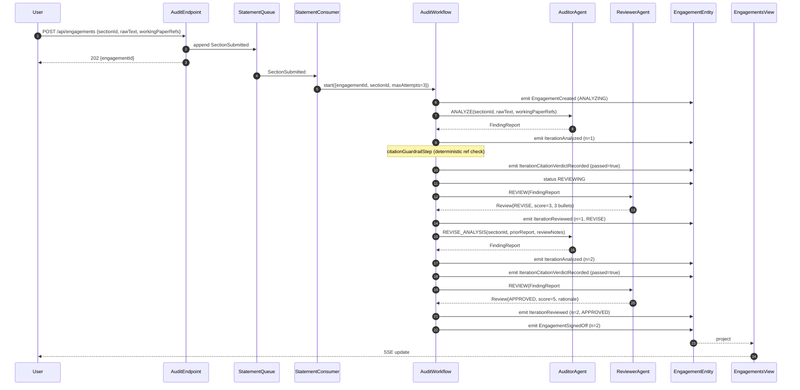
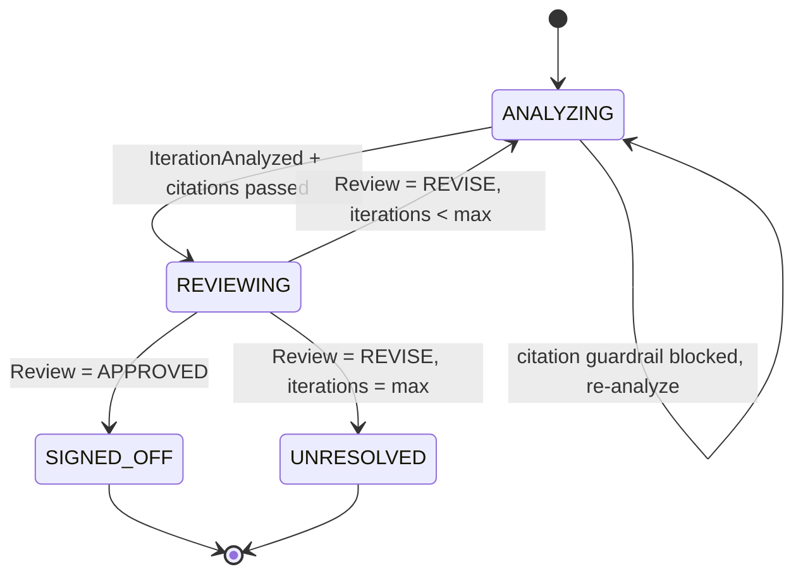
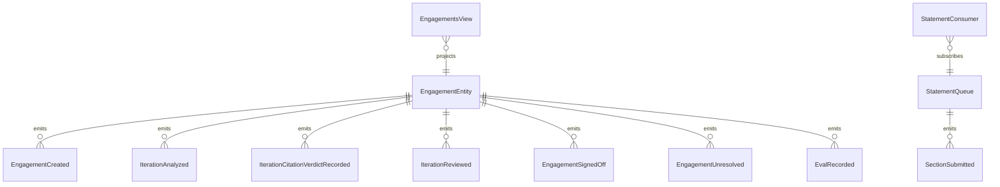

# PLAN — statement-auditor

Architectural sketch consumed by `/akka:plan` (or skipped if `/akka:specify` covers it). Diagrams are rendered on the generated system's Architecture tab.

---

## Component graph

## Interaction sequence — J1 (convergence on iteration 2)

## State machine — `EngagementEntity`

## Entity model

## Component table — Java file targets

| Component | Path (generated) |
|---|---|
| `AuditorAgent` | `application/AuditorAgent.java` |
| `ReviewerAgent` | `application/ReviewerAgent.java` |
| `AuditTasks` | `application/AuditTasks.java` |
| `AuditWorkflow` | `application/AuditWorkflow.java` |
| `EngagementEntity` | `application/EngagementEntity.java` (state in `domain/Engagement.java`, events in `domain/EngagementEvent.java`) |
| `StatementQueue` | `application/StatementQueue.java` |
| `EngagementsView` | `application/EngagementsView.java` |
| `StatementConsumer` | `application/StatementConsumer.java` |
| `StatementSimulator` | `application/StatementSimulator.java` |
| `EvalSampler` | `application/EvalSampler.java` |
| `AuditEndpoint` | `api/AuditEndpoint.java` |
| `AppEndpoint` | `api/AppEndpoint.java` |
| `MockModelProvider` (option (a) only) | `application/MockModelProvider.java` |
| Bootstrap | `Bootstrap.java` |

## Concurrency notes

- **Workflow step timeouts:** `analyzeStep` and `reviewStep` each carry `stepTimeout(Duration.ofSeconds(60))`. The default 5-second timeout never applies to agent-calling steps (Lesson 4).
- **Default step recovery:** `defaultStepRecovery(maxRetries(2).failoverTo(unresolvedStep))` — the workflow degrades to `UNRESOLVED` on irrecoverable agent failure rather than hanging.
- **Idempotency:** `AuditEndpoint.submit` uses `(sectionId, submittedBy)` over a 10 s window as the dedup key.
- **EvalSampler idempotency:** the sampler keys its `recordEval` calls on `(engagementId, iterationNumber)` so a tick that fires twice for the same iteration is a no-op on the entity side.
- **maxAttempts ceiling:** read from `statement-auditor.audit.max-attempts` (default 3). The workflow checks the count BEFORE calling `analyzeStep` for the next iteration; it never recurses past the ceiling.
- **Saga semantics:** there is no external side-effect to compensate. `unresolvedStep` is the only terminal fallback; it preserves the best-scored finding report and every review on the entity.
- **Citation guardrail step:** `citationGuardrailStep` is pure-function (no LLM call); it checks each `Finding.citedWorkingPaper` against the engagement's `workingPaperRefs` list and either advances to `reviewStep` or returns to `analyzeStep` with a structured feedback note listing the unresolvable references.
