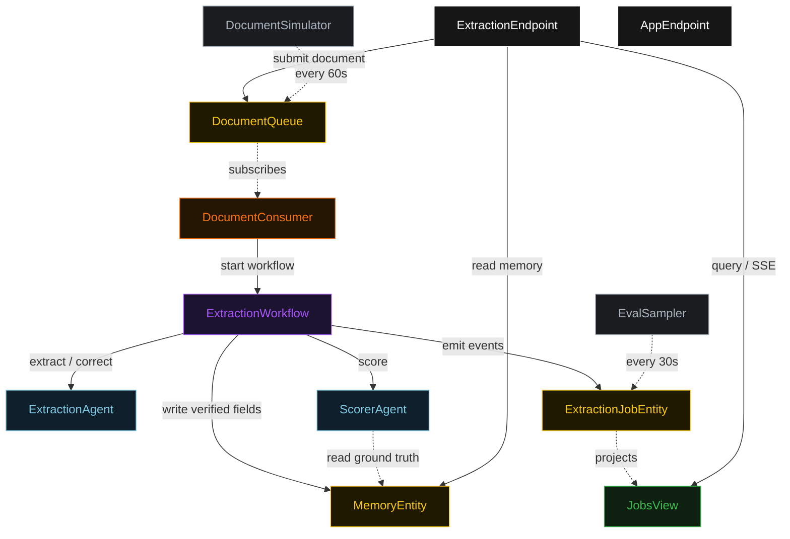
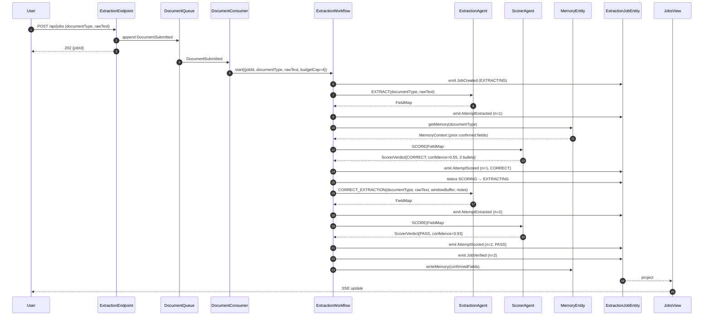
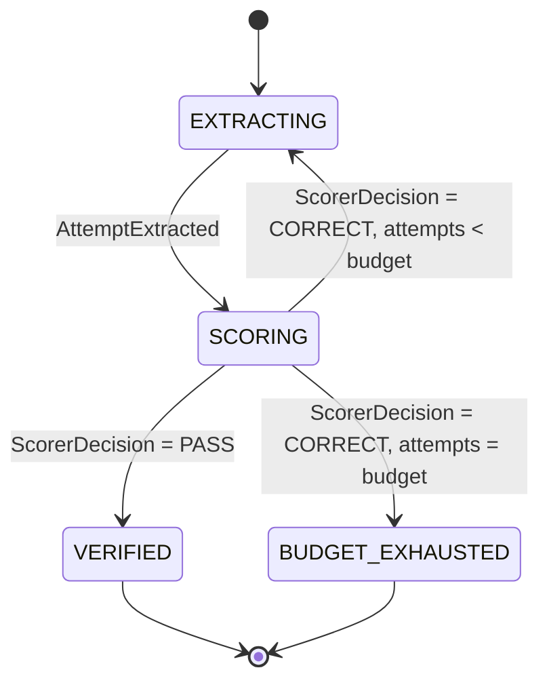
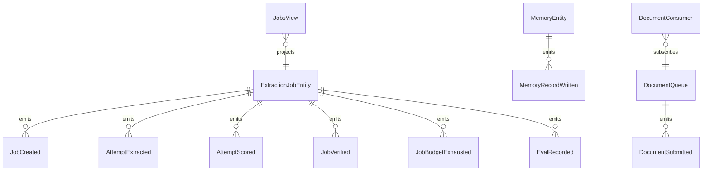

# PLAN — self-correcting-extraction

Architectural sketch consumed by `/akka:plan` (or skipped if `/akka:specify` covers it). Diagrams are rendered on the generated system's Architecture tab.

---

## Component graph

## Interaction sequence — J1 (convergence on attempt 2)

## State machine — `ExtractionJobEntity`

## Entity model

## Component table — Java file targets

| Component | Path (generated) |
|---|---|
| `ExtractionAgent` | `application/ExtractionAgent.java` |
| `ScorerAgent` | `application/ScorerAgent.java` |
| `ExtractionTasks` | `application/ExtractionTasks.java` |
| `ExtractionWorkflow` | `application/ExtractionWorkflow.java` |
| `ExtractionJobEntity` | `application/ExtractionJobEntity.java` (state in `domain/ExtractionJob.java`, events in `domain/JobEvent.java`) |
| `MemoryEntity` | `application/MemoryEntity.java` |
| `DocumentQueue` | `application/DocumentQueue.java` |
| `JobsView` | `application/JobsView.java` |
| `DocumentConsumer` | `application/DocumentConsumer.java` |
| `DocumentSimulator` | `application/DocumentSimulator.java` |
| `EvalSampler` | `application/EvalSampler.java` |
| `ExtractionEndpoint` | `api/ExtractionEndpoint.java` |
| `AppEndpoint` | `api/AppEndpoint.java` |
| `MockModelProvider` (option (a) only) | `application/MockModelProvider.java` |
| Bootstrap | `Bootstrap.java` |

## Concurrency notes

- **Workflow step timeouts:** `extractStep` and `scoreStep` each carry `stepTimeout(Duration.ofSeconds(60))`. The default 5-second timeout never applies to agent-calling steps (Lesson 4).
- **Default step recovery:** `defaultStepRecovery(maxRetries(2).failoverTo(exhaustStep))` — the workflow degrades to `BUDGET_EXHAUSTED` on irrecoverable agent failure rather than hanging.
- **Window buffer:** the workflow state carries a `List<FieldMap>` capped at 3 entries (configured via `self-correcting-extraction.extraction.window-buffer-size`). Each extractStep prepends the new FieldMap and trims to the cap before passing the buffer to the next CORRECT_EXTRACTION call.
- **Memory write ordering:** `verifyStep` writes to `MemoryEntity` only after `JobVerified` is emitted on `ExtractionJobEntity`; the order is enforced by step sequencing, not by a compensating saga.
- **Idempotency:** `ExtractionEndpoint.submit` uses `(documentType, submittedBy)` over a 10 s window as the dedup key. `EvalSampler` keys its `recordEval` calls on `(jobId, attemptNumber)` so a tick that fires twice is a no-op.
- **budgetCap ceiling:** read from `self-correcting-extraction.extraction.budget-cap` (default 4). The workflow checks `attemptCount < budgetCap` BEFORE calling `extractStep` for the next iteration.
- **Memory reads are advisory:** the Scorer receives the memory context as a hint; if `MemoryEntity` has no record for a document type, the context is an empty map and the Scorer falls back to rubric-only scoring.
