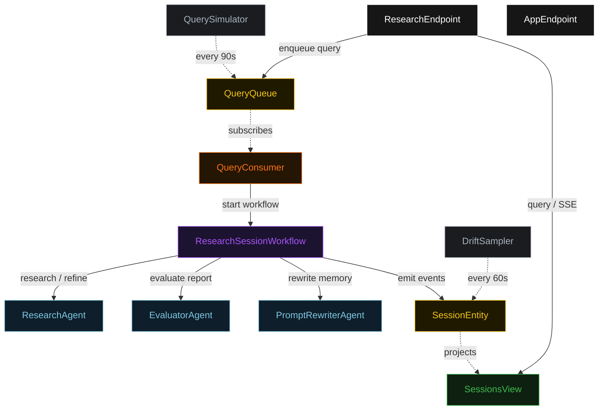
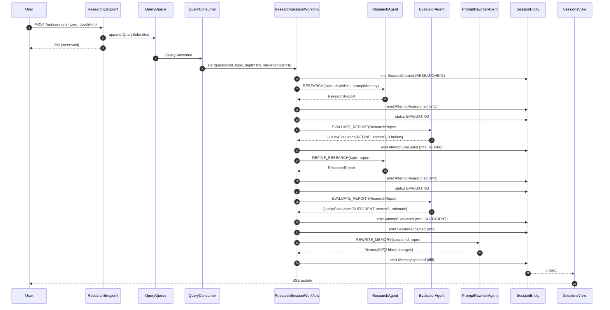
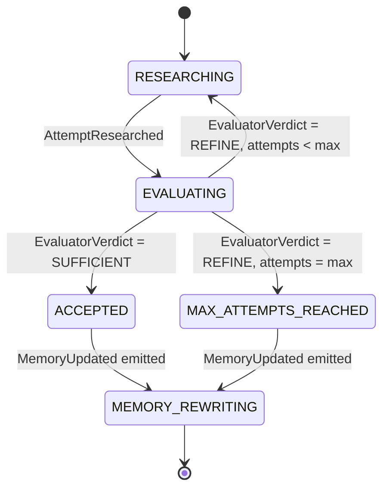
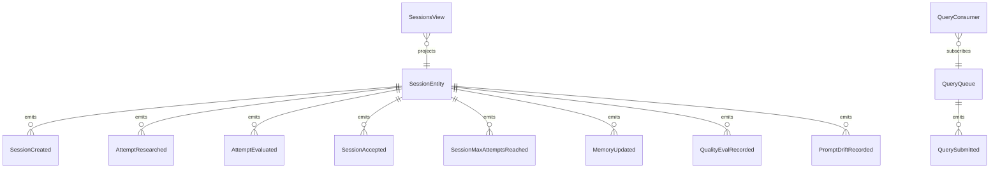

# PLAN — self-improving-deep-researcher

Architectural sketch consumed by `/akka:plan` (or skipped if `/akka:specify` covers it). Diagrams are rendered on the generated system's Architecture tab.

---

## Component graph

## Interaction sequence — J1 (convergence on attempt 2)

## State machine — `SessionEntity`

## Entity model

## Component table — Java file targets

| Component | Path (generated) |
|---|---|
| `ResearchAgent` | `application/ResearchAgent.java` |
| `EvaluatorAgent` | `application/EvaluatorAgent.java` |
| `PromptRewriterAgent` | `application/PromptRewriterAgent.java` |
| `ResearchTasks` | `application/ResearchTasks.java` |
| `ResearchSessionWorkflow` | `application/ResearchSessionWorkflow.java` |
| `SessionEntity` | `application/SessionEntity.java` (state in `domain/Session.java`, events in `domain/SessionEvent.java`) |
| `QueryQueue` | `application/QueryQueue.java` |
| `SessionsView` | `application/SessionsView.java` |
| `QueryConsumer` | `application/QueryConsumer.java` |
| `QuerySimulator` | `application/QuerySimulator.java` |
| `DriftSampler` | `application/DriftSampler.java` |
| `ResearchEndpoint` | `api/ResearchEndpoint.java` |
| `AppEndpoint` | `api/AppEndpoint.java` |
| `MockModelProvider` (option (a) only) | `application/MockModelProvider.java` |
| Bootstrap | `Bootstrap.java` |

## Concurrency notes

- **Workflow step timeouts:** `researchStep`, `refineStep`, `evaluateStep`, and `rewriteMemoryStep` each carry `stepTimeout(Duration.ofSeconds(90))`. Research workloads can take substantially longer than the default 5-second timeout; the override is mandatory (Lesson 4).
- **Default step recovery:** `defaultStepRecovery(maxRetries(2).failoverTo(maxAttemptsStep))` — any unrecoverable agent failure ends in `MAX_ATTEMPTS_REACHED`, not a hung workflow. The `rewriteMemoryStep` is outside the recovery scope; it runs after the terminal state is chosen.
- **Idempotency:** `ResearchEndpoint.submit` deduplicates on `(topic, requestedBy)` over a 15 s window. `DriftSampler` deduplicates on the `(oldFingerprint, newFingerprint)` pair so a tick that fires twice for the same transition is a no-op.
- **maxAttempts ceiling:** read from `self-improving-researcher.session.max-attempts` (default 3). The workflow checks the count BEFORE calling `refineStep`; it never recurses past the ceiling.
- **Memory store:** `PromptMemory` is a JSON file on the classpath (`governance/prompt-memory.json`). The `rewriteMemoryStep` writes the updated blocks back to this file. In a production deployment this would be an external KV store; the file-based approach is intentional for the out-of-the-box demo.
- **Drift fingerprint:** SHA-256 of the serialized `PromptMemory.blocks` JSON array, hex-encoded, first 16 chars. The `DriftSampler` stores the last-seen fingerprint in a local volatile field; a restart reseeds from the current file.
- **Rewrite step is unconditional:** the `PromptRewriterAgent` runs after every terminal transition — `ACCEPTED` and `MAX_ATTEMPTS_REACHED` alike. This ensures the memory always reflects the most recent session outcome, including failure patterns.
