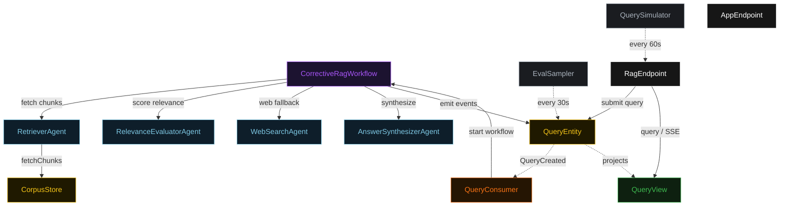
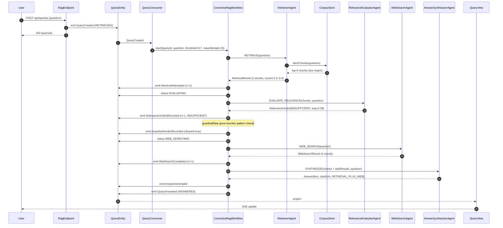
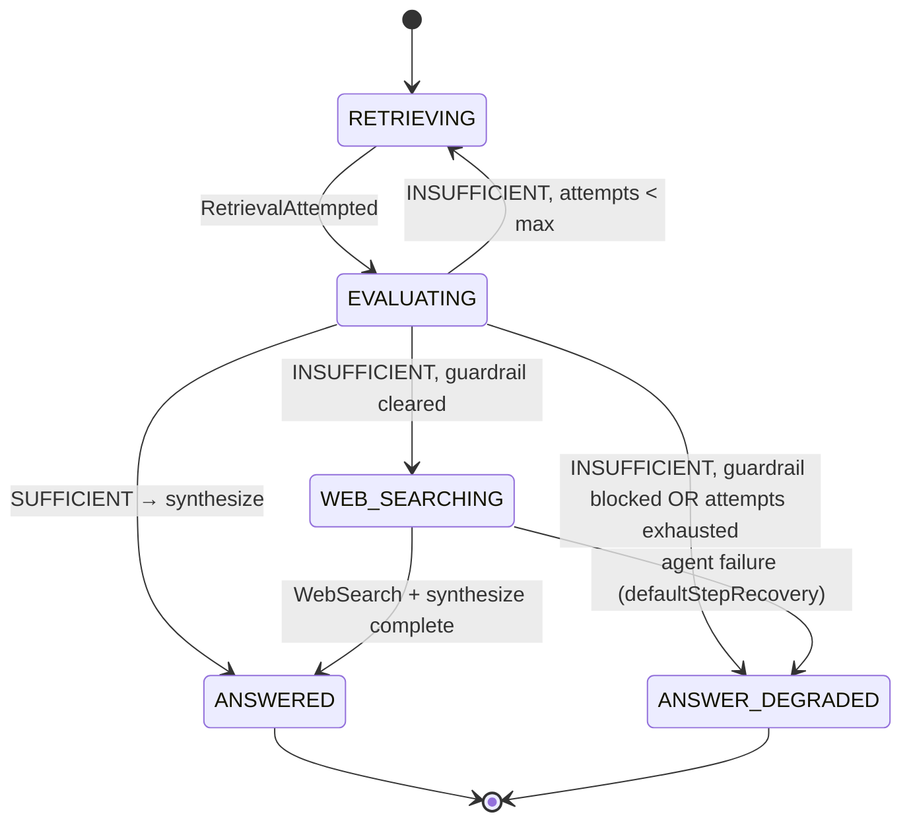
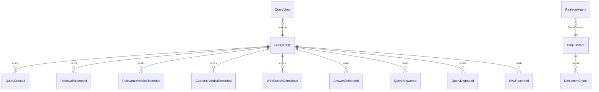

# PLAN — corrective-rag-workflow

Architectural sketch consumed by `/akka:plan` (or skipped if `/akka:specify` covers it). Diagrams are rendered on the generated system's Architecture tab.

---

## Component graph

## Interaction sequence — J2 (corrective fallback path)

## State machine — `QueryEntity`

## Entity model

## Component table — Java file targets

| Component | Path (generated) |
|---|---|
| `RetrieverAgent` | `application/RetrieverAgent.java` |
| `RelevanceEvaluatorAgent` | `application/RelevanceEvaluatorAgent.java` |
| `WebSearchAgent` | `application/WebSearchAgent.java` |
| `AnswerSynthesizerAgent` | `application/AnswerSynthesizerAgent.java` |
| `RagTasks` | `application/RagTasks.java` |
| `CorrectiveRagWorkflow` | `application/CorrectiveRagWorkflow.java` |
| `QueryEntity` | `application/QueryEntity.java` (state in `domain/Query.java`, events in `domain/QueryEvent.java`) |
| `CorpusStore` | `application/CorpusStore.java` |
| `QueryView` | `application/QueryView.java` |
| `QueryConsumer` | `application/QueryConsumer.java` |
| `QuerySimulator` | `application/QuerySimulator.java` |
| `EvalSampler` | `application/EvalSampler.java` |
| `RagEndpoint` | `api/RagEndpoint.java` |
| `AppEndpoint` | `api/AppEndpoint.java` |
| `MockModelProvider` (option (a) only) | `application/MockModelProvider.java` |
| Bootstrap | `Bootstrap.java` |

## Concurrency notes

- **Workflow step timeouts:** `retrieveStep`, `evaluateStep`, `webSearchStep`, and `synthesizeStep` each carry `stepTimeout(Duration.ofSeconds(60))`. The guardrail step is in-process and effectively instant.
- **Default step recovery:** `defaultStepRecovery(maxRetries(2).failoverTo(degradeStep))` — any unrecoverable agent failure ends in `ANSWER_DEGRADED`, not a hung workflow.
- **Idempotency:** `RagEndpoint.submit` uses `(question, requestedBy)` over a 10 s window as the dedup key.
- **EvalSampler idempotency:** the sampler keys its `recordEval` calls on `(queryId, attemptNumber)` so a tick that fires twice for the same attempt is a no-op on the entity side.
- **maxRetrievalAttempts ceiling:** read from `corrective-rag.retrieval.max-attempts` (default 3). The workflow checks the count BEFORE looping back to `retrieveStep`; it never recurses past the ceiling.
- **Guardrail placement:** `guardrailStep` runs only on the `INSUFFICIENT` branch, immediately before `webSearchStep`. A `SUFFICIENT` verdict never touches the guardrail.
- **CorpusStore seeding:** `CorpusStore` is pre-seeded on first start from `corpus-chunks.jsonl` via Bootstrap. Subsequent starts are idempotent because the entity ignores `AddChunk` commands for chunkIds it already holds.
