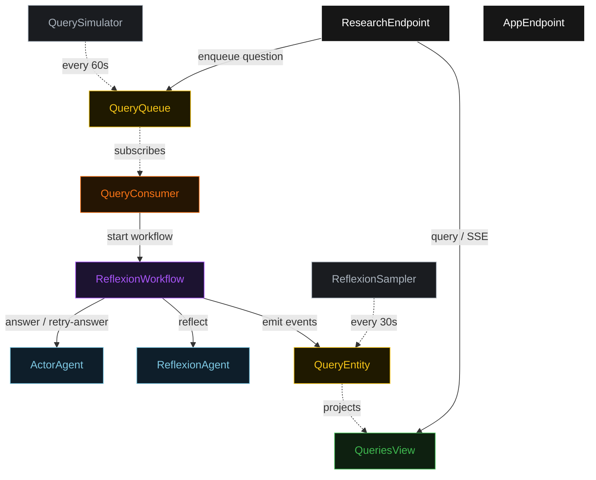
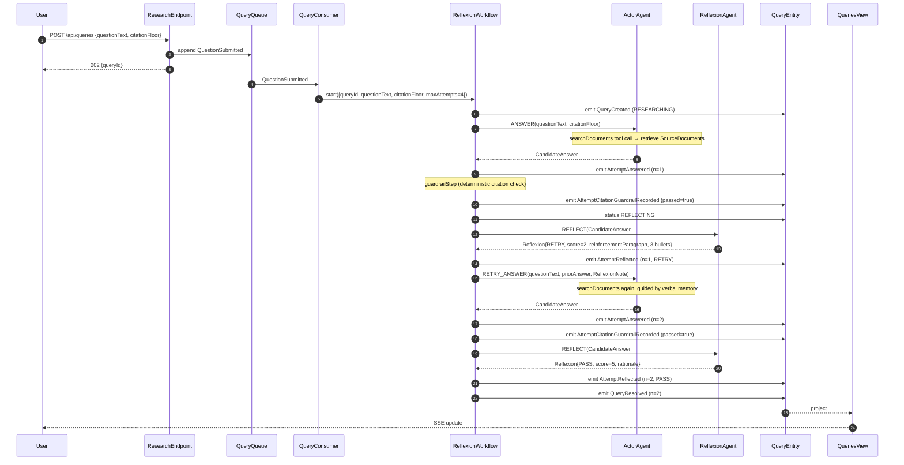
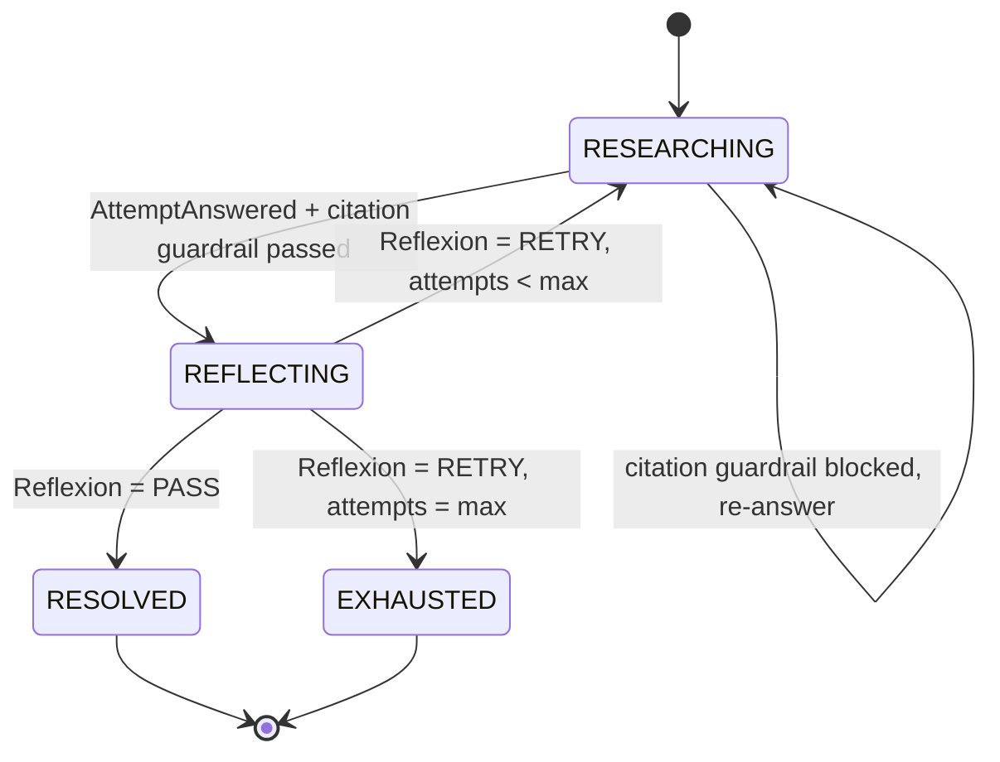
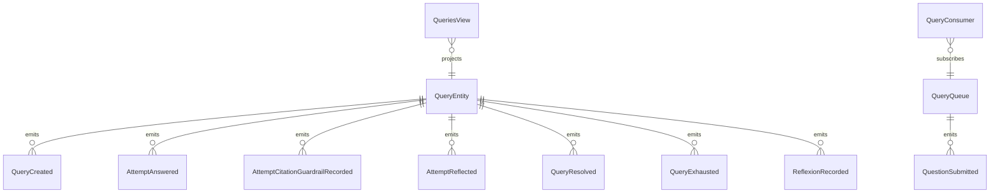

# PLAN — reflexion-self-critique

Architectural sketch consumed by `/akka:plan` (or skipped if `/akka:specify` covers it). Diagrams are rendered on the generated system's Architecture tab.

---

## Component graph

## Interaction sequence — J1 (convergence on attempt 2)

## State machine — `QueryEntity`

## Entity model

## Component table — Java file targets

| Component | Path (generated) |
|---|---|
| `ActorAgent` | `application/ActorAgent.java` |
| `ReflexionAgent` | `application/ReflexionAgent.java` |
| `ResearchTasks` | `application/ResearchTasks.java` |
| `ReflexionWorkflow` | `application/ReflexionWorkflow.java` |
| `QueryEntity` | `application/QueryEntity.java` (state in `domain/Query.java`, events in `domain/QueryEvent.java`) |
| `QueryQueue` | `application/QueryQueue.java` |
| `QueriesView` | `application/QueriesView.java` |
| `QueryConsumer` | `application/QueryConsumer.java` |
| `QuerySimulator` | `application/QuerySimulator.java` |
| `ReflexionSampler` | `application/ReflexionSampler.java` |
| `ResearchEndpoint` | `api/ResearchEndpoint.java` |
| `AppEndpoint` | `api/AppEndpoint.java` |
| `MockModelProvider` (option (a) only) | `application/MockModelProvider.java` |
| Bootstrap | `Bootstrap.java` |

## Concurrency notes

- **Workflow step timeouts:** `answerStep` and `reflectStep` each carry `stepTimeout(Duration.ofSeconds(60))`. The default 5-second timeout never applies to agent-calling steps (Lesson 4).
- **Default step recovery:** `defaultStepRecovery(maxRetries(2).failoverTo(exhaustStep))` — the workflow degrades to `EXHAUSTED` on irrecoverable agent failure rather than hanging.
- **Idempotency:** `ResearchEndpoint.submit` uses `(questionText, submittedBy)` over a 10 s window as the dedup key.
- **ReflexionSampler idempotency:** the sampler keys its `recordReflexionEval` calls on `(queryId, attemptNumber)` so a tick that fires twice for the same attempt is a no-op on the entity side.
- **maxAttempts ceiling:** read from `reflexion.max-attempts` (default 4). The workflow checks the count BEFORE calling `answerStep` for the next iteration; it never recurses past the ceiling.
- **Saga semantics:** there is no external side-effect to compensate. The halt mechanism (`HT1`) is the only "compensation"; it preserves the best answer and every reflexion note on the entity.
- **Guardrail step:** `guardrailStep` is pure-function (no LLM call); it checks `answer.citationCount() >= citationFloor` and either advances to `reflectStep` or returns to `answerStep` with a structured feedback `ReflexionNote`. The feedback is never an LLM-generated critique; it is a deterministic message with a single focusBullet naming the shortfall count.
- **Verbal memory propagation:** on `RETRY_ANSWER`, the full `ReflexionNote` — `reinforcementParagraph` plus `focusBullets` — is passed as a structured input to `ActorAgent`. The agent serialises this into its prompt context as prior reasoning, not as a system instruction, so subsequent model calls see it as part of the conversation history.
