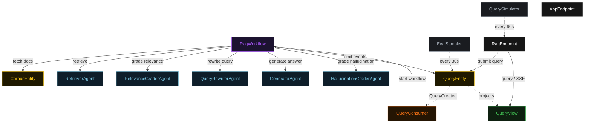
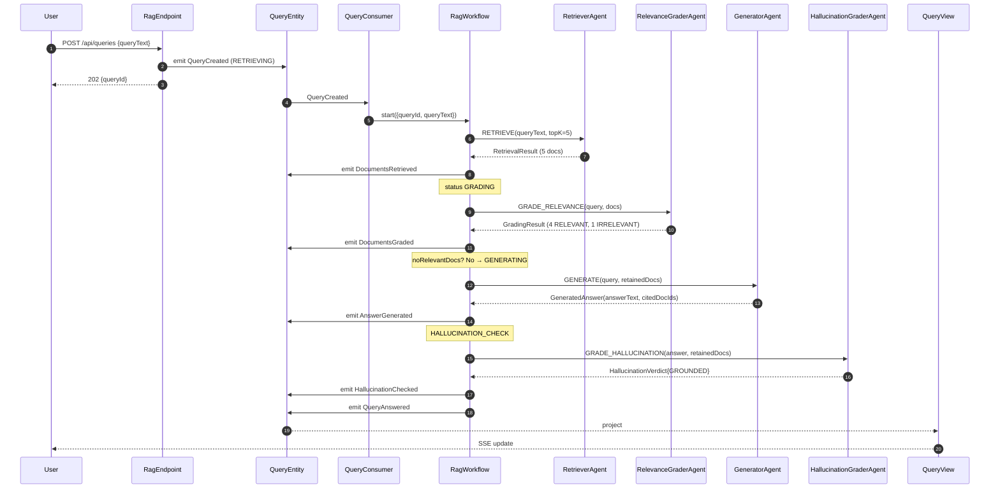
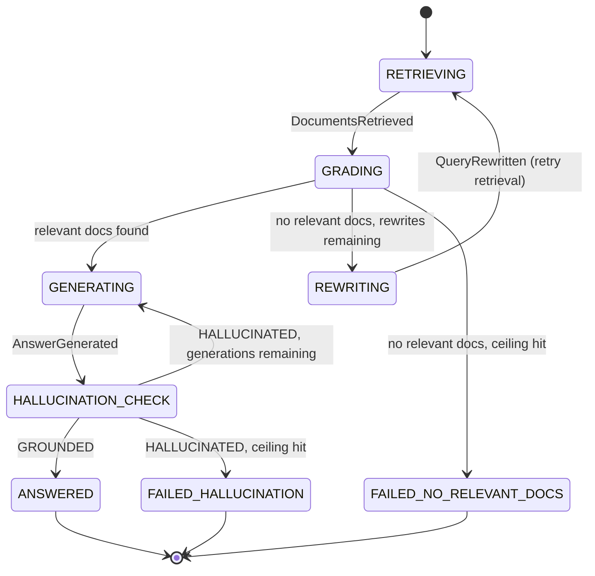
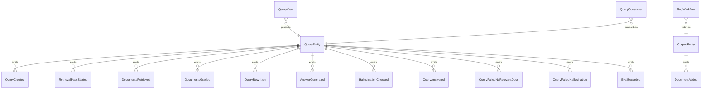

# PLAN — self-correcting-rag

Architectural sketch consumed by `/akka:plan` (or skipped if `/akka:specify` covers it). Diagrams are rendered on the generated system's Architecture tab.

---

## Component graph

## Interaction sequence — J1 (single-pass answer)

## State machine — `QueryEntity`

## Entity model

## Component table — Java file targets

| Component | Path (generated) |
|---|---|
| `RetrieverAgent` | `application/RetrieverAgent.java` |
| `RelevanceGraderAgent` | `application/RelevanceGraderAgent.java` |
| `QueryRewriterAgent` | `application/QueryRewriterAgent.java` |
| `GeneratorAgent` | `application/GeneratorAgent.java` |
| `HallucinationGraderAgent` | `application/HallucinationGraderAgent.java` |
| `RagTasks` | `application/RagTasks.java` |
| `RagWorkflow` | `application/RagWorkflow.java` |
| `QueryEntity` | `application/QueryEntity.java` (state in `domain/Query.java`, events in `domain/QueryEvent.java`) |
| `CorpusEntity` | `application/CorpusEntity.java` |
| `QueryView` | `application/QueryView.java` |
| `QueryConsumer` | `application/QueryConsumer.java` |
| `QuerySimulator` | `application/QuerySimulator.java` |
| `EvalSampler` | `application/EvalSampler.java` |
| `RagEndpoint` | `api/RagEndpoint.java` |
| `AppEndpoint` | `api/AppEndpoint.java` |
| `MockModelProvider` (option (a) only) | `application/MockModelProvider.java` |
| Bootstrap | `Bootstrap.java` |

## Concurrency notes

- **Workflow step timeouts:** `retrieveStep`, `gradeRelevanceStep`, `rewriteStep`, `generateStep`, and `hallucinationCheckStep` each carry `stepTimeout(Duration.ofSeconds(60))`. The default 5-second timeout never applies to agent-calling steps (Lesson 4).
- **Default step recovery:** `defaultStepRecovery(maxRetries(2).failoverTo(failHallucinationStep))` — the workflow degrades to `FAILED_HALLUCINATION` on irrecoverable agent failure rather than hanging.
- **Rewrite ceiling:** read from `self-correcting-rag.retrieval.max-rewrite-attempts` (default 2). The workflow checks the count before scheduling a rewrite; it never recurses past the ceiling.
- **Generation ceiling:** read from `self-correcting-rag.generation.max-generation-attempts` (default 2). Same guard pattern.
- **EvalSampler idempotency:** the sampler keys its `recordEval` calls on `(queryId, passNumber, stepKind)` so a tick that fires twice is a no-op on the entity side.
- **CorpusEntity consistency:** document fetches are served from the entity's in-memory state snapshot; no external vector store is required. The corpus is bootstrapped at startup from `src/main/resources/sample-events/corpus-documents.jsonl`.
- **Saga semantics:** both failure states (`FAILED_NO_RELEVANT_DOCS`, `FAILED_HALLUCINATION`) are graceful terminal states that preserve the full retrieval and generation history on the entity.
