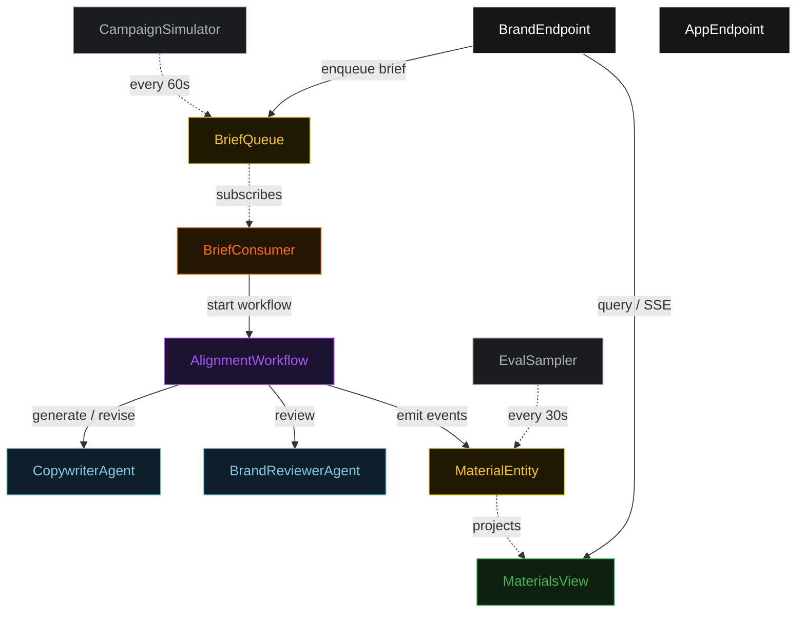
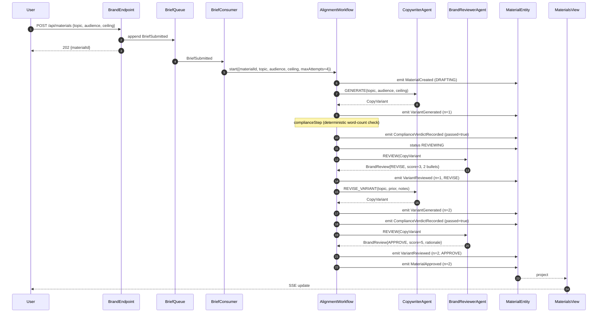
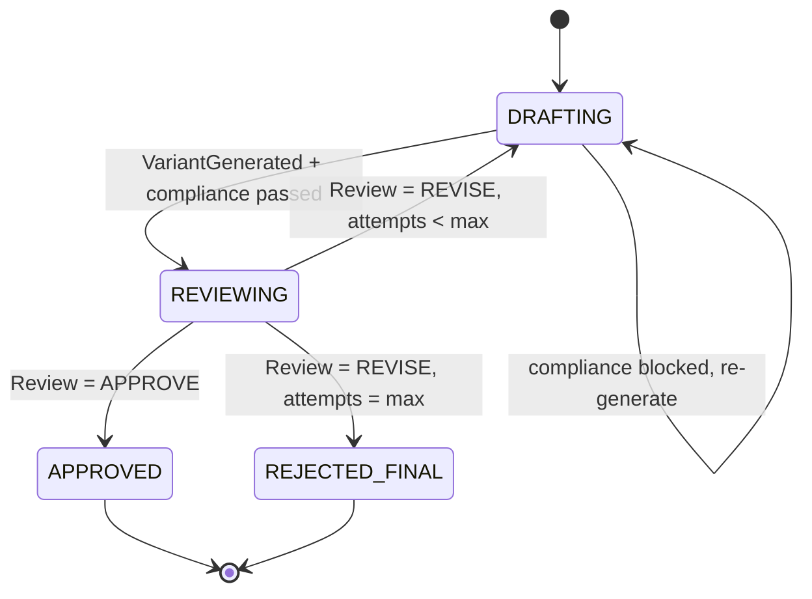
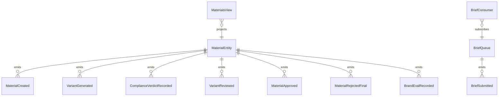

# PLAN — brand-aligner

Architectural sketch consumed by `/akka:plan` (or skipped if `/akka:specify` covers it). Diagrams are rendered on the generated system's Architecture tab.

---

## Component graph

## Interaction sequence — J1 (convergence on attempt 2)

## State machine — `MaterialEntity`

## Entity model

## Component table — Java file targets

| Component | Path (generated) |
|---|---|
| `CopywriterAgent` | `application/CopywriterAgent.java` |
| `BrandReviewerAgent` | `application/BrandReviewerAgent.java` |
| `BrandTasks` | `application/BrandTasks.java` |
| `AlignmentWorkflow` | `application/AlignmentWorkflow.java` |
| `MaterialEntity` | `application/MaterialEntity.java` (state in `domain/Material.java`, events in `domain/MaterialEvent.java`) |
| `BriefQueue` | `application/BriefQueue.java` |
| `MaterialsView` | `application/MaterialsView.java` |
| `BriefConsumer` | `application/BriefConsumer.java` |
| `CampaignSimulator` | `application/CampaignSimulator.java` |
| `EvalSampler` | `application/EvalSampler.java` |
| `BrandEndpoint` | `api/BrandEndpoint.java` |
| `AppEndpoint` | `api/AppEndpoint.java` |
| `MockModelProvider` (option (a) only) | `application/MockModelProvider.java` |
| Bootstrap | `Bootstrap.java` |

## Concurrency notes

- **Workflow step timeouts:** `generateStep` and `reviewStep` each carry `stepTimeout(Duration.ofSeconds(60))`. The default 5-second timeout never applies to agent-calling steps (Lesson 4).
- **Default step recovery:** `defaultStepRecovery(maxRetries(2).failoverTo(rejectStep))` — the workflow degrades to `REJECTED_FINAL` on irrecoverable agent failure rather than hanging.
- **Idempotency:** `BrandEndpoint.submit` uses `(topic, requestedBy)` over a 10 s window as the dedup key.
- **EvalSampler idempotency:** the sampler keys its `recordEval` calls on `(materialId, attemptNumber)` so a tick that fires twice for the same attempt is a no-op on the entity side.
- **maxAttempts ceiling:** read from `brand-aligner.alignment.max-attempts` (default 4). The workflow checks the count BEFORE calling `generateStep` for the next iteration; it never recurses past the ceiling.
- **Saga semantics:** there is no external side-effect to compensate. The halt mechanism (`HT1`) is the only "compensation"; it preserves the best variant and every review on the entity.
- **Compliance step:** `complianceStep` is pure-function (no LLM call); it computes the word count from the variant and either advances to `reviewStep` or returns to `generateStep` with a structured feedback note. The structured feedback never becomes an LLM-generated review; it stays a deterministic `ReviewNotes` payload with a single bullet.
