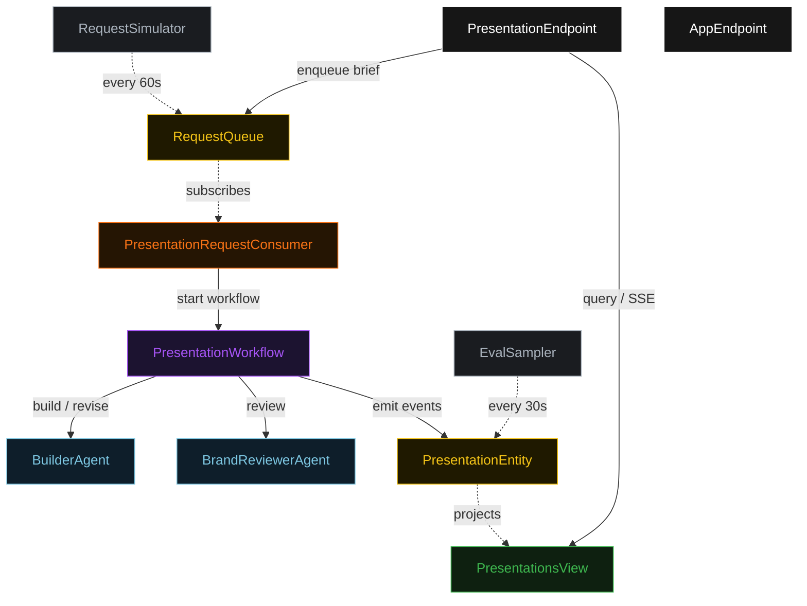
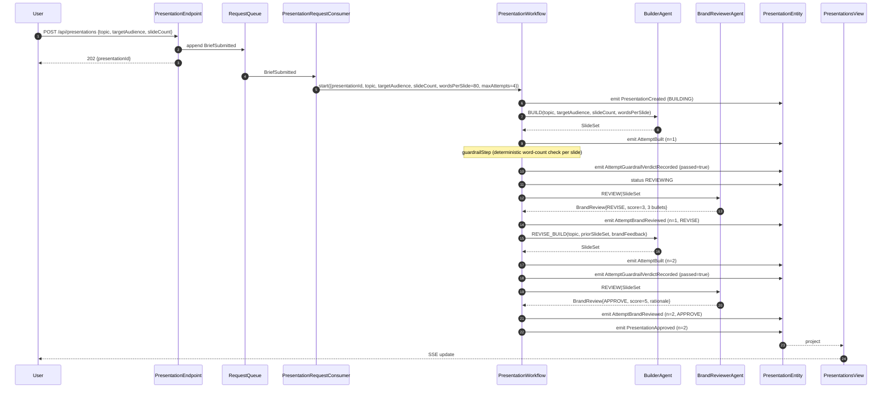
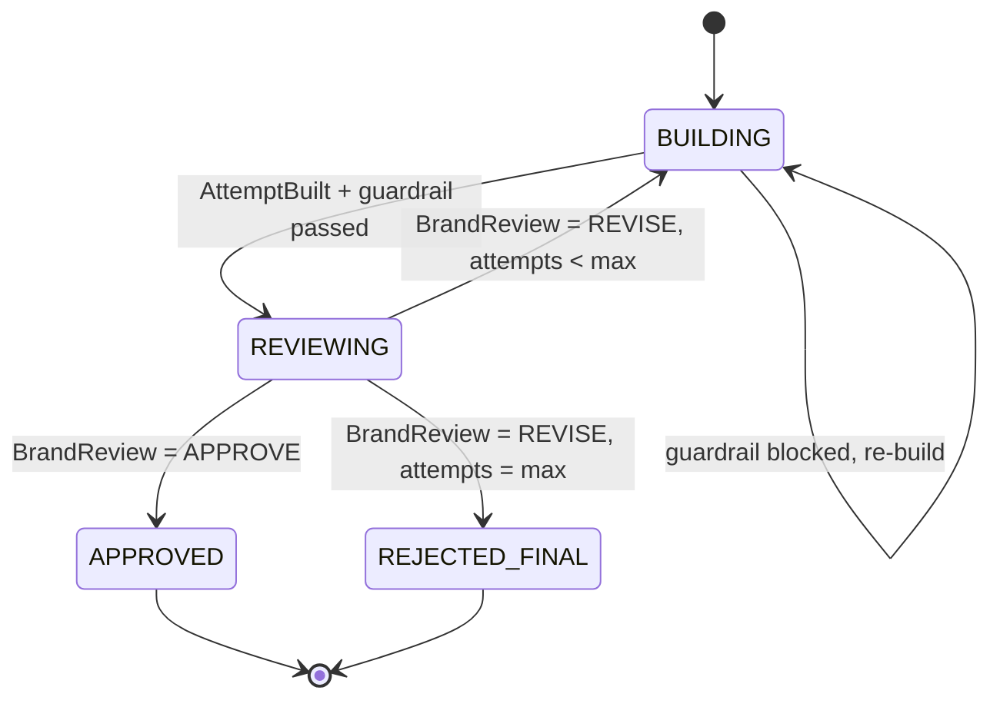
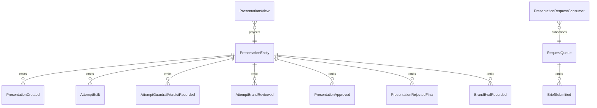

# PLAN — brand-presentation-builder

Architectural sketch consumed by `/akka:plan` (or skipped if `/akka:specify` covers it). Diagrams are rendered on the generated system's Architecture tab.

---

## Component graph

## Interaction sequence — J1 (convergence on attempt 2)

## State machine — `PresentationEntity`

## Entity model

## Component table — Java file targets

| Component | Path (generated) |
|---|---|
| `BuilderAgent` | `application/BuilderAgent.java` |
| `BrandReviewerAgent` | `application/BrandReviewerAgent.java` |
| `PresentationTasks` | `application/PresentationTasks.java` |
| `PresentationWorkflow` | `application/PresentationWorkflow.java` |
| `PresentationEntity` | `application/PresentationEntity.java` (state in `domain/Presentation.java`, events in `domain/PresentationEvent.java`) |
| `RequestQueue` | `application/RequestQueue.java` |
| `PresentationsView` | `application/PresentationsView.java` |
| `PresentationRequestConsumer` | `application/PresentationRequestConsumer.java` |
| `RequestSimulator` | `application/RequestSimulator.java` |
| `EvalSampler` | `application/EvalSampler.java` |
| `PresentationEndpoint` | `api/PresentationEndpoint.java` |
| `AppEndpoint` | `api/AppEndpoint.java` |
| `MockModelProvider` (option (a) only) | `application/MockModelProvider.java` |
| Bootstrap | `Bootstrap.java` |

## Concurrency notes

- **Workflow step timeouts:** `buildStep` and `reviewStep` each carry `stepTimeout(Duration.ofSeconds(60))`. The default 5-second timeout never applies to agent-calling steps (Lesson 4).
- **Default step recovery:** `defaultStepRecovery(maxRetries(2).failoverTo(rejectStep))` — the workflow degrades to `REJECTED_FINAL` on irrecoverable agent failure rather than hanging.
- **Idempotency:** `PresentationEndpoint.submit` uses `(topic, requestedBy)` over a 10 s window as the dedup key.
- **EvalSampler idempotency:** the sampler keys its `recordBrandEval` calls on `(presentationId, attemptNumber)` so a tick that fires twice for the same attempt is a no-op on the entity side.
- **maxAttempts ceiling:** read from `brand-presentation.refinement.max-attempts` (default 4). The workflow checks the count BEFORE calling `buildStep` for the next iteration; it never recurses past the ceiling.
- **Saga semantics:** there is no external side-effect to compensate. The halt mechanism (`HT1`) is the only "compensation"; it preserves the best slide set and every round of feedback on the entity.
- **Guardrail step:** `guardrailStep` is pure-function (no LLM call); it checks each `slide.wordCount() <= wordsPerSlide` and either advances to `reviewStep` or returns to `buildStep` with a structured feedback note listing the offending slide numbers. The structured feedback never becomes an LLM-generated review; it stays a deterministic `BrandFeedback` payload.
