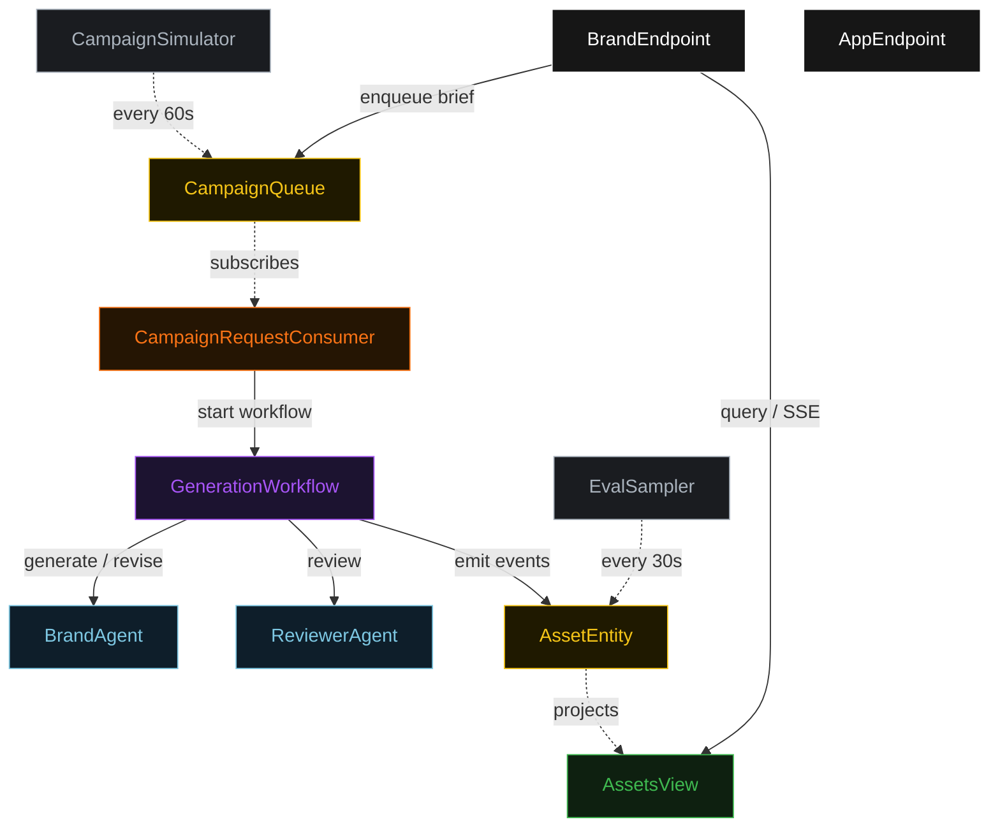
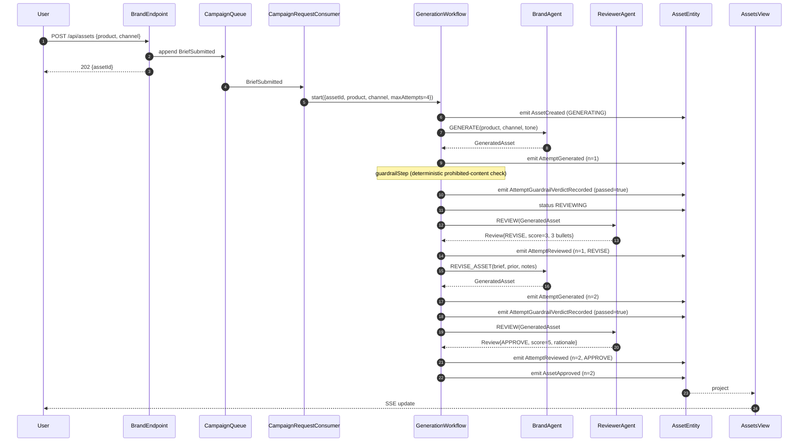
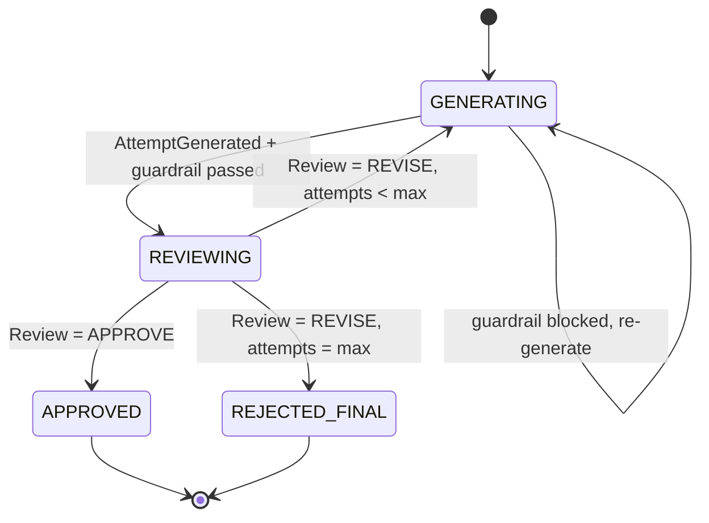
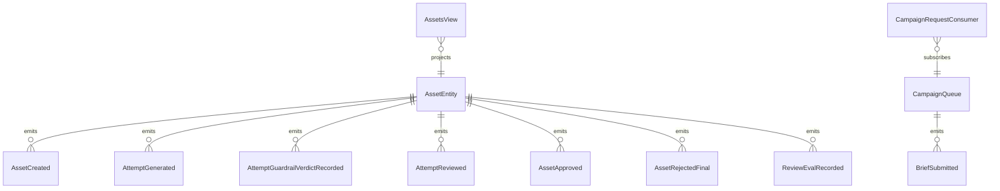

# PLAN — on-brand-genmedia

Architectural sketch consumed by `/akka:plan` (or skipped if `/akka:specify` covers it). Diagrams are rendered on the generated system's Architecture tab.

---

## Component graph

## Interaction sequence — J1 (convergence on attempt 2)

## State machine — `AssetEntity`

## Entity model

## Component table — Java file targets

| Component | Path (generated) |
|---|---|
| `BrandAgent` | `application/BrandAgent.java` |
| `ReviewerAgent` | `application/ReviewerAgent.java` |
| `BrandTasks` | `application/BrandTasks.java` |
| `GenerationWorkflow` | `application/GenerationWorkflow.java` |
| `AssetEntity` | `application/AssetEntity.java` (state in `domain/Asset.java`, events in `domain/AssetEvent.java`) |
| `CampaignQueue` | `application/CampaignQueue.java` |
| `AssetsView` | `application/AssetsView.java` |
| `CampaignRequestConsumer` | `application/CampaignRequestConsumer.java` |
| `CampaignSimulator` | `application/CampaignSimulator.java` |
| `EvalSampler` | `application/EvalSampler.java` |
| `BrandEndpoint` | `api/BrandEndpoint.java` |
| `AppEndpoint` | `api/AppEndpoint.java` |
| `MockModelProvider` (option (a) only) | `application/MockModelProvider.java` |
| Bootstrap | `Bootstrap.java` |

## Concurrency notes

- **Workflow step timeouts:** `generateStep` and `reviewStep` each carry `stepTimeout(Duration.ofSeconds(60))`. The default 5-second timeout never applies to agent-calling steps (Lesson 4).
- **Default step recovery:** `defaultStepRecovery(maxRetries(2).failoverTo(rejectStep))` — the workflow degrades to `REJECTED_FINAL` on irrecoverable agent failure rather than hanging.
- **Idempotency:** `BrandEndpoint.submit` uses `(product, channel, requestedBy)` over a 10 s window as the dedup key.
- **EvalSampler idempotency:** the sampler keys its `recordEval` calls on `(assetId, attemptNumber)` so a tick that fires twice for the same attempt is a no-op on the entity side.
- **maxAttempts ceiling:** read from `on-brand-genmedia.generation.max-attempts` (default 4). The workflow checks the count BEFORE calling `generateStep` for the next iteration; it never recurses past the ceiling.
- **Saga semantics:** there is no external side-effect to compensate. The halt mechanism (`HT1`) is the only terminal path for ceiling-exhausted loops; it preserves the best asset and every review on the entity.
- **Guardrail step:** `guardrailStep` is pure-function (no LLM call); it scans the generated text against a configurable prohibited-terms list and either advances to `reviewStep` or returns to `generateStep` with a structured feedback note. The structured feedback stays a deterministic `ReviewNotes` payload with a single bullet.
