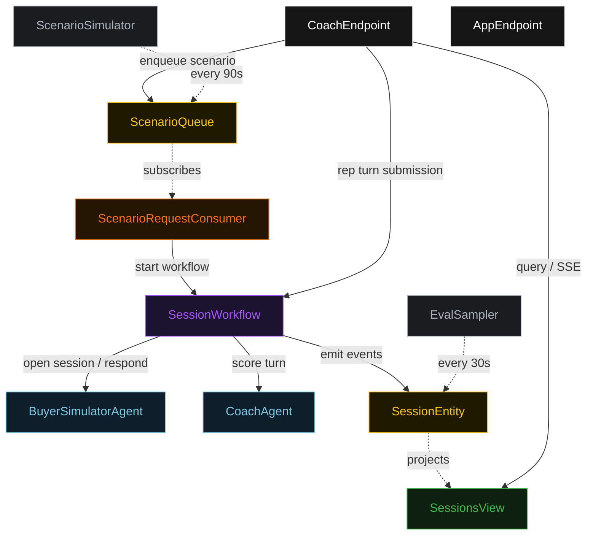
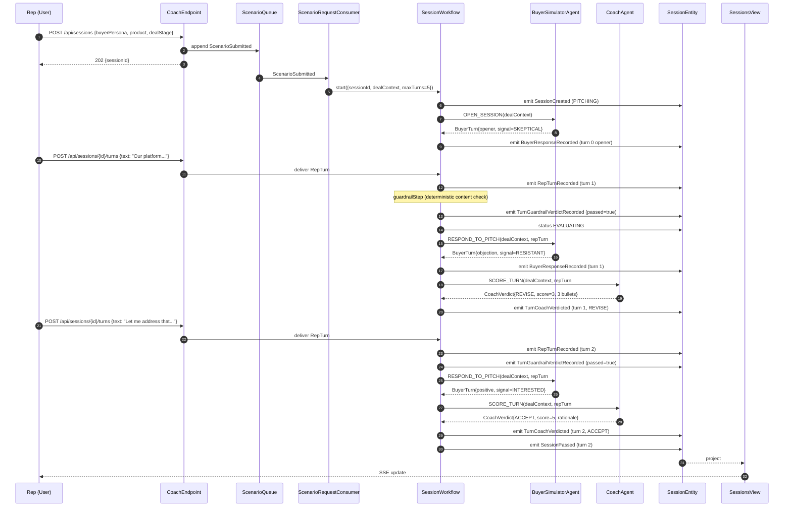
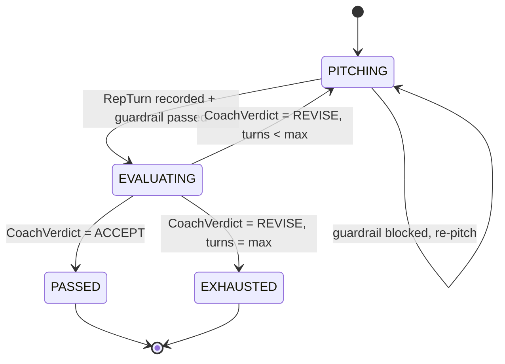
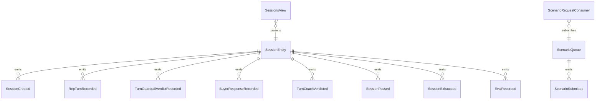

# PLAN — sales-roleplay-coach

Architectural sketch consumed by `/akka:plan` (or skipped if `/akka:specify` covers it). Diagrams are rendered on the generated system's Architecture tab.

---

## Component graph

## Interaction sequence — J1 (convergence on turn 2)

## State machine — `SessionEntity`

## Entity model

## Component table — Java file targets

| Component | Path (generated) |
|---|---|
| `BuyerSimulatorAgent` | `application/BuyerSimulatorAgent.java` |
| `CoachAgent` | `application/CoachAgent.java` |
| `SalesCoachTasks` | `application/SalesCoachTasks.java` |
| `SessionWorkflow` | `application/SessionWorkflow.java` |
| `SessionEntity` | `application/SessionEntity.java` (state in `domain/Session.java`, events in `domain/SessionEvent.java`) |
| `ScenarioQueue` | `application/ScenarioQueue.java` |
| `SessionsView` | `application/SessionsView.java` |
| `ScenarioRequestConsumer` | `application/ScenarioRequestConsumer.java` |
| `ScenarioSimulator` | `application/ScenarioSimulator.java` |
| `EvalSampler` | `application/EvalSampler.java` |
| `CoachEndpoint` | `api/CoachEndpoint.java` |
| `AppEndpoint` | `api/AppEndpoint.java` |
| `MockModelProvider` (option (a) only) | `application/MockModelProvider.java` |
| Bootstrap | `Bootstrap.java` |

## Concurrency notes

- **Workflow step timeouts:** `openBuyerStep`, `buyerResponseStep`, and `coachStep` each carry `stepTimeout(Duration.ofSeconds(90))`. The default 5-second timeout never applies to agent-calling steps (Lesson 4).
- **Default step recovery:** `defaultStepRecovery(maxRetries(2).failoverTo(exhaustStep))` — the workflow degrades to `EXHAUSTED` on irrecoverable agent failure rather than hanging.
- **Idempotency:** `CoachEndpoint.createSession` uses `(buyerPersona, product, requestedBy)` over a 10 s window as the dedup key.
- **EvalSampler idempotency:** the sampler keys its `recordEval` calls on `(sessionId, turnNumber)` so a tick that fires twice for the same turn is a no-op on the entity side.
- **maxTurns ceiling:** read from `sales-coach.session.max-turns` (default 5). The workflow checks the count BEFORE waiting for the next rep turn; it never accepts a submission past the ceiling.
- **Saga semantics:** there is no external side-effect to compensate. The halt mechanism is the only "compensation"; it preserves the best turn and every coaching verdict on the entity.
- **Guardrail step:** `guardrailStep` is pure-function (no LLM call); it checks the rep's turn text against the prohibited-content list (loaded from `src/main/resources/prohibited-patterns.txt`) and either advances to `buyerResponseStep` or returns to the repTurnStep wait state with a structured feedback note. The structured feedback never becomes an LLM-generated critique; it stays a deterministic `CoachingNotes` payload with a single bullet.
- **Rep turn delivery:** the workflow pauses at `repTurnStep` waiting for the rep to POST to `/api/sessions/{id}/turns`. `CoachEndpoint` delivers the turn into the workflow via a `ComponentClient` call. If no turn arrives within the step timeout, the workflow fails over to `exhaustStep`.
