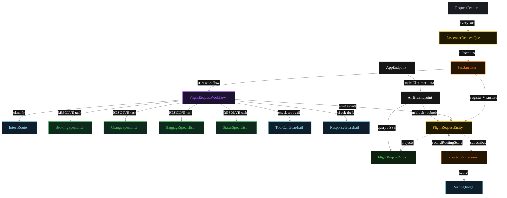
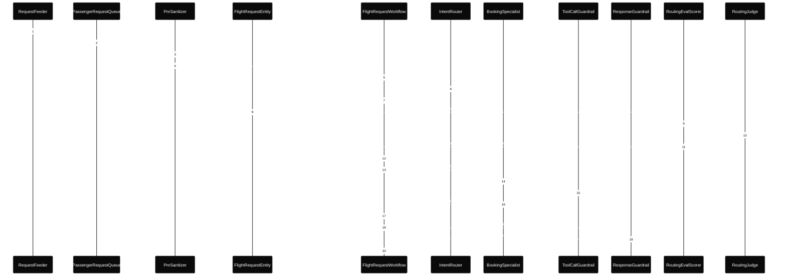
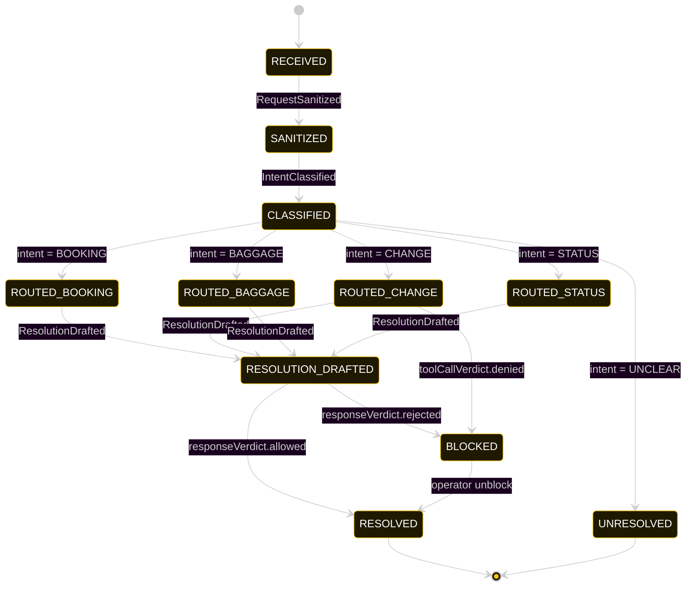
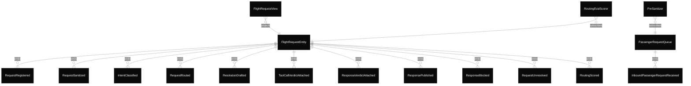

# PLAN — airline-triage-router

Architectural sketch consumed by `/akka:plan` and rendered on the generated system's Architecture tab.

---

## Component graph

Solid arrows = synchronous component calls. Dashed arrows = event subscriptions and scheduler ticks.

## Interaction sequence — J1 (booking happy path)

The eval-event sequence (steps 7–10) runs concurrently with the workflow's continuation — `RoutingEvalScorer` is a Consumer reading the entity's event stream, independent of `FlightRequestWorkflow`. Both writes target the same `FlightRequestEntity`; the entity's commands are idempotent on `requestId`.

## State machine — `FlightRequestEntity`

The `RoutingScored` event does not change `status`; it attaches the eval result. The state machine omits this as a no-op transition.

A `BLOCKED` state can arise from either a denied tool call (before the specialist finishes) or a blocked response (after the specialist returns a draft). Both surface the same way to the operator.

## Entity model

## Component table — Java file targets

| Component | Path (generated) |
|---|---|
| `RequestFeeder` | `application/RequestFeeder.java` |
| `PassengerRequestQueue` | `application/PassengerRequestQueue.java` |
| `PnrSanitizer` | `application/PnrSanitizer.java` |
| `IntentRouter` | `application/IntentRouter.java` |
| `BookingSpecialist` | `application/BookingSpecialist.java` |
| `ChangeSpecialist` | `application/ChangeSpecialist.java` |
| `BaggageSpecialist` | `application/BaggageSpecialist.java` |
| `StatusSpecialist` | `application/StatusSpecialist.java` |
| `RoutingJudge` | `application/RoutingJudge.java` |
| `ToolCallGuardrail` | `application/ToolCallGuardrail.java` |
| `ResponseGuardrail` | `application/ResponseGuardrail.java` |
| `FlightRequestWorkflow` | `application/FlightRequestWorkflow.java` |
| `FlightRequestEntity` | `application/FlightRequestEntity.java` (state in `domain/FlightRequest.java`, events in `domain/FlightRequestEvent.java`) |
| `FlightRequestView` | `application/FlightRequestView.java` |
| `RoutingEvalScorer` | `application/RoutingEvalScorer.java` |
| `AirlineEndpoint` | `api/AirlineEndpoint.java` |
| `AppEndpoint` | `api/AppEndpoint.java` |
| Task definitions | `application/AirlineTasks.java` |
| Mock provider (option a) | `application/MockModelProvider.java` |
| Bootstrap | `Bootstrap.java` |

## Concurrency notes

- **Per-step timeout.** `classifyStep` 20 s, `responseGuardrailStep` 20 s, all specialist steps and `publishStep` 60 s. On timeout, default recovery is `maxRetries(2).failoverTo(error)` which transitions the request to `UNRESOLVED` with the failure reason captured.
- **Idempotency.** Every per-request primitive is keyed by `requestId`: `FlightRequestEntity` id is `requestId`; `FlightRequestWorkflow` id is `requestId`; agent sessions for `IntentRouter`, `RoutingJudge`, `ToolCallGuardrail`, and `ResponseGuardrail` use `requestId`. Duplicate sanitize events fold into a single workflow start.
- **Two guardrail layers.** A before-tool-call denial and a response guardrail rejection both write to `BLOCKED`. They are not mutually exclusive but in practice only one fires per request: if the tool-call is denied, the specialist returns `outcome=ESCALATED` and the response guardrail sees a safe draft; if the tool-call is allowed, the response guardrail is the next gate.
- **Race between eval and workflow.** `RoutingEvalScorer` and `FlightRequestWorkflow` both append events to the same entity. The `RoutingScored` event only mutates `routingScore`, never `status`. The view materialises both independently.
- **Four-way branch.** The four intent categories produce four `ROUTED_*` states. They all converge at `RESOLUTION_DRAFTED` once the specialist returns, then share the single response guardrail step. The workflow code has one guard branch per intent; the post-draft path is shared.
- **Simulator throughput.** `RequestFeeder` drips one request every 30 s. With status-specialist and intent-router calls being fast, and booking/change/baggage at 60 s timeout, the system can process each request end-to-end inside that window on mock or real LLMs.
