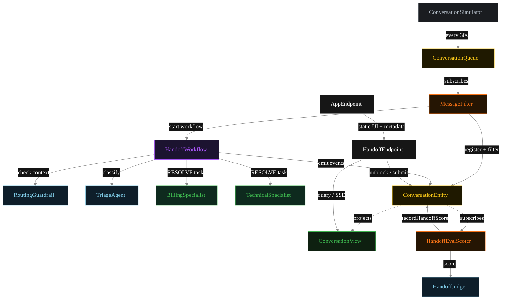
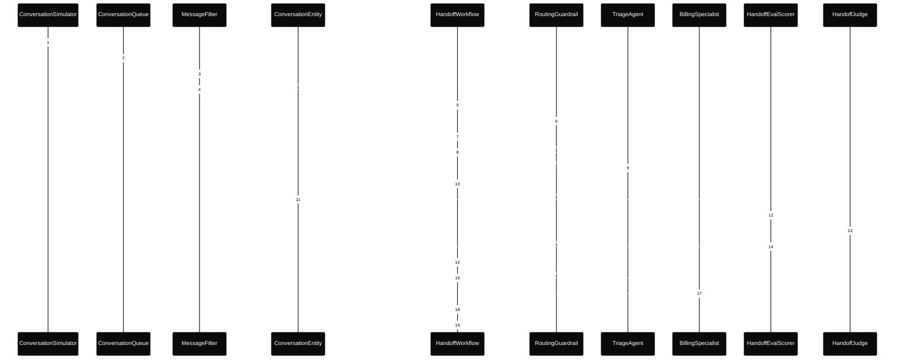
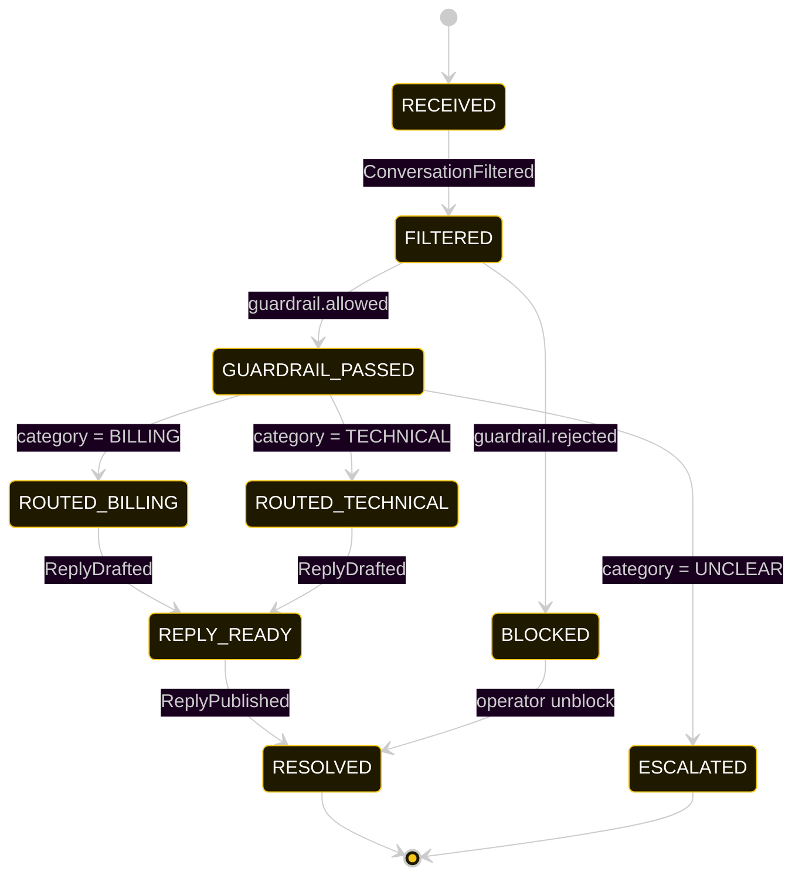
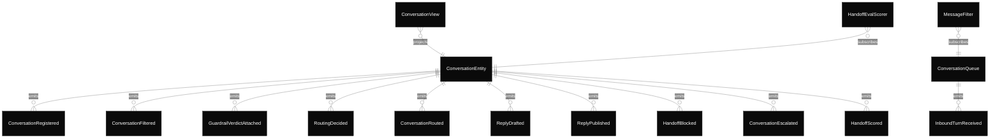

# PLAN — akka-handoff-routing

Architectural sketch consumed by `/akka:plan` and rendered on the generated system's Architecture tab.

---

## Component graph

Solid arrows = synchronous component calls. Dashed arrows = event subscriptions and scheduler ticks.

## Interaction sequence — J1 (billing happy path)

The eval-event sequence (steps 10–13) runs concurrently with the workflow's continuation — `HandoffEvalScorer` is a Consumer reading the entity's event stream, independent of `HandoffWorkflow`. Both writes target the same `ConversationEntity`; the entity's commands are idempotent on `conversationId`.

## State machine — `ConversationEntity`

The `HandoffScored` event does not change `status`; it attaches the eval result as metadata. The state machine therefore treats it as a no-op transition (omitted for clarity).

## Entity model

## Component table — Java file targets

| Component | Path (generated) |
|---|---|
| `ConversationSimulator` | `application/ConversationSimulator.java` |
| `ConversationQueue` | `application/ConversationQueue.java` |
| `MessageFilter` | `application/MessageFilter.java` |
| `RoutingGuardrail` | `application/RoutingGuardrail.java` |
| `TriageAgent` | `application/TriageAgent.java` |
| `BillingSpecialist` | `application/BillingSpecialist.java` |
| `TechnicalSpecialist` | `application/TechnicalSpecialist.java` |
| `HandoffJudge` | `application/HandoffJudge.java` |
| `HandoffWorkflow` | `application/HandoffWorkflow.java` |
| `ConversationEntity` | `application/ConversationEntity.java` (state in `domain/Conversation.java`, events in `domain/ConversationEvent.java`) |
| `ConversationView` | `application/ConversationView.java` |
| `HandoffEvalScorer` | `application/HandoffEvalScorer.java` |
| `HandoffEndpoint` | `api/HandoffEndpoint.java` |
| `AppEndpoint` | `api/AppEndpoint.java` |
| Task definitions | `application/HandoffTasks.java` |
| Mock provider (option a) | `application/MockModelProvider.java` |
| Bootstrap | `Bootstrap.java` |

## Concurrency notes

- **Per-step timeout.** `filterConfirmStep` 20 s, `guardrailStep` 20 s, `triageStep` 20 s, `billingStep` / `technicalStep` / `publishStep` 60 s each. On timeout, default recovery is `maxRetries(2).failoverTo(error)` which transitions the conversation to `ESCALATED` with the failure reason captured.
- **Idempotency.** Every per-conversation primitive is keyed by `conversationId`: `ConversationEntity` id is `conversationId`; `HandoffWorkflow` id is `conversationId`; agent sessions for `RoutingGuardrail`, `TriageAgent`, `HandoffJudge` use `conversationId`. Duplicate filter events fold into a single workflow start.
- **Race between eval and workflow.** `HandoffEvalScorer` (Consumer) and `HandoffWorkflow` both append events to the same `ConversationEntity`. Order is not guaranteed but does not matter: `HandoffScored` only mutates `handoffScore`, never `status`.
- **Guardrail before triage.** Unlike the response-guardrail pattern, `RoutingGuardrail` fires *before* `TriageAgent` is called. A blocked context never reaches the classifier or any specialist — the entity transitions directly to `BLOCKED` from `FILTERED`.
- **No saga compensation.** Once the specialist returns its `Reply`, the workflow publishes directly. There is no rollback — the guardrail gate is the pre-condition, not a post-check.
- **Simulator throughput.** `ConversationSimulator` drips one turn every 30 s; the system can process each conversation end-to-end inside that window with mock or real LLMs.
