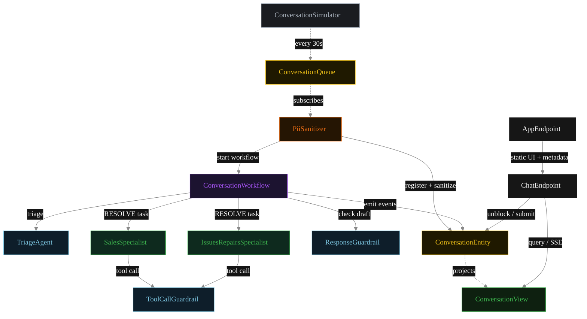
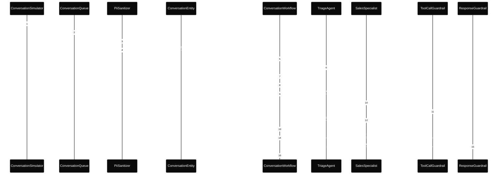
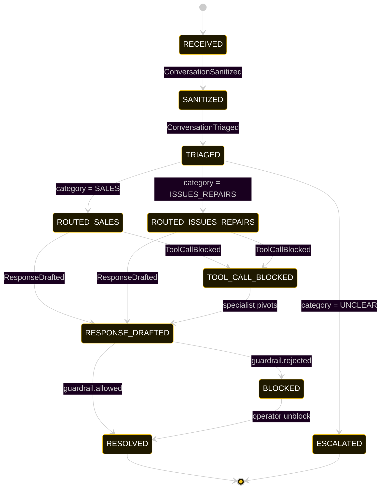
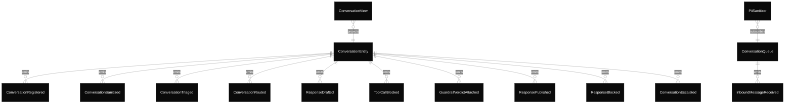

# PLAN — cx-handoff-triage

Architectural sketch consumed by `/akka:plan` and rendered on the generated system's Architecture tab.

---

## Component graph

Solid arrows = synchronous component calls. Dashed arrows = event subscriptions and scheduler ticks.

## Interaction sequence — J1 (sales happy path)

The tool-call guardrail (steps 10–11) runs inline within the specialist's task loop, before the tool executes. If the verdict is `allowed=false`, the tool call is cancelled, `ToolCallBlocked` is emitted on `ConversationEntity`, and the specialist receives a policy-rejection signal within the same iteration.

## State machine — `ConversationEntity`

`TOOL_CALL_BLOCKED` is a transient annotation state — after the specialist receives the rejection signal it continues the task loop and eventually still produces a `SpecialistResponse` that moves the conversation to `RESPONSE_DRAFTED`.

## Entity model

## Component table — Java file targets

| Component | Path (generated) |
|---|---|
| `ConversationSimulator` | `application/ConversationSimulator.java` |
| `ConversationQueue` | `application/ConversationQueue.java` |
| `PiiSanitizer` | `application/PiiSanitizer.java` |
| `TriageAgent` | `application/TriageAgent.java` |
| `SalesSpecialist` | `application/SalesSpecialist.java` |
| `IssuesRepairsSpecialist` | `application/IssuesRepairsSpecialist.java` |
| `ResponseGuardrail` | `application/ResponseGuardrail.java` |
| `ToolCallGuardrail` | `application/ToolCallGuardrail.java` |
| `ConversationWorkflow` | `application/ConversationWorkflow.java` |
| `ConversationEntity` | `application/ConversationEntity.java` (state in `domain/Conversation.java`, events in `domain/ConversationEvent.java`) |
| `ConversationView` | `application/ConversationView.java` |
| `ChatEndpoint` | `api/ChatEndpoint.java` |
| `AppEndpoint` | `api/AppEndpoint.java` |
| Task definitions | `application/ChatTasks.java` |
| Mock provider (option a) | `application/MockModelProvider.java` |
| Bootstrap | `Bootstrap.java` |

## Concurrency notes

- **Per-step timeout.** `triageStep` 20 s, `guardrailStep` 20 s, `salesStep` / `issuesStep` / `publishStep` 60 s each. On timeout, default recovery is `maxRetries(2).failoverTo(error)` which transitions the conversation to `ESCALATED` with the failure reason captured.
- **Idempotency.** Every per-conversation primitive is keyed by `conversationId`: `ConversationEntity` id is `conversationId`; `ConversationWorkflow` id is `conversationId`; agent sessions for `TriageAgent`, `ResponseGuardrail`, and `ToolCallGuardrail` use `conversationId`. Duplicate sanitize events fold into a single workflow start.
- **Tool-call guardrail ordering.** The `ToolCallGuardrail` check happens inline within the specialist's autonomous task loop, before any tool side-effect occurs. The specialist may retry with a different tool or parameter set within its `maxIterationsPerTask` budget.
- **No saga compensation.** A blocked draft sits in `BLOCKED` until an operator unblocks via `POST /api/conversations/{id}/unblock`. There is no automatic retry path after a `ResponseBlocked` event.
- **No HITL on the happy path.** The system only waits for a human when the response guardrail blocks; everything else flows through to `RESOLVED` autonomously. This is the distinction from a human-in-loop-gate pattern.
- **Simulator throughput.** `ConversationSimulator` drips one conversation every 30 s; the system can comfortably process each one end-to-end inside that window with mock or real LLMs.
