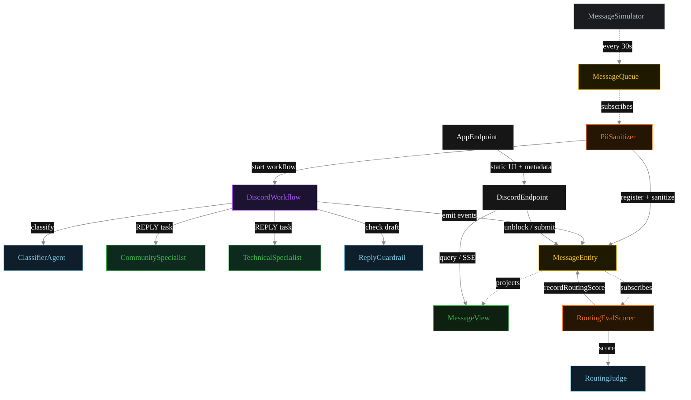
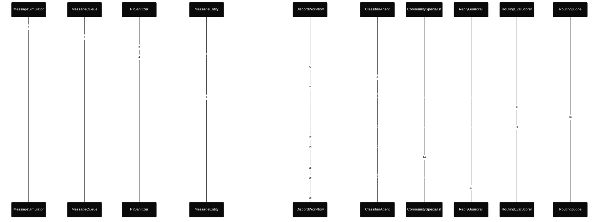
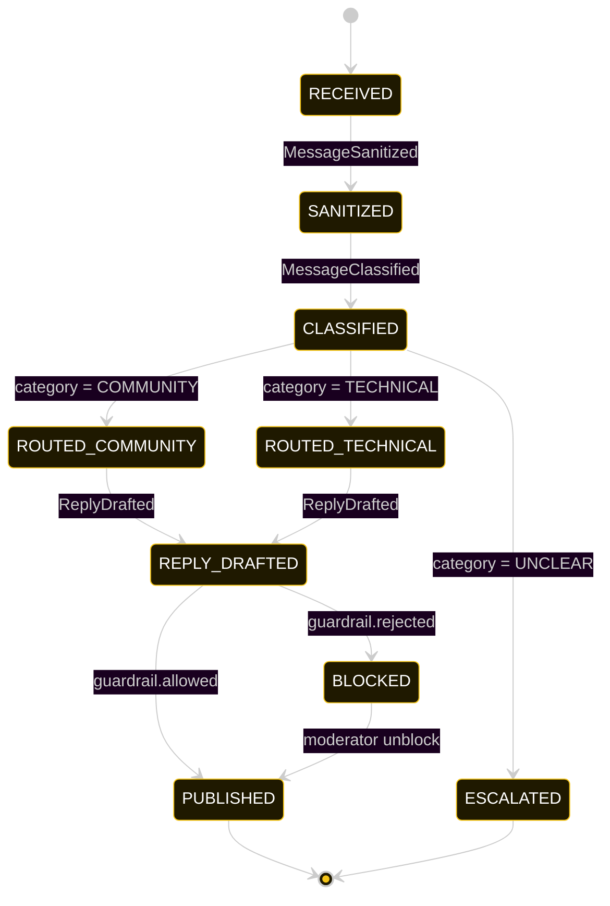
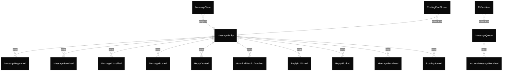

# PLAN — discord-router

Architectural sketch consumed by `/akka:plan` and rendered on the generated system's Architecture tab.

---

## Component graph

Solid arrows = synchronous component calls. Dashed arrows = event subscriptions and scheduler ticks.

## Interaction sequence — J1 (community happy path)

The eval-event sequence (steps 8–11) runs concurrently with the workflow's continuation — `RoutingEvalScorer` is a Consumer reading the entity's event stream, independent of `DiscordWorkflow`. Both write to the same `MessageEntity`; the entity's commands are idempotent on `messageId`.

## State machine — `MessageEntity`

The `RoutingScored` event does not change `status`; it attaches the eval result as metadata. The state machine therefore treats it as a no-op transition (omitted from the diagram for clarity).

## Entity model

## Component table — Java file targets

| Component | Path (generated) |
|---|---|
| `MessageSimulator` | `application/MessageSimulator.java` |
| `MessageQueue` | `application/MessageQueue.java` |
| `PiiSanitizer` | `application/PiiSanitizer.java` |
| `ClassifierAgent` | `application/ClassifierAgent.java` |
| `CommunitySpecialist` | `application/CommunitySpecialist.java` |
| `TechnicalSpecialist` | `application/TechnicalSpecialist.java` |
| `RoutingJudge` | `application/RoutingJudge.java` |
| `ReplyGuardrail` | `application/ReplyGuardrail.java` |
| `DiscordWorkflow` | `application/DiscordWorkflow.java` |
| `MessageEntity` | `application/MessageEntity.java` (state in `domain/Message.java`, events in `domain/MessageEvent.java`) |
| `MessageView` | `application/MessageView.java` |
| `RoutingEvalScorer` | `application/RoutingEvalScorer.java` |
| `DiscordEndpoint` | `api/DiscordEndpoint.java` |
| `AppEndpoint` | `api/AppEndpoint.java` |
| Task definitions | `application/DiscordTasks.java` |
| Mock provider (option a) | `application/MockModelProvider.java` |
| Bootstrap | `Bootstrap.java` |

## Concurrency notes

- **Per-step timeout.** `classifyStep` 20 s, `guardrailStep` 20 s, `communityStep` / `technicalStep` / `publishStep` 60 s each. On timeout, default recovery is `maxRetries(2).failoverTo(error)` which transitions the message to `ESCALATED` with the failure reason captured.
- **Idempotency.** Every per-message primitive is keyed by `messageId`: `MessageEntity` id is `messageId`; `DiscordWorkflow` id is `messageId`; agent sessions for `ClassifierAgent`, `RoutingJudge`, and `ReplyGuardrail` use `messageId`. Duplicate sanitize events fold into a single workflow start (workflow start is idempotent per id).
- **Race between eval and workflow.** `RoutingEvalScorer` (Consumer) and `DiscordWorkflow` both append events to the same `MessageEntity`. Order is not guaranteed but does not matter: `RoutingScored` only mutates `routingScore`, never `status`. The view materialises both events independently.
- **No saga compensation.** The handoff is a single-direction transfer of ownership; once the specialist returns its `BotReply`, the workflow either publishes or blocks based on the guardrail verdict. A blocked draft sits in `BLOCKED` until a moderator unblocks via `POST /api/messages/{id}/unblock`.
- **No HITL on the happy path.** The system only waits for a human when the guardrail blocks; everything else flows through to `PUBLISHED` autonomously.
- **Simulator throughput.** `MessageSimulator` drips one message every 30 s; the service can process each message end-to-end inside that window with mock or real LLMs.
