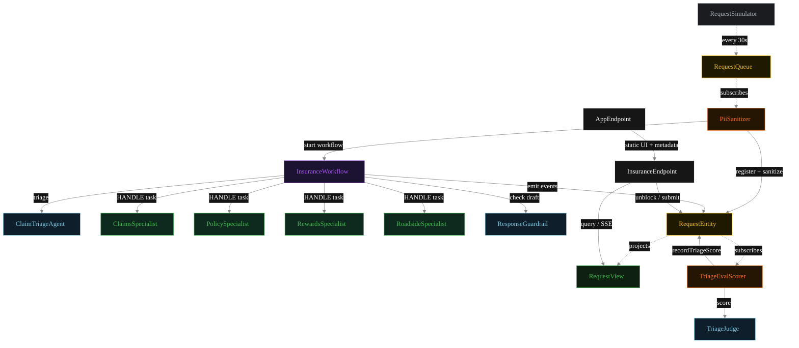
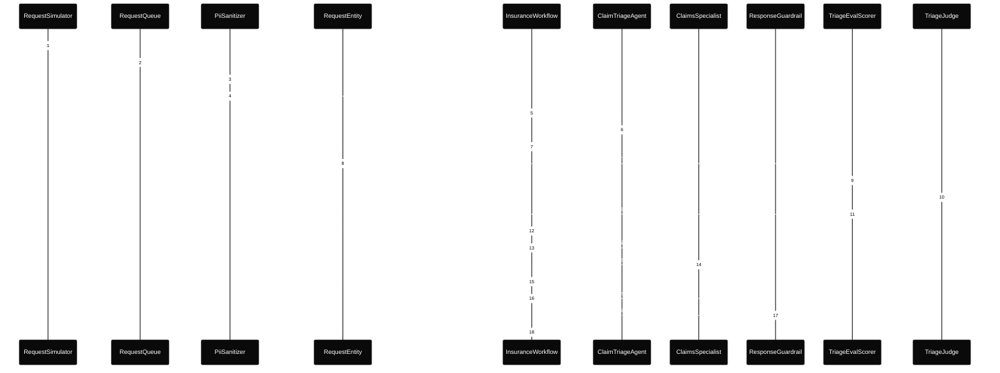
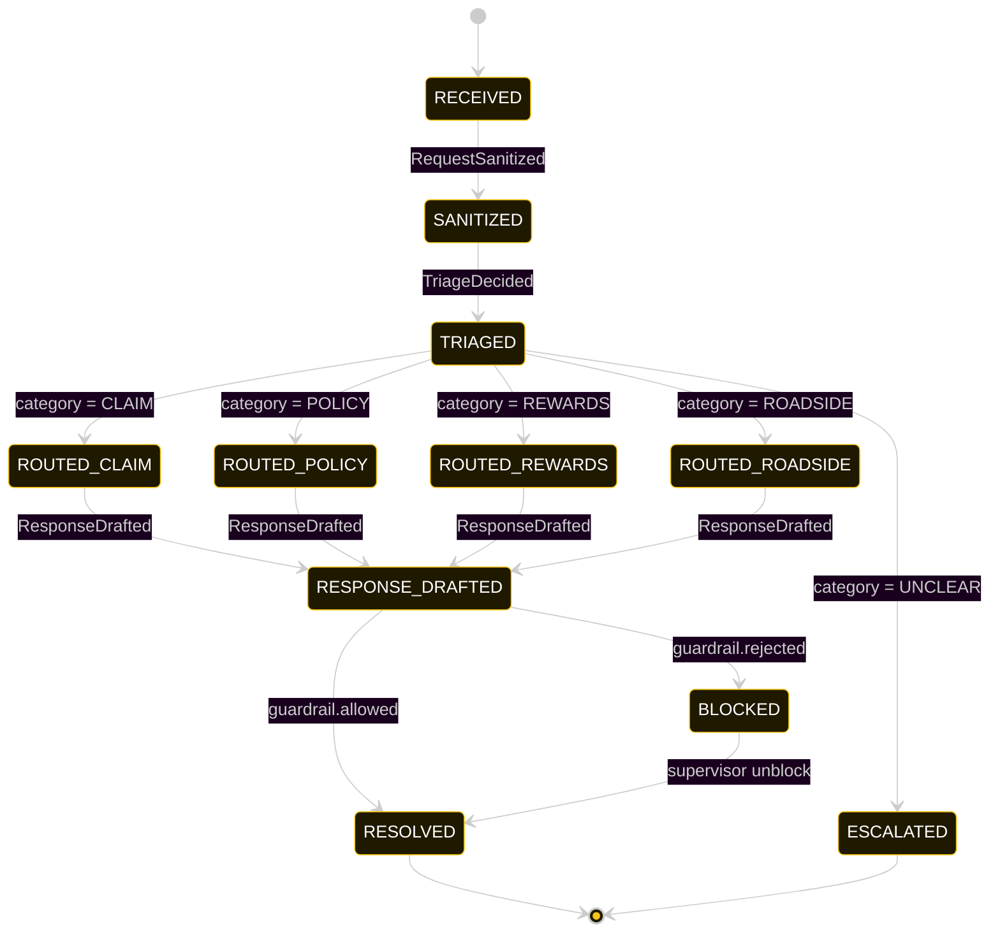
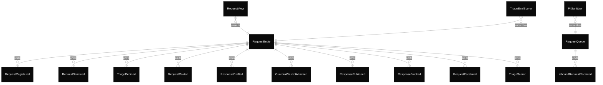

# PLAN — auto-insurance-agent

Architectural sketch consumed by `/akka:plan` and rendered on the generated system's Architecture tab.

---

## Component graph

Solid arrows = synchronous component calls. Dashed arrows = event subscriptions and scheduler ticks.

## Interaction sequence — J1 (claim happy path)

The eval-event sequence (steps 7–10) runs concurrently with the workflow's continuation — `TriageEvalScorer` is a Consumer reading the entity's event stream, independent of `InsuranceWorkflow`. Both writes target the same `RequestEntity`; the entity's commands are idempotent on `requestId`.

## State machine — `RequestEntity`

The `TriageScored` event does not change `status`; it attaches the eval result. The state machine treats it as a no-op transition (omitted from the diagram for clarity).

## Entity model

## Component table — Java file targets

| Component | Path (generated) |
|---|---|
| `RequestSimulator` | `application/RequestSimulator.java` |
| `RequestQueue` | `application/RequestQueue.java` |
| `PiiSanitizer` | `application/PiiSanitizer.java` |
| `ClaimTriageAgent` | `application/ClaimTriageAgent.java` |
| `ClaimsSpecialist` | `application/ClaimsSpecialist.java` |
| `PolicySpecialist` | `application/PolicySpecialist.java` |
| `RewardsSpecialist` | `application/RewardsSpecialist.java` |
| `RoadsideSpecialist` | `application/RoadsideSpecialist.java` |
| `TriageJudge` | `application/TriageJudge.java` |
| `ResponseGuardrail` | `application/ResponseGuardrail.java` |
| `InsuranceWorkflow` | `application/InsuranceWorkflow.java` |
| `RequestEntity` | `application/RequestEntity.java` (state in `domain/MemberRequest.java`, events in `domain/RequestEvent.java`) |
| `RequestView` | `application/RequestView.java` |
| `TriageEvalScorer` | `application/TriageEvalScorer.java` |
| `InsuranceEndpoint` | `api/InsuranceEndpoint.java` |
| `AppEndpoint` | `api/AppEndpoint.java` |
| Task definitions | `application/InsuranceTasks.java` |
| Mock provider (option a) | `application/MockModelProvider.java` |
| Bootstrap | `Bootstrap.java` |

## Concurrency notes

- **Per-step timeout.** `triageStep` 20 s, `guardrailStep` 20 s, `claimsStep` / `policyStep` / `rewardsStep` / `roadsideStep` / `publishStep` 60 s each. On timeout, default recovery is `maxRetries(2).failoverTo(error)` which transitions the request to `ESCALATED` with the failure reason captured.
- **Idempotency.** Every per-request primitive is keyed by `requestId`: `RequestEntity` id is `requestId`; `InsuranceWorkflow` id is `requestId`; agent sessions for `ClaimTriageAgent`, `TriageJudge`, and `ResponseGuardrail` use `requestId`. Duplicate sanitize events fold into a single workflow start (workflow start is idempotent per id).
- **Race between eval and workflow.** `TriageEvalScorer` (Consumer) and `InsuranceWorkflow` both append events to the same `RequestEntity`. Order is not guaranteed but does not matter: `TriageScored` only mutates `triageScore`, never `status`. The view materialises both events independently.
- **No saga compensation.** The handoff is a single-direction transfer of ownership; once the specialist returns its `MemberResponse`, the workflow either publishes or blocks based on the guardrail verdict. A blocked draft sits in `BLOCKED` until a supervisor unblocks via `POST /api/requests/{id}/unblock`.
- **No HITL on the happy path.** The system only waits for a human when the guardrail blocks; all other paths flow through to `RESOLVED` autonomously.
- **Four-way fan-out.** The workflow routes to exactly one of four specialists per request; the others are never invoked. From the component graph's perspective the four branches all terminate at the same `guardrailStep`.
- **Simulator throughput.** `RequestSimulator` drips one request every 30 s; the system can comfortably process each request end-to-end inside that window with mock or real LLMs.
