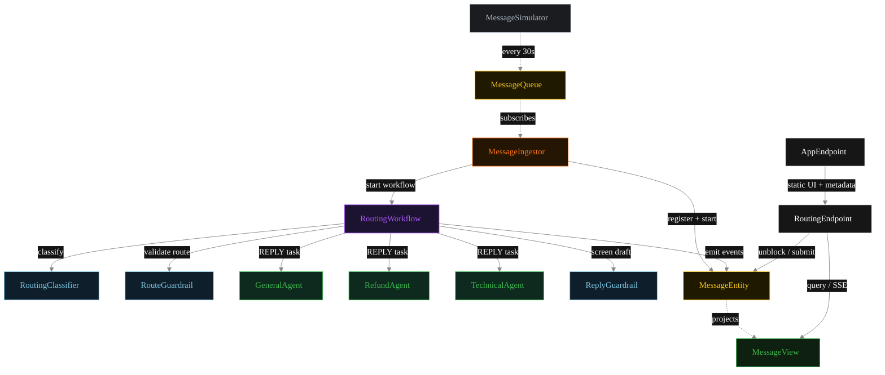
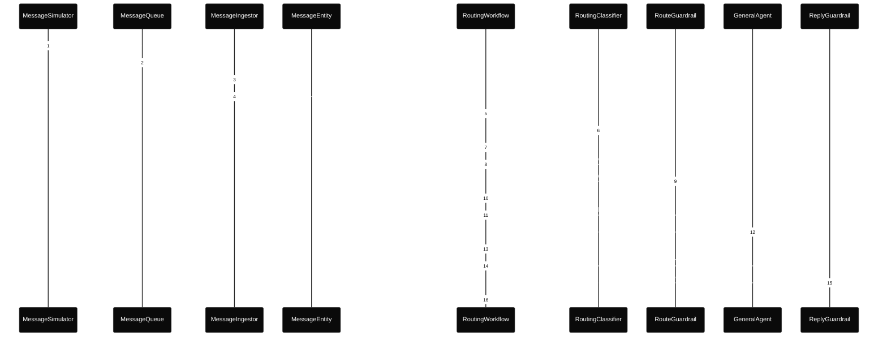
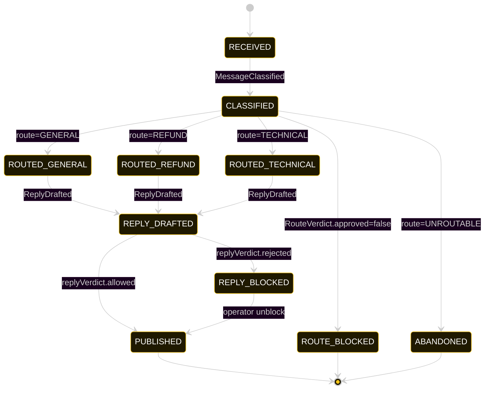
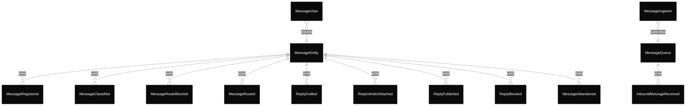

# PLAN — routing-classifier-pattern

Architectural sketch consumed by `/akka:plan` and rendered on the generated system's Architecture tab.

---

## Component graph

Solid arrows = synchronous component calls. Dashed arrows = event subscriptions and scheduler ticks.

## Interaction sequence — J1 (general happy path)

The `RouteGuardrail` call (steps 8–9) is the before-agent-invocation gate — it happens after classification but before `GeneralAgent` is ever called. The `ReplyGuardrail` call (steps 14–15) is the before-agent-response gate — it happens after the specialist returns but before the reply is published.

## State machine — `MessageEntity`

`ROUTE_BLOCKED` and `ABANDONED` are both terminal with no forward transition. `REPLY_BLOCKED` allows one forward transition: operator unblock → `PUBLISHED`.

## Entity model

## Component table — Java file targets

| Component | Path (generated) |
|---|---|
| `MessageSimulator` | `application/MessageSimulator.java` |
| `MessageQueue` | `application/MessageQueue.java` |
| `MessageIngestor` | `application/MessageIngestor.java` |
| `RoutingClassifier` | `application/RoutingClassifier.java` |
| `RouteGuardrail` | `application/RouteGuardrail.java` |
| `GeneralAgent` | `application/GeneralAgent.java` |
| `RefundAgent` | `application/RefundAgent.java` |
| `TechnicalAgent` | `application/TechnicalAgent.java` |
| `ReplyGuardrail` | `application/ReplyGuardrail.java` |
| `RoutingWorkflow` | `application/RoutingWorkflow.java` |
| `MessageEntity` | `application/MessageEntity.java` (state in `domain/Message.java`, events in `domain/MessageEvent.java`) |
| `MessageView` | `application/MessageView.java` |
| `RoutingEndpoint` | `api/RoutingEndpoint.java` |
| `AppEndpoint` | `api/AppEndpoint.java` |
| Task definitions | `application/RoutingTasks.java` |
| Mock provider (option a) | `application/MockModelProvider.java` |
| Bootstrap | `Bootstrap.java` |

## Concurrency notes

- **Per-step timeout.** `classifyStep` 20 s, `validateRouteStep` 20 s, `screenStep` 20 s, `generalStep` / `refundStep` / `technicalStep` / `publishStep` 60 s each. On timeout, default recovery is `maxRetries(2).failoverTo(error)` which transitions the message to `ABANDONED` with the failure reason captured.
- **Idempotency.** Every per-message primitive is keyed by `messageId`: `MessageEntity` id is `messageId`; `RoutingWorkflow` id is `messageId`; agent sessions for `RoutingClassifier`, `RouteGuardrail`, and `ReplyGuardrail` use `messageId`. Duplicate ingest events fold into a single workflow start (workflow start is idempotent per id).
- **Two guardrail positions.** `RouteGuardrail` is invoked synchronously inside `validateRouteStep` before any specialist sees the message. `ReplyGuardrail` is invoked synchronously inside `screenStep` after the specialist returns. Both are blocking gates — a failure in either stops the message from advancing to `PUBLISHED`.
- **No saga compensation.** The handoff is a single-direction transfer of ownership. Once the specialist returns its `Reply`, the workflow either publishes or blocks based on the screen verdict. A route-blocked message has no forward path; a reply-blocked message waits for operator unblock.
- **No HITL on the happy path.** Human review is only required when `ReplyGuardrail` blocks. Route-blocked messages are terminal without human action (by design — an invalid route decision should not reach a human for override).
- **Simulator throughput.** `MessageSimulator` drips one message every 30 s; the system handles each message end-to-end inside that window with mock or real model providers.
